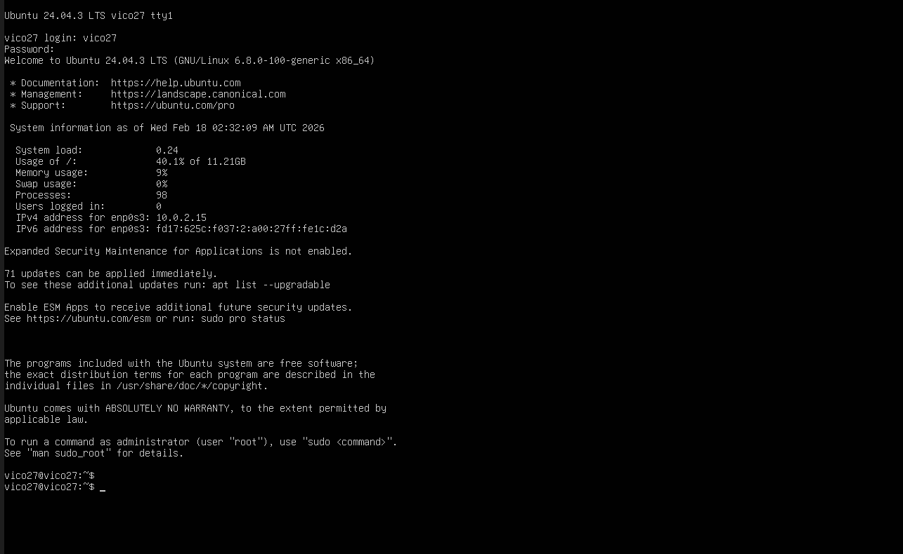
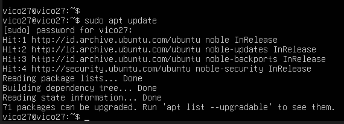
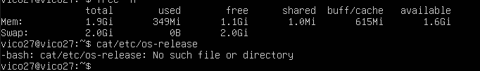
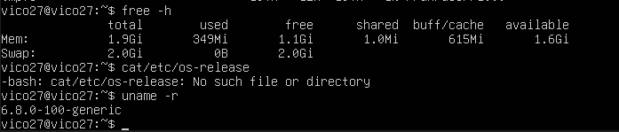
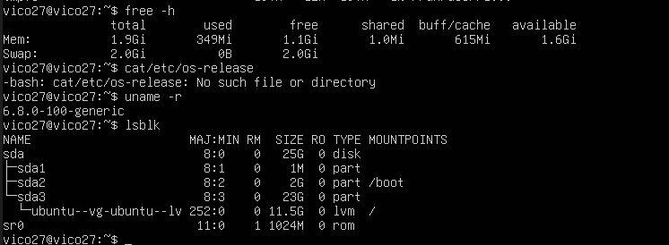
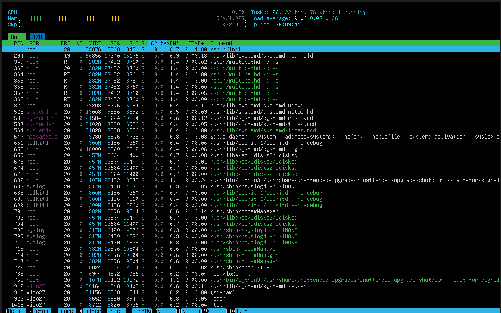

# Laporan Praktikum Sistem Operasi Jobsheet 1

<h4>Nama : Vico Dwi Wijaya<h4>
<h4>NIM  : 254107020259<h4>
<h4>Kelas: TI-1H<h4>

## 1.10. Latihan 
## 1.10.1. Latihan konseptual

### Latihan 1.1
Jelaskan 5 fungsi utama sistem operasi dengan contoh konkret dari minimal 2
OS berbeda (Windows, macOS, atau Linux)

### Latihan 1.2
Kapan sebaiknya menggunakan Windows vs Linux vs macOS? Analisis
berdasarkan use case: gaming, development, server, creative work, dan enter
prise.

## 1.10.2. Latihan Praktikal

### Latihan 1.3
Install Ubuntu Server 22.04 LTS di VirtualBox dengan langkah berikut:
1. Download Ubuntu Server ISO dari website resmi
2. Create VM baru di VirtualBox (RAM: 2GB, Disk: 25GB)
3. Install dengan automatic partitioning (guided)
4. Buat user account dengan password yang kuat
5. Reboot dan login ke sistem
6. Dokumentasikan proses instalasi dengan screenshot key steps

### Latihan 1.4
Setelah instalasi Ubuntu Server, lakukan tasks berikut:
1. Update package list: sudo apt update
2. Upgrade packages: sudo apt upgrade
3. Install neofetch: sudo apt install neofetch
4. Jalankan neofetch dan screenshot hasilnya
5. Check disk usage dengan df-h
6. Check memory dengan free-h
7. Dokumentasikan output dari setiap command

### Latihan 1.5
Eksplorasi sistem yang baru diinstall:
1. Tampilkan informasi OS: cat /etc/os-release
2. Tampilkan versi kernel: uname-r
3. List partisi: lsblk
4. Check network connectivity: ping-c 4 google.com
5. Install dan jalankan htop untuk melihat resource usage
6. Buat laporan singkat tentang konfigurasi sistem Anda

## 1.10.3. Latihan Refleksi
### Latihan 1.6
1. Sistem operasi apa yang Anda gunakan sehari-hari? (Windows, macOS,
Linux, atau lainnya)
2. Berapa lama Anda menggunakan sistem operasi tersebut?
3. Apa yang Anda sukai dari sistem operasi tersebut?
4. Apa tantangan atau masalah yang pernah Anda hadapi?
pengalaman Anda.
5. Apakah Anda pernah menggunakan sistem operasi lain? Bandingkan
6. Setelah mempelajari bab ini, apakah ada sistem operasi lain yang ingin
Anda coba? Mengapa?

## Jawaban

### Latihan 1.1
## Process Management
Fungsi:
Mengatur jalannya program yang sedang aktif (proses), termasuk penjadwalan CPU, menjalankan, menghentikan, dan multitasking.

Contoh:

Windows → Menggunakan Task Manager (Ctrl + Shift + Esc) untuk melihat aplikasi yang berjalan dan mengakhiri proses.

macOS → Menggunakan Activity Monitor untuk memantau penggunaan CPU dan menghentikan aplikasi.

Linux → Menggunakan perintah top, htop, atau ps di terminal untuk melihat proses, dan kill untuk menghentikannya.

Contoh konkret: Saat membuka browser, musik, dan Word bersamaan, OS membagi waktu CPU agar semua aplikasi tetap berjalan lancar.

##  Memory Management
Fungsi:
Mengatur penggunaan RAM agar setiap program mendapat memori yang cukup tanpa saling mengganggu.

Contoh:

Windows → Menggunakan fitur Virtual Memory (Paging File) jika RAM hampir penuh.

macOS → Menggunakan Memory Compression untuk menghemat penggunaan RAM.

Linux → Menggunakan sistem swap sebagai memori cadangan saat RAM penuh.

Contoh konkret: Jika RAM 4GB penuh saat membuka banyak aplikasi, OS akan menggunakan memori virtual agar komputer tidak langsung hang.

## Manajemen File (File System Management)
Fungsi:
Mengatur penyimpanan data dalam bentuk file dan folder.

Contoh:

Windows → Menggunakan sistem file NTFS dan File Explorer.

macOS → Menggunakan sistem file APFS dan Finder.

Linux → Menggunakan sistem file seperti ext4 dan manajer file seperti Nautilus.

Contoh konkret: Saat membuat folder “Tugas Basis Data”, OS menyimpan lokasi file tersebut di hard disk dan mengatur hak aksesnya.

## Manajemen Perangkat Keras (Device Management)
Fungsi:
Mengontrol dan mengatur perangkat keras seperti keyboard, mouse, printer, dan hard disk melalui driver.

Contoh:

Windows → Menggunakan Device Manager untuk mengelola driver.

macOS → Biasanya otomatis mendeteksi perangkat tanpa perlu instal driver manual.

Linux → Menggunakan sistem driver bawaan kernel dan bisa dikonfigurasi lewat terminal.

Contoh konkret: Saat mencolokkan flashdisk, OS langsung mengenali dan menampilkannya tanpa perlu pengaturan rumit.

## Manajemen Keamanan (Security Management)

Fungsi:
Melindungi sistem dari akses tidak sah dengan sistem login, password, dan hak akses (permission).

Contoh:

Windows → Login menggunakan akun Microsoft dan fitur Windows Defender.

macOS → Menggunakan sistem login Apple ID dan fitur Gatekeeper.

Linux → Menggunakan sistem permission (rwx) dan autentikasi root/sudo.

Contoh konkret: User biasa tidak bisa menginstal aplikasi tanpa izin administrator.

### Latihan 1.2
 ## Perbandingan menggunakan Windows vs Linux vs macOS? 
 
 Analisis
berdasarkan use case: 
gaming, development, server, creative work, dan enter
prise.

| OS | Kernel type |  Primary Use |License | Market Share |
|--------|------|--------------|--------|-------|
| Windows | Hybrid | Desktop/Business| Proprietary | Desktop: 75% |
| macOS | Hybrid (XNU)  | Creative/Dev |Proprietary | Desktop: 15% |
| Linux | Monolithic | Server/Dev | Open Source |  Server: 60% |
| Android| Linux-based | Mobile | Open Source |  Mobile: 70% |
| iOS | Hybrid (XNU) | Mobile | Proprietary |  Mobile: 28% |

## Pemilihan sistem operasi bergantung pada kebutuhan:

* Gaming & Aplikasi Bisnis: Windows (kompatibilitas terbaik)
* Pekerjaan Kreatif: macOS (standar industri untuk video/audio edit
ing)
* Server & Cloud: Linux (stabilitas, keamanan, tanpa biaya lisensi)
* Development: macOS atau Linux (tools berbasis Unix)

## Latihan 1.3

## Latihan 1.4

.png)

.png)

.png)

.png)

.png)

## Latihan 1.5

## 1.10.3. Latihan Refleksi
### Latihan 1.6
Sistem operasi yang saya gunakan sehari-hari adalah Microsoft Windows 11. Saya sudah menggunakan Windows sejak sekolah menengah, kurang lebih sekitar 3-4 tahun hingga sekarang. Sistem operasi ini menjadi pilihan utama saya karena hampir semua perangkat yang saya miliki menggunakan Windows, baik laptop pribadi maupun komputer di kampus.

Hal yang saya sukai dari Windows adalah tampilannya yang mudah dipahami (user-friendly) serta kompatibilitasnya dengan banyak aplikasi. Sebagai mahasiswa Teknik Informatika, saya sering menggunakan software seperti Microsoft Office, Visual Studio Code, dan beberapa tools pemrograman yang berjalan dengan baik di Windows. Selain itu, proses instalasi aplikasi relatif mudah dan dukungan driver perangkat keras juga lengkap. Windows juga mendukung berbagai game dan aplikasi desain, sehingga fleksibel untuk kebutuhan akademik maupun hiburan.

Namun, saya juga pernah menghadapi beberapa tantangan saat menggunakan Windows. Salah satunya adalah masalah pembaruan (update) otomatis yang terkadang memakan waktu lama dan muncul di saat yang kurang tepat. Selain itu, Windows juga cukup rentan terhadap virus jika tidak berhati-hati dalam mengunduh file dari internet, sehingga saya harus selalu memastikan antivirus aktif. Kadang performa sistem juga melambat jika terlalu banyak aplikasi berjalan secara bersamaan.

Saya pernah mencoba sistem operasi lain yaitu Ubuntu, salah satu distribusi dari Linux. Dibandingkan Windows, Ubuntu terasa lebih ringan dan jarang mengalami gangguan virus. Sistemnya lebih stabil untuk pemrograman, terutama ketika menggunakan bahasa seperti Python atau saat belajar tentang server dan jaringan. Namun, bagi saya yang sudah terbiasa dengan Windows, tampilan dan cara penggunaan Ubuntu membutuhkan waktu adaptasi, terutama dalam penggunaan terminal dan instalasi software tertentu.

Setelah mempelajari bab tentang sistem operasi, saya menjadi tertarik untuk mencoba macOS. Alasannya karena macOS dikenal stabil, memiliki keamanan yang baik, dan banyak digunakan oleh developer profesional. Selain itu, integrasi antara perangkat keras dan perangkat lunaknya cukup optimal karena dikembangkan langsung oleh Apple.

Secara keseluruhan, setiap sistem operasi memiliki kelebihan dan kekurangan masing-masing. Pengalaman menggunakan Windows membantu saya memahami dasar-dasar penggunaan komputer, sedangkan mencoba Ubuntu memberikan wawasan baru tentang sistem operasi berbasis open source. Ke depannya, saya ingin lebih mengeksplorasi berbagai sistem operasi agar memiliki pemahaman yang lebih luas sebagai mahasiswa di bidang teknologi informasi.