# Laporan Pratikum 10 Manajemen Memori dan System Call

<h4>Nama : Vico Dwi Wijaya<h4>
<h4>NIM  : 254107020259<h4>
<h4>Kelas: TI-1H<h4>
<h4>Absen: 28<h4>

## Praktikum 10.1 Melihat Penggunaan Memori

Langkah 1: Jalankan free-h untuk melihat ringkasan RAM dan swap.
```
free-h
```
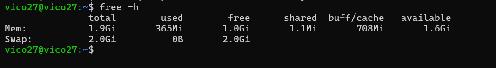

Langkah 2: Lihat detail memori dari kernel melalui /proc/meminfo.     
```
cat /proc/meminfo | head-n 20
```
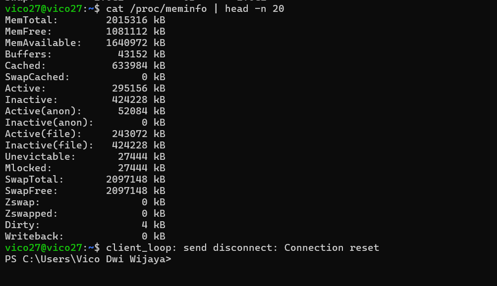

#### Analisis
1. Hitung persentas ememori tersedia(available / total × 100%).Apakah sistem dalam kondisi normal?

(1.6 / 1.9) × 100% = 84.21%

**Kesimpulan**: Persentase memori yang tersedia adalah sekitar 84,21%. Karena hasilnya jauh di atas 10%, sistem Linux masih sangat aman dan tidak dalam kondisi kekurangan memori.

2. Mengapa buff/cache tidak dihitung sebagai memori yang terpakai dari sudut pandang ketersediaan untuk aplikasi?

* Nilai pada kolom used adalah 0B (0 Byte).  
* Karena nilainya 0, berarti kernel belum pernah memindahkan data ke disk.


3. Dari /proc/meminfo, apakah SwapTotal lebih besar dari 0? Berapa nilai SwapFree?

* Nilai Buffers: 43152 kB (sekitar 43 MB)   
* Nilai Cached: 633984 kB (sekitar 633 MB)   
* Jika ditotal, hasilnya sekitar 677 MB. Nilai ini sangat mendekati dengan nilai kolom buff/cache pada output free -h di atasnya yang tertera 708Mi. Perbedaan hitungan sedikit ini wajar karena fluktuasi alokasi memori yang terus berjalan di latar belakang.


## Studi Kasus 10.1 Server Lambat karena Memori

Langkah 1: Periksa kondisi memori secara keseluruhan.
```
free-h
```
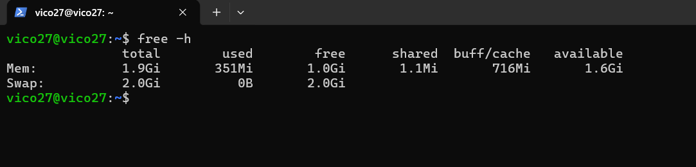

Langkah 2: Pantau proses secara real-time.
```
top
```
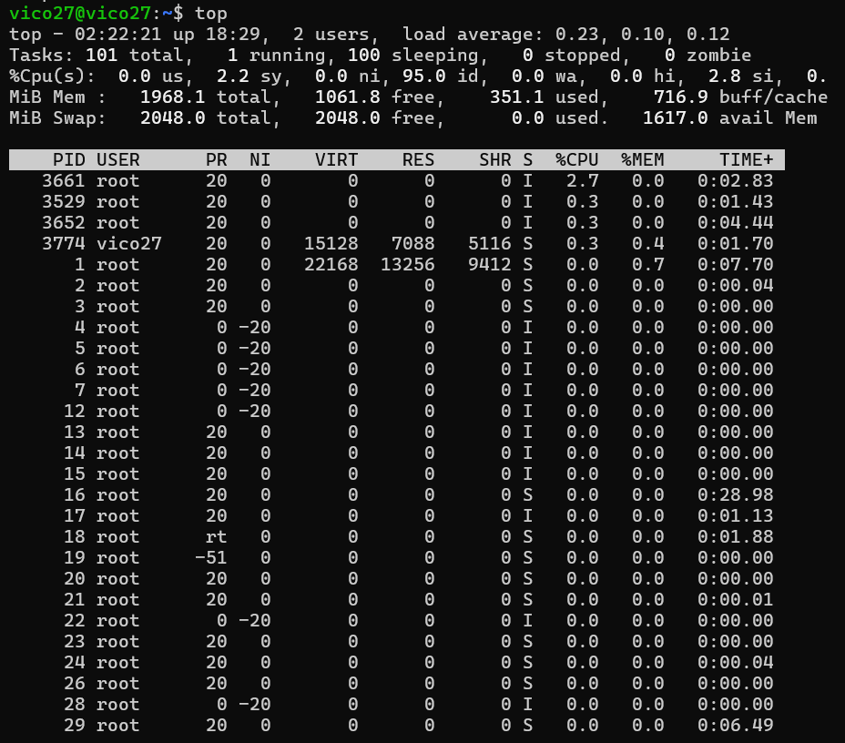

Analisis:
1. Apakah nilai available sangat kecil (misalnya di bawah 200 MB pada server
dengan RAM 2 GB)? Jika ya, server kemungkinan kekurangan memori.

* Berdasarkan output free -h (dan juga header di top), nilai available memori adalah 1.6Gi (sekitar 1600 MB).  
* Kesimpulan: Nilai ini jauh di atas batas indikasi lambat (misalnya 200 MB). Jadi, server saat ini sangat lega dan kemungkinan besar tidak sedang mengalami kekurangan memori.

2. Apakah kolom used pada baris Swap lebih dari 0? Jika ya, kernel sedang
menggunakan swap, yang berarti performa menurun.
* nilainya 0, artinya kernel sama sekali tidak memindahkan data ke disk (swap). Performa servermu tetap optimal karena semuanya masih ter-cover oleh RAM yang cepat.
3. Di tampilan top, proses apa yang memiliki %MEM terbesar? Proses tersebut
menjadi kandidat utama penyebab lambatnya server.
* %MEM terbesar yang terlihat adalah PID 1 (root) dengan 0.7%, disusul oleh proses milikmu sendiri yaitu PID 3774 (vico27) dengan 0.4%.
## Praktikum 10.2 Mengamati Aktivitas Paging
Langkah 1: Jalankan vmstat dengan interval 1 detik, 5 sampel
```
vmstat 1 5
```
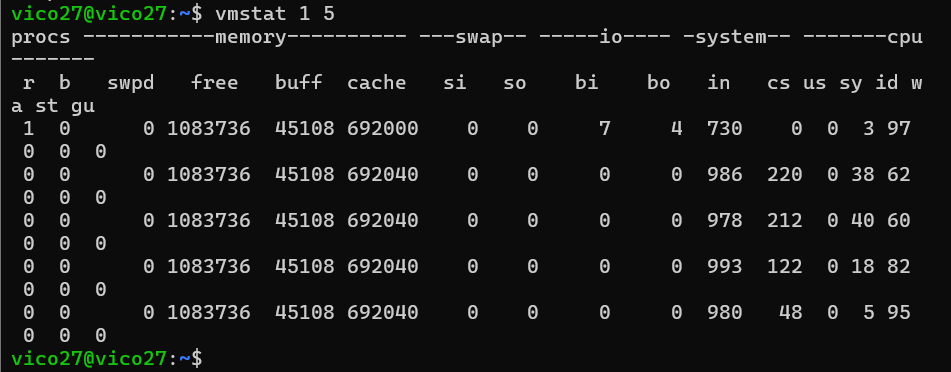

## Praktikum 10.3 Membuat dan Mengonfigurasi Swap File

Langkah 1: Buat file berukuran 512 MB sebagai calon swap.
 ```
 sudo fallocate-l 512M /swapfile-week10
 ```
 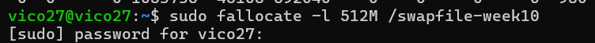
Langkah 2: Atur permission file menjadi 600 — hanya root yang boleh membaca dan menulis.
```
sudo chmod 600 /swapfile-week10
```

Langkah 3: Format file sebagai area swap, lalu aktifkan
```
sudo mkswap /swapfile-week10
sudo swapon /swapfile-week10
```
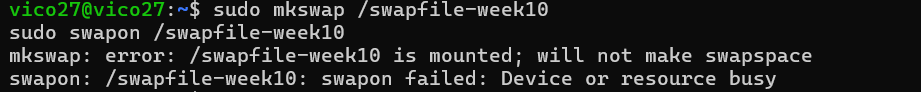
Langkah 4: Verifikasi swap aktif. Anda akan melihat entri /swapfile-week10 dengan ukuran 512M, dan nilai total pada baris Swap di free-h bertambah 512M
```
swapon--show
free-h
```
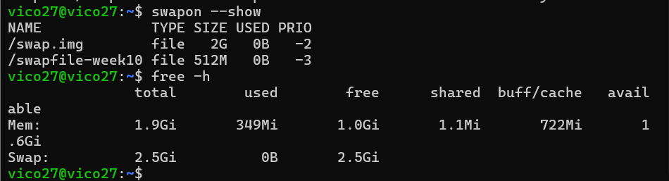
Langkah 5: Periksa nilai swappiness, ubah sementara, dan verifikasi perubahan.
```
cat /proc/sys/vm/swappiness
sudo sysctl vm.swappiness=10
cat /proc/sys/vm/swappiness
```
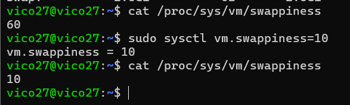

Analisis:
1. Berapa nilai swappiness default? Apa artinya bagi perilaku kernel dalam
menggunakan swap?

* defaultnya adalah 60. Dengan nilai 60 (yang merupakan bawaan Linux), kernel cukup agresif dalam menggunakan swap. Kernel akan mulai memindahkan sebagian data proses yang jarang diakses ke disk (swap) lebih awal, meskipun sebenarnya kapasitas RAM utama belum benar-benar habis terpakai.

2. Setelah diubah ke 10, konfirmasi nilai berubah pada output cat kedua. Apa
dampak nilai 10 terhadap penggunaan swap dibanding nilai 60?

* Menurunkan nilai menjadi 10 membuat kernel jauh lebih konservatif. Sistem akan sangat mengutamakan penggunaan RAM fisik dan akan menahan diri sekuat mungkin untuk tidak memindahkan data ke swap kecuali RAM sudah benar-benar dalam kondisi kritis. Untuk server aplikasi, ini sangat disarankan agar performa tetap cepat.

3. Apakah entri /swapfile-week10 muncul di swapon–show? Jika tidak,
pastikan Langkah 2 (chmod 600) sudah dijalankan sebelum Langkah 3.

* iya muncul tipe file dan ukuran 512M. 
## Praktikum 10.4 Monitoring Memory
Langkah 1: Ambil snapshot proses diurutkan dari penggunaan memori terbesar
```
ps aux --sort=-%mem | head
```
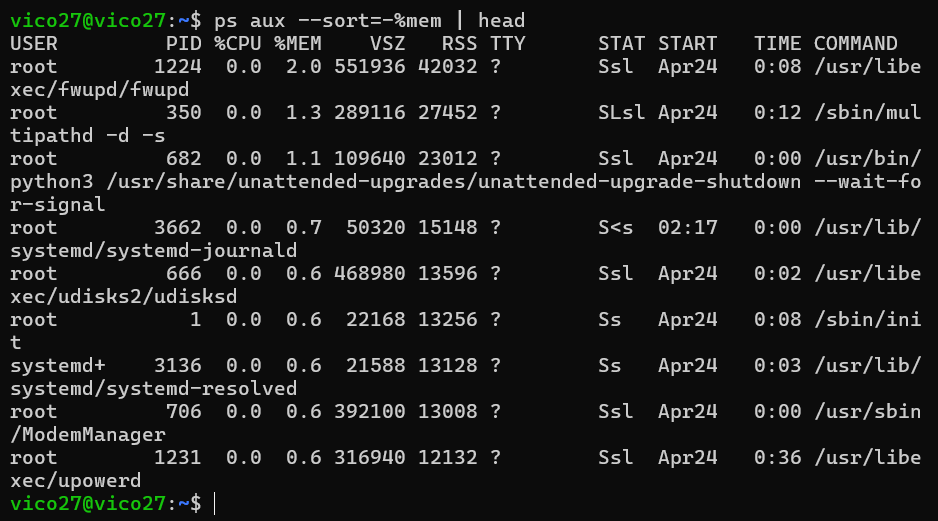
Langkah 2: Pantau secara real-time dengan top.
```
top
```
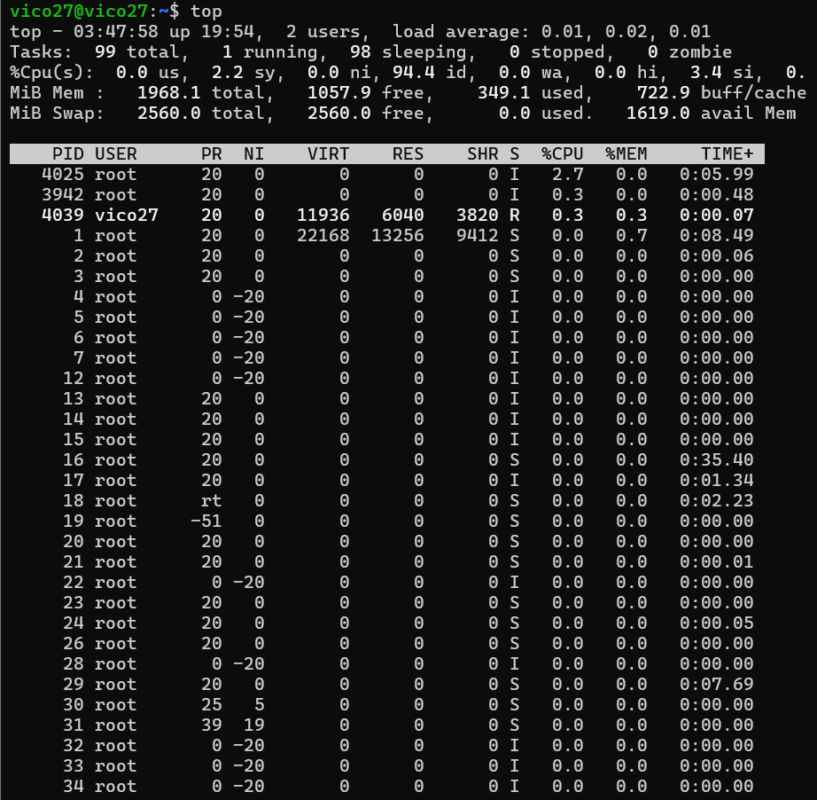

Analisis:
1. Proses apa yang berada di urutan pertama? Catat nilai %MEM dan RSS-nya.

* %MEM: 2.0
* RSS: 42032

2. Konversikan RSS dari KB ke MB (bagi 1024). Misalnya, RSS=524288 be
rarti proses menggunakan 512 MB RAM. Apakah wajar untuk jenis program
tersebut?

* RSS: 42032 
* 42032/1024 = 41,04 MB sekitar **41MB**

3. Mengapa VSZ selalu lebih besar dari RSS pada proses yang sama?

* karena **VSZ (Virtual Memory Size)** adalah total seluruh memori virtual yang diminta atau dialokasikan oleh program, yang mencakup kode program, pustaka memori (shared libraries), dan bagian memori yang mungkin belum dimuat ke RAM. Sedangkan **RSS (Resident Set Size)** adalah ukuran RAM fisik yang benar-benar sedang dipakai oleh proses tersebut pada detik itu juga. Linux sangat cerdas; ia tidak akan memuat seluruh bagian program ke RAM fisik jika belum diperlukan (demand paging).
4. Apakah urutan proses di ps konsisten dengan tampilan top saat diurutkan
berdasarkan %MEM?

* Belum Diurutkan: Pada screenshot kamu, perintah top belum diurutkan berdasarkan memori (terlihat dari %MEM 0.0 yang posisinya masih di atas 0.7).
* Perbedaan Cara Kerja: Perintah ps ibarat "foto" yang menangkap data proses pada satu detik itu saja (snapshot statis). Sedangkan perintah top ibarat "video live" yang datanya terus bergerak secara real-time. Jadi, sangat wajar jika posisinya agak bergeser karena pemakaian memori sistem selalu berubah-ubah.
## Praktikum 10.5 Script Monitor Memori
```
cd ~/praktikum-os/week10-memory
nano monitor-memori.sh
```
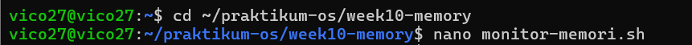

Ketik script berikut:
```
#!/bin/bash
set-euo pipefail
THRESHOLD=20
echo "=== Monitor Memori ==="
date
echo
free-h
echo
AVAIL=$(free | awk '/Mem/ {printf "%d", $7/$2*100}')
if [ "$AVAIL"-lt "$THRESHOLD" ]; then
echo "PERINGATAN: Memori tersedia hanya ${AVAIL}%!"
else
echo "Status: Memori tersedia ${AVAIL}% (normal)"
fi
echo
echo "--- 5 Proses Memori Tertinggi---"
ps aux--sort=-%mem | head-n 6 | tail-n 5
```
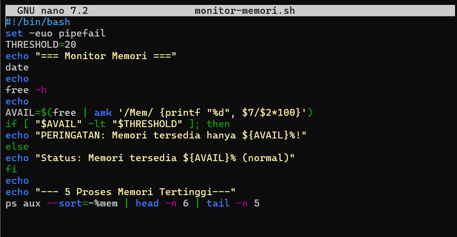

```
chmod +x monitor-memori.sh
bash monitor-memori.sh
```
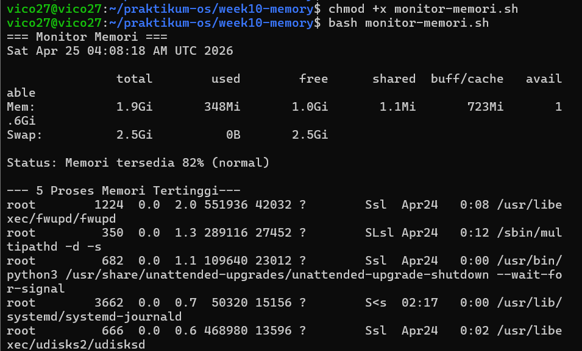

#### Analisis

1. Variabel THRESHOLD=20 menetapkan batas persentase. Perintah free | awk
’/Mem/ {printf "%d", $7/$2*100}’ mengambil kolom ke-7 (available) dibagi
kolom ke-2 (total) dari baris Mem, lalu dikalikan 100 untuk menghasilkan
persentase bilangan bulat.
2. Kondisi if [ "$AVAIL"-lt "$THRESHOLD" ] bernilai benar jika persentase
memori tersedia di bawah 20.
3. Ubah THRESHOLD menjadi 90 dan jalankan ulang. Apa yang berubah pada
output? Mengapa demikian?

* 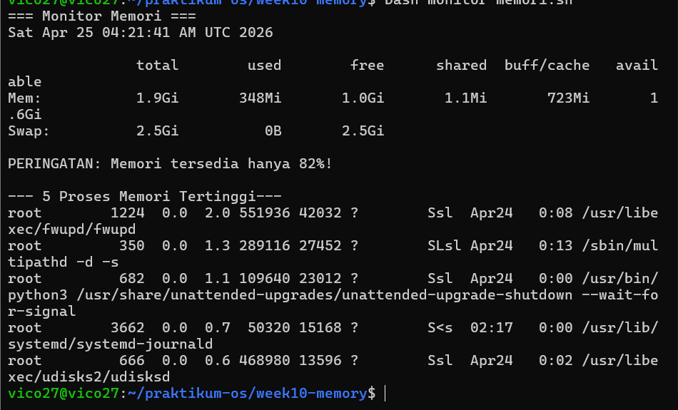
Brubah **PERINGATAN: Memori tersedia hanya 82%!**

## Studi Kasus 10.2 Gagal Akses File
Langkah 1: Buat direktori dan file konfigurasi contoh.
```
mkdir-p ~/praktikum-os/week10-memory/syscall-case
cd ~/praktikum-os/week10-memory/syscall-case
echo "PORT=8080" > app.conf
ls-l app.conf
cat app.conf
```
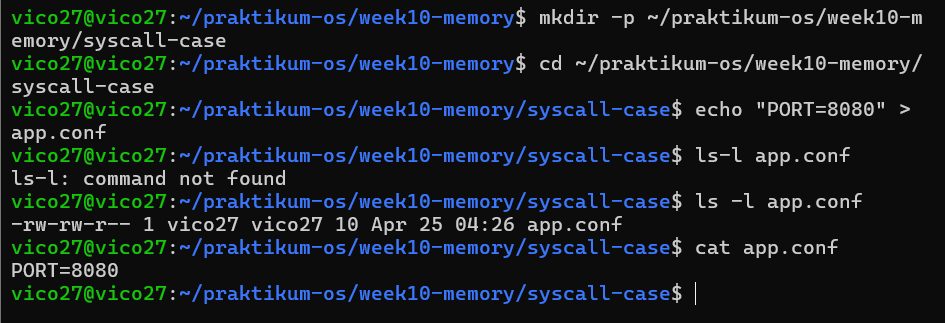

Langkah 2: Simulasikan permission bermasalah.
```
chmod 000 app.conf
cat app.conf
```
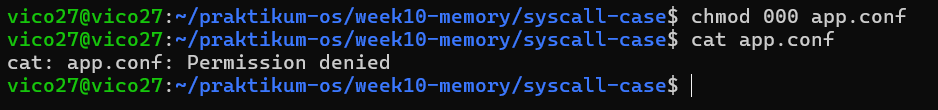
Langkah 3: Kembalikan permission dan verifikasi
```
chmod 644 app.conf
cat app.conf
```
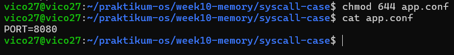

Analisis:
1. Mengapa cat menghasilkan Permission denied setelah chmod 000? System
call apa yang gagal?
* Karena perintah chmod 000 berfungsi untuk mencabut semua hak akses (baca, tulis, dan eksekusi) dari semua pihak
2. Apa perbedaan pesan error Permission denied vs No such file or directory?
Coba rm app.conf lalu cat app.conf untuk melihat perbedaannya.
* Permission denied: File app.conf secara fisik ada di direktori tersebut, tetapi perlindungannya aktif sehingga sistem (kernel) memblokir atau melarang kamu membacanya.
* No such file or directory: Jika kamu menghapus filenya dengan rm app.conf, lalu mencoba membacanya dengan cat, error inilah yang akan muncul. Artinya, kernel memberi tahu bahwa file yang kamu minta memang sudah tidak ada wujudnya di direktori tersebut.

3. Permission 644 berarti apa untuk owner, group, dan others?
* 6 untuk Owner (Pemilik): Didapat dari nilai 4 (Read/Baca) + 2 (Write/Tulis). Artinya, sebagai pemilik file diberi hak untuk membaca dan mengedit isi app.conf.
* 4 untuk Group (Grup): Nilai 4 (Read/Baca). Artinya, pengguna lain yang berada dalam satu grup sistem denganmu hanya boleh membaca filenya, tidak bisa mengedit.
* 4 untuk Others (Pengguna Lain): Nilai 4 (Read/Baca). Artinya, semua pengguna lain (orang luar) di server juga hanya diberi izin sebatas untuk membaca filenya.
* permission 644 ini tertulis sebagai -rw-r--r--

## Praktikum 10.6 Mengamati System Call dengan strace

Langkah 1: Lihat 30 baris pertama system call dari perintah ls.
```
strace ls 2>&1 | head-n 30
```
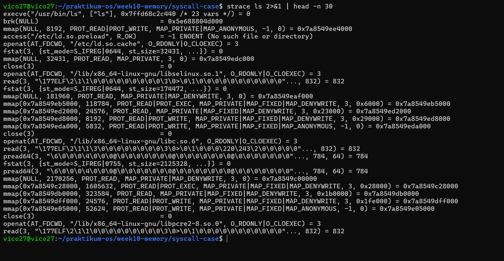
Langkah 2: Lihat ringkasan statistik dan bandingkan dua direktori berbeda.
```
strace-c ls
strace-c ls /etc 2>&1 | tail-5
```
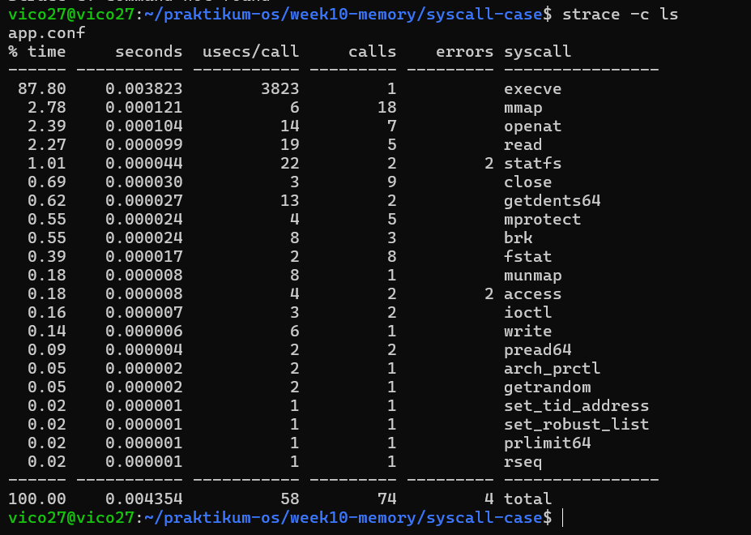

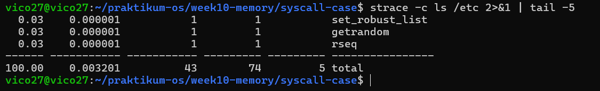

Analisis:
1. Dari output Langkah 1, identifikasi minimal 4 system call berbeda. Jelaskan fungsi singkat masing-masing berdasarkan argumen yang terlihat.
* Berdasarkan screenshot pertamamu, berikut adalah 4 system call yang dipanggil beserta fungsinya:


    1. openat: Berfungsi untuk membuka file (misalnya membuka /etc/ld.so.cache) agar bisa dibaca oleh program. Pada layar, proses ini berhasil dan mengembalikan nilai file descriptor (misal: 3).  


    2. read: Berfungsi untuk membaca isi data dari file. Pada layar, ia membaca isi file descriptor 3 sebanyak 832 byte.  


    3. close: Berfungsi untuk menutup file. Pada layar, terlihat ia menutup file descriptor 3 setelah selesai digunakan.  


    4. mmap: Berfungsi dalam manajemen memori untuk memetakan file ke memori. Program menggunakan ini untuk memuat shared library ke dalam ruang alamat memori agar bisa dieksekusi.


2. Dari ringkasan strace-c, system call mana yang paling sering dipanggil?
Mengapa?
    * Berdasarkan tabel ringkasan strace -c ls di screenshot kedua, system call yang paling sering dipanggil adalah mmap (sebanyak 18 kali panggilan).
    * Mengapa? Perintah ls (meskipun kelihatannya sederhana) sangat bergantung pada banyak shared library dari sistem (seperti libc.so, libselinux.so, dll) untuk bisa berjalan. Setiap kali satu library dimuat ke memori virtual, kernel akan memanggil mmap beberapa kali. Itulah mengapa jumlah panggilannya sangat mendominasi di awal eksekusi program.
3. Apakah ada system call dengan errors lebih dari 0? Apakah itu berarti
program bermasalah, ataukah bagian normal dari logika program?
    * Ya, ada. Pada kolom errors, terlihat system call statfs memiliki 2 error dan access memiliki 2 error. Tidak, ini sama sekali bukan bug atau masalah. Ini adalah bagian normal dari logika program. Seringkali, sebuah program (seperti ls) akan mencoba mencari konfigurasi default di lokasi tertentu terlebih dahulu menggunakan access().
4. Apakah jumlah system call berbeda antara ls dan ls /etc? Faktor apa yang
menyebabkan perbedaan tersebut?
    * Hasil Praktikum: lan Kebetujumlahnya sama persis (74 panggilan).
    * Faktor Penentu Perbedaan: Bergantung pada banyaknya file di dalam direktori tersebut.
    * Alasannya: Ibarat mengangkut barang, memori punya batas kapasitas untuk sekali jalan. Karena isi folder saat itu tergolong sedikit, datanya bisa langsung dibaca dalam satu kali "tarikan" (menggunakan system call getdents64). Kalau mengecek folder yang isinya ribuan file, pasti jumlah panggilannya akan jauh lebih banyak karena sistem harus bolak-balik membacanya.


## 1.6 Tugas Praktikum
```
mkdir-p ~/praktikum-os/week10-memory
cd ~/praktikum-os/week10-memory
```
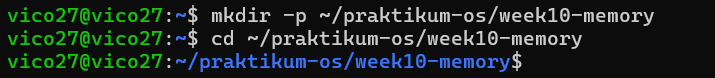
```
nano ~/praktikum-os/week10-memory/memory-audit.sh
```
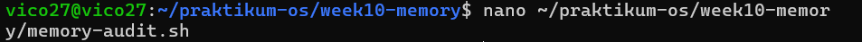

```
#!/bin/bash
set-euo pipefail
LAPORAN="memory-report.txt"
{
echo "=== LAPORAN MEMORI SISTEM ==="
date
echo
echo "--- Ringkasan free-h---"
free-h
echo
echo "--- /proc/meminfo---"
cat /proc/meminfo | head-n 20
} > "$LAPORAN"
echo "Laporan disimpan ke: $LAPORAN"
cat "$LAPORAN"
```
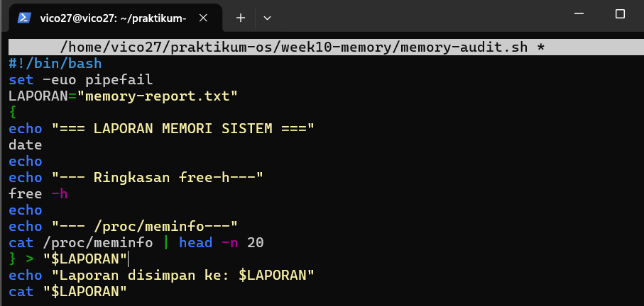
```
chmod +x ~/praktikum-os/week10-memory/memory-audit.sh
cd ~/praktikum-os/week10-memory
bash memory-audit.sh
```
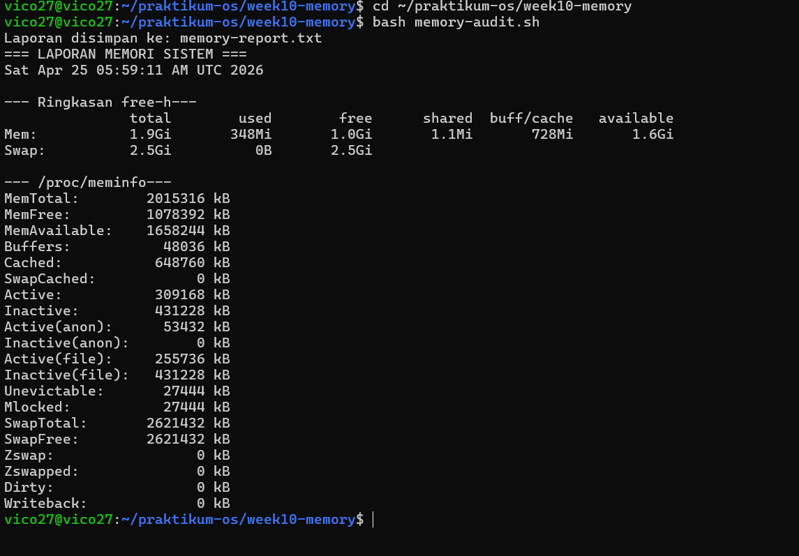

#### Analisis
1. Hitung persentase memori tersedia(available / total × 100%). Apakah sistem dalam kondisi normal?
    * (1.6/1.9 ) x 100% = 84,21%.
    * normal dan aman. Karena memori yang tersedia (84,21%) jauh di atas batas kritis 10%, sistem Linux-mu punya ruang yang sangat lega untuk menjalankan banyak proses.
2. Mengapa buff/cache tidak dihitung sebagai memori yang terpakai dari sudut pandang ketersediaan untuk aplikasi?
    * Sistem operasi Linux memang sengaja memanfaatkan kapasitas RAM yang sedang menganggur untuk dijadikan cache agar proses baca/tulis file menjadi jauh lebih cepat. Namun, kapasitas yang dipakai untuk buff/cache ini sifatnya fleksibel.
3. Dari /proc/meminfo, apakah SwapTotal lebih besar dari 0? Berapa nilai SwapFree?
    * Ya. Berdasarkan laporan di bagian bawah, nilai SwapTotal adalah 2621432 kB (atau sekitar 2.6 GB), yang berarti jelas lebih besar dari 0.
    * Nilai SwapFree tercatat persis sama, yaitu 2621432 kB. Karena nilai total dan free (kosong) jumlahnya sama

## Tugas 10.2 Identifikasi Proses dengan Memori Tertinggi
nstruksi: Simpan daftar 10 proses pengguna memori terbesar ke file.
```
ps aux--sort=-%mem | head-n 10 > top-memory-process.txt
cat top-memory-process.txt
```
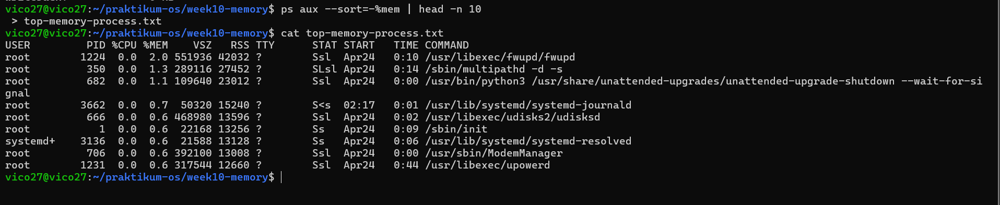
Analisis
1. Proses apa di urutan pertama? Catat nilai %MEM dan RSS.
    *  %MEM: 2.0
    *  RSS: 42032
2. Konversikan RSS ke MB (bagi 1024). Apakah wajar?
    *  42032/1024 = 41.05 MB
3. Jumlahkan %MEM dari 5 proses teratas. Berapa persen RAM yang mereka gunakan bersama?
    * Proses 1 (fwupd): 2.0%
    * Proses 2 (multipathd): 1.3%
    * Proses 3 (python3 / unattended-upgrades): 1.1%
    * Proses 4 (systemd-journald): 0.7%
    * Proses 5 (udisksd): 0.6%
    * Total Perhitungan: 2.0 + 1.3 + 1.1 + 0.7 + 0.6 = **5.7%**

## Tugas 10.3 Membuat dan Memverifikasi Swap File
Instruksi: Buat swap file khusus tugas sebesar 256 MB dan verifikasi
```
sudo fallocate-l 256M /swapfile-tugas-week10
sudo chmod 600 /swapfile-tugas-week10
sudo mkswap /swapfile-tugas-week10
sudo swapon /swapfile-tugas-week10
```
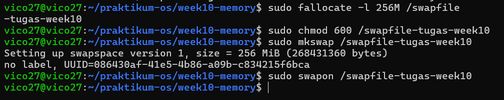
```
{
echo "=== VERIFIKASI SWAP ==="
swapon--show
echo
free-h
} > swap-check.txt
cat swap-check.txt
```
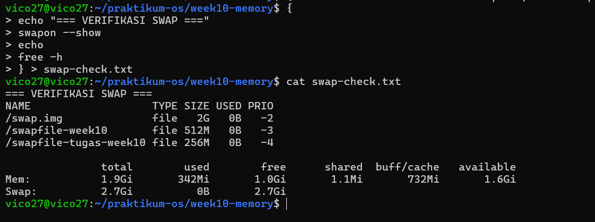

#### Analisis
1. Identifikasi kolom NAME, TYPE, SIZE, dan USED pada output swapon–show.
    * Nama : /swapfile-tugas-week10
    * Type : file
    * Size : 256M
    * Used : 0 
2. Apakah nilai total pada baris Swap di free-h bertambah 256 MB?
    * Ya, bertambah 2G + 0.5G = 2.5G
3. Mengapa permission 600 penting? Apa risiko jika diatur ke 644?
    * Pentingnya 600: File swap pada dasarnya adalah "fotokopi" dari RAM fisik.
    * Risiko 644: Permission terbuka (644) membuat pengguna lain bisa membaca isi memori tersebut

## Tugas 10.4 Analisis System Call dengan strace
Instruksi: Analisis system call yang dipanggil perintah ls
```
strace-c ls 2> strace-summary.txt
strace ls /etc 2> strace-ls-etc.txt
cat strace-summary.txt
```
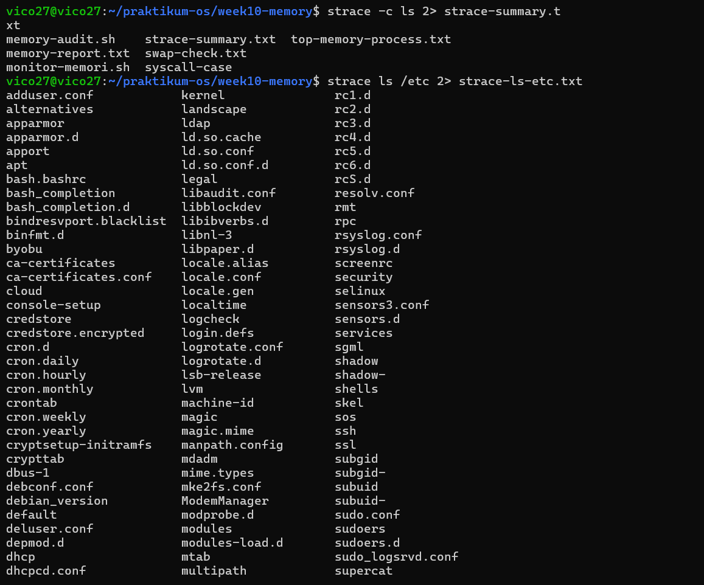
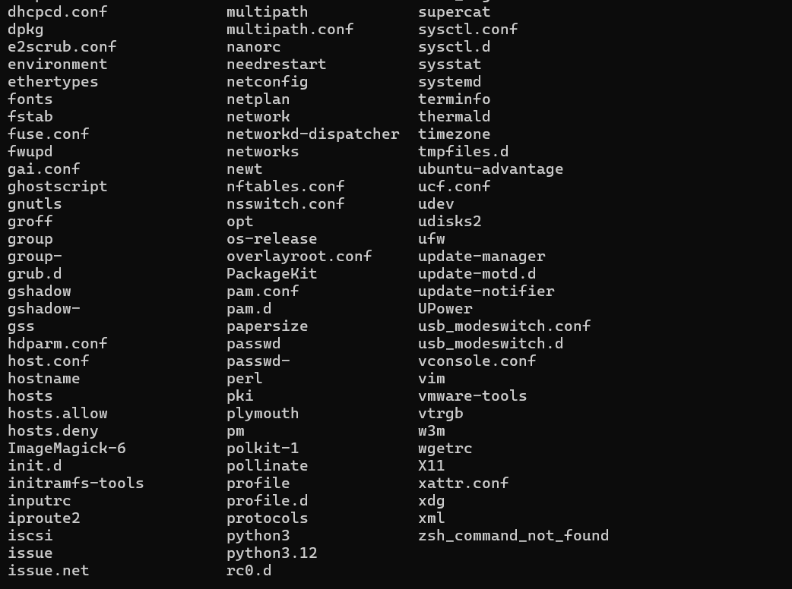
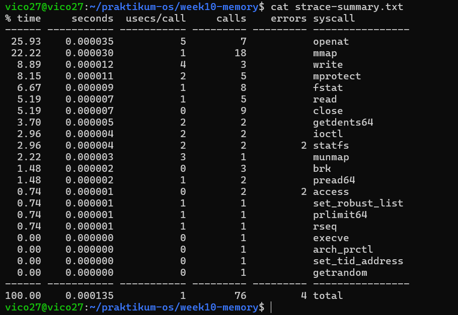

#### Analisis
1. Sebutkan minimal 5 system call dari strace-summary.txt beserta fungsi singkatnya.

    1. mmap: Berfungsi untuk memetakan file atau device ke dalam memori virtual. Biasanya dipakai saat program memuat shared libraries ke dalam RAM.

    2. openat: Berfungsi untuk membuka file atau direktori agar isinya bisa diakses oleh program.

    3. close: Berfungsi untuk menutup file descriptor yang sebelumnya dibuka oleh program, sehingga resource memori bisa dibebaskan kembali.

    4. fstat: Berfungsi untuk mengambil informasi atau metadata tentang sebuah file (seperti ukuran, permission, dan waktu modifikasi) tanpa harus membuka isi filenya.

    5. read: Berfungsi untuk membaca barisan data (byte) dari sebuah file descriptor yang sedang terbuka.

2. System call mana yang paling sering dipanggil? Mengapa?
    * paling banyak dipanggil adalah mmap dengan jumlah 18 kali panggilan.
    * karena program sesederhana perintah ls itu tetap membutuhkan banyak pustaka bantuan (shared libraries) untuk bisa berfungsi, misalnya pustaka dari libc untuk mencetak teks ke layar. Setiap kali kernel memuat satu library tersebut ke dalam memori virtual, ia akan mengeksekusi system call mmap.
3. Apakah ada errors lebih dari 0? Apakah program tetap berjalan normal meskipun ada kegagalan tersebut?
    * Ya ada , yaitu  2 statfs dan access
    * Ya, program tetap berjalan sangat normal tanpa crash

## Tugas 10.5 Studi Kasus Diagnosa Server Lambat
```
nano ~/praktikum-os/week10-memory/diagnosa-server.sh
```
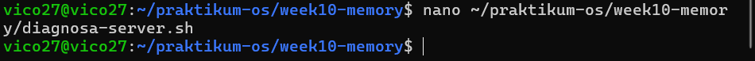

Isi ini dalam nano ~/praktikum-os/week10-memory/diagnosa-server.sh
```
#!/bin/bash
set-euo pipefail
LAPORAN="diagnosa-server-lambat.txt"
WARN_MEM=false
WARN_SWAP=0
cek_memori() {
echo "---Kondisi Memori---"
free-h
echo
AVAIL_PCT=$(free | awk '/Mem/ {printf "%d", $7/$2*100}
')
if [ "$AVAIL_PCT"-lt 20 ]; then
echo "PERINGATAN: Memori tersedia hanya ${
AVAIL_PCT}%"
WARN_MEM=true
fi
}
cek_swap() {
echo "---Penggunaan Swap---"
swapon--show 2>/dev/null || echo "Tidak ada swap
aktif"
echo
WARN_SWAP=$(free | awk '/Swap/ {print $3}')
if [ "$WARN_SWAP"-gt 0 ]; then
echo "INFO: Swap digunakan (${WARN_SWAP} kB)"
fi
}
cek_proses() {
echo "---10 Proses Memori Tertinggi---"
ps aux--sort=-%mem | head-n 11
echo
}
cek_paging() {
echo "---Aktivitas Paging (5 sampel)---"
vmstat 1 5
echo
}
ringkasan() {
echo "=== RINGKASAN ==="
if [ "$WARN_MEM" = true ]; then
echo "-Memori: KRITIS-perlu tindakan segera"
else
echo "-Memori: normal"
fi
if [ "$WARN_SWAP"-gt 0 ]; then
echo "-Swap: aktif-pantau aktivitas paging"
else
echo "-Swap: tidak digunakan"
fi
}
{
echo "=== LAPORAN DIAGNOSA SERVER ==="
date
echo
cek_memori
cek_swap
cek_proses
cek_paging
ringkasan
} | tee "$LAPORAN"
echo
echo "Laporan disimpan ke: $LAPORAN"

```

```
chmod +x ~/praktikum-os/week10-memory/diagnosa-server.sh
cd ~/praktikum-os/week10-memory
bash diagnosa-server.sh
```
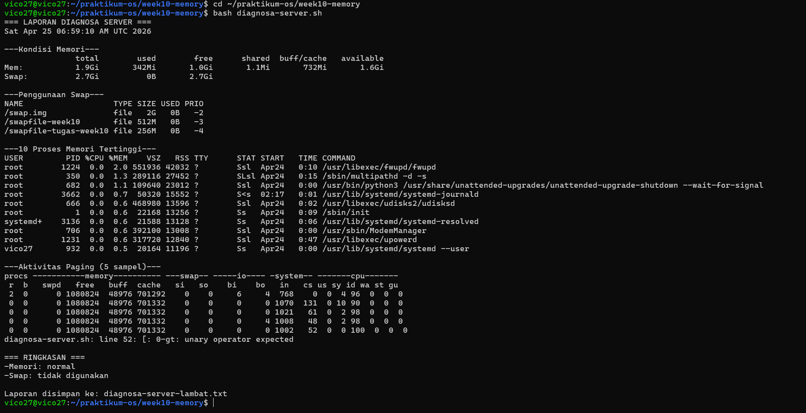

#### Analisis
1. Jelaskan peran masing-masing fungsi: cek_memori, cek_swap, cek_proses,cek_paging, dan ringkasan. Mengapa diagnosa dipecah menjadi fungsi terpisah?
    * cek_memori: Mengecek kapasitas RAM secara keseluruhan menggunakan perintah free -h dan menghitung persentase ketersediaannya.  
    * cek_swap: Mengidentifikasi apakah ada memori swap yang aktif dan berapa kapasitas yang sedang digunakan saat ini.  
    * cek_proses: Mengambil snapshot 10 proses teratas yang paling banyak menyedot memori menggunakan perintah ps.  
    * cek_paging: Memantau pergerakan data antara RAM dan disk (swap) secara real-time selama 5 detik menggunakan perintah vmstat 1 5.  
    * ringkasan: Mengevaluasi hasil dari fungsi-fungsi sebelumnya (lewat variabel WARN_MEM dan WARN_SWAP) untuk mencetak status akhir server. 
2. Berdasarkan bagian RINGKASAN, apakah kondisi sistem normal atau kritis? Jelaskan berdasarkan nilai threshold yang digunakan script.
    * normal , Pada fungsi cek_memori, terdapat kondisi threshold (batas aman) yang tertulis if [ "$AVAIL_PCT" -lt 20 ]. Artinya, sistem hanya akan berstatus KRITIS jika persentase memori yang tersedia berada di bawah 20%. Karena memori avaiable-mu masih sekitar 84%, maka sistem aman dan mengeksekusi blok status normal.
3. Mengapa script menggunakan tee "$LAPORAN" bukan redirection biasa > "$LAPORAN"? Apa keuntungannya?
    * Jika menggunakan redirection biasa seperti > "$LAPORAN", semua teks output akan langsung ditelan dan dimasukkan ke dalam file, sehingga layar terminalmu akan kosong melompong saat script berjalan.
    * Penggunaan perintah tee "$LAPORAN" memiliki keuntungan ganda: ia menampilkan hasil diagnosa secara langsung di layar terminal agar kamu bisa langsung membacanya, sekaligus menyalin teks tersebut ke dalam file teks untuk disimpan sebagai laporan.
4. Dari output cek_paging, apakah ada aktivitas si atau so? Jika ada, apa implikasinya terhadap performa server?

    * Dari output cek_paging, tidak ada aktivitas si dan so (keduanya bernilai 0). Jika seandainya ada aktivitas si dan so yang tinggi, implikasinya adalah server akan mengalami penurunan performa yang drastis (lambat) karena kernel sibuk melakukan proses paging ke disk yang kecepatannya jauh lebih lambat daripada RAM. 

