<h4>Nama : Vico Dwi Wijaya<h4>
<h4>NIM  : 254107020259<h4>
<h4>Kelas: TI-1H<h4>
<h4>Absen: 28<h4>

## Praktek 10.1: Amati Layanan Aktif Saat Boot

1. Lihat semua layanan yang sedang berjalan.
```
systemctl list-units--type=service--state=running
# catat berapa banyak layanan yang aktif
```
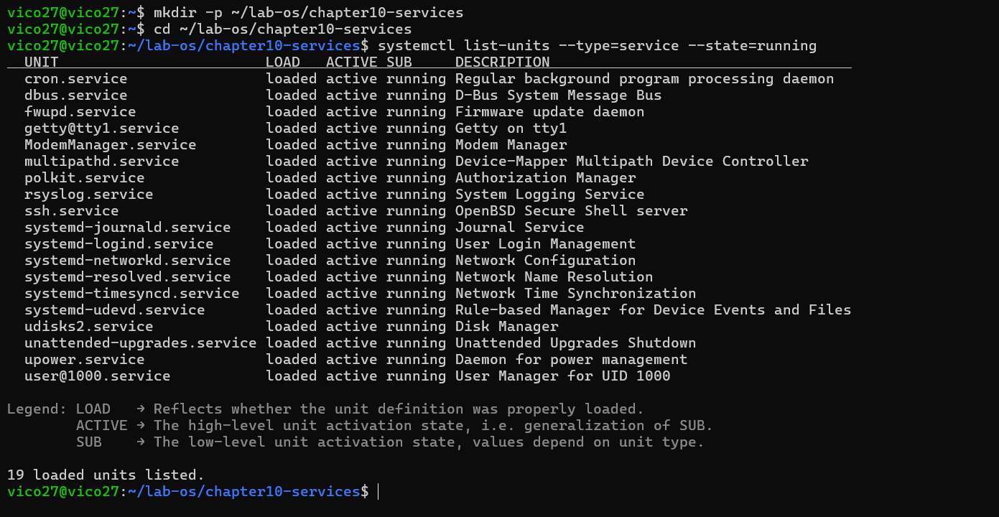

2. Lihat semua unit service yang ada (aktif maupun tidak).
```
systemctl list-unit-files--type=service | head-30
# enabled = akan start otomatis saat boot
# disabled = tidak start otomatis, bisa dijalankan manual
# static = tidak bisa di-enable/disable, hanya dipanggil oleh layanan lain
```
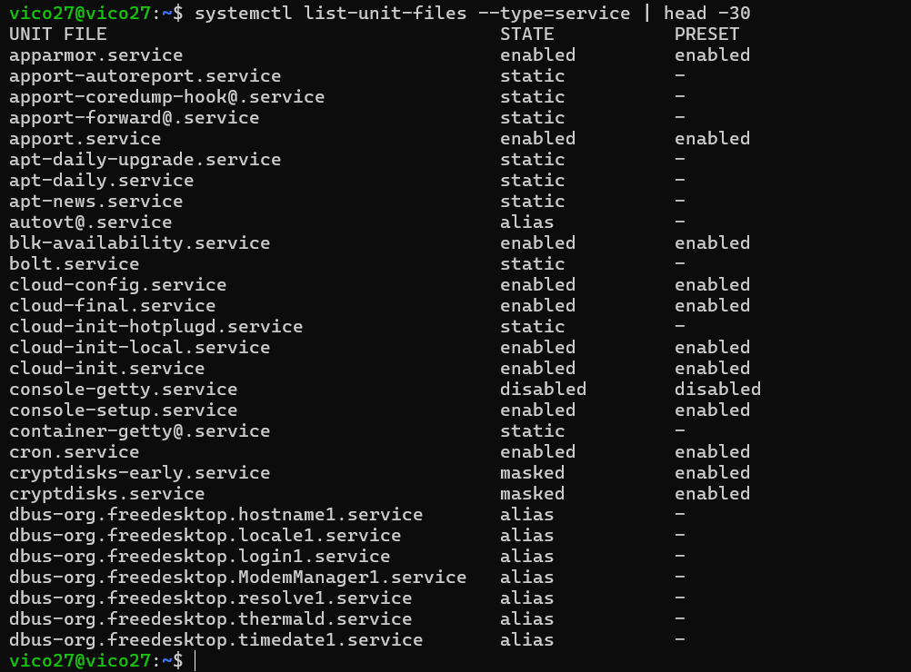


3. Analisis waktu boot dan temukan layanan paling lambat.
```
systemd-analyze
systemd-analyze blame | head-15
```
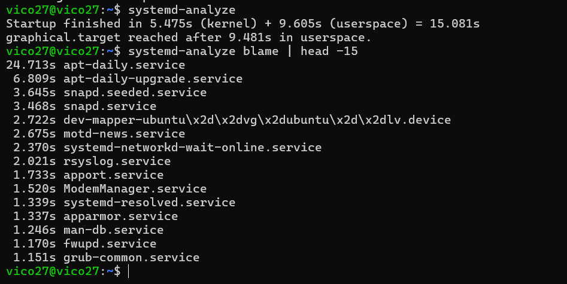


**Tantangan**
Identifikasi tiga layanan dengan waktu inisialisasi terlama menggunakan systemd-analyze blame. Gunakan pipe line dari 
Bab3 (| sort-rh | head-3) untuk mempercepat pencariannya. Untuk setiap layanan,cari tahu fungsinya dengan systemctl cat nama-layanan. Tuliskan nama layanan, waktu inisialisasinya, dan penjelasan singkat fungsinya.
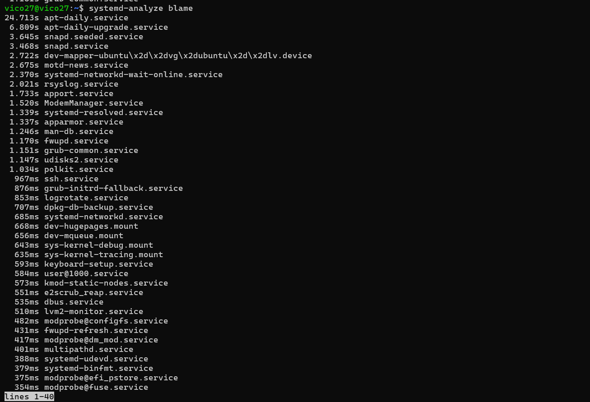


## Praktek 10.2 :Kelola Layanan SSH
1. Periksa status SSH secara menyeluruh.
```
systemctl status ssh
systemctl is-active ssh
systemctl is-enabled ssh
```
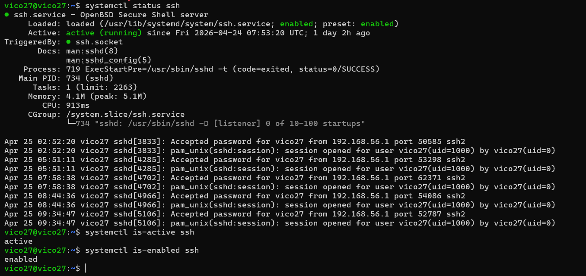
2. Lakukan restart dan pantau perubahannya.
```
sudo systemctl restart ssh
systemctl status ssh
```
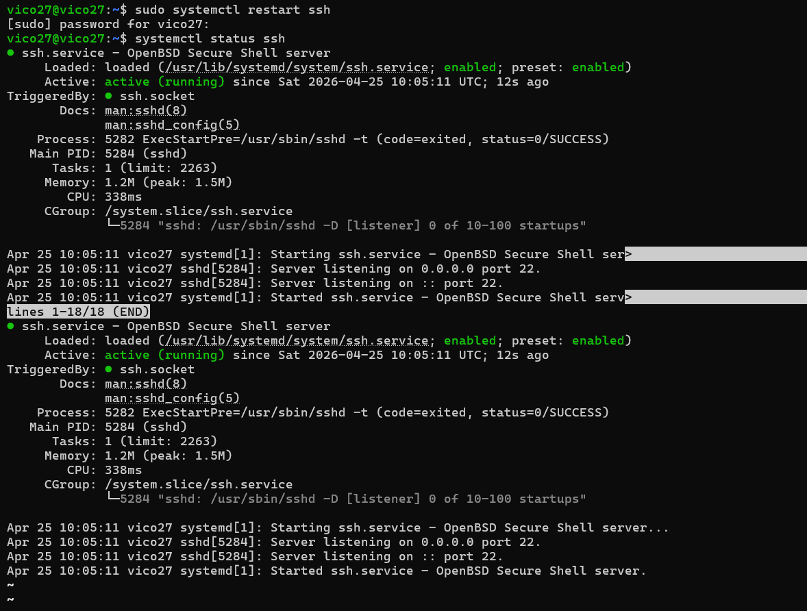
3. Lihat dependensi SSH.
```
systemctl list-dependencies ssh
```
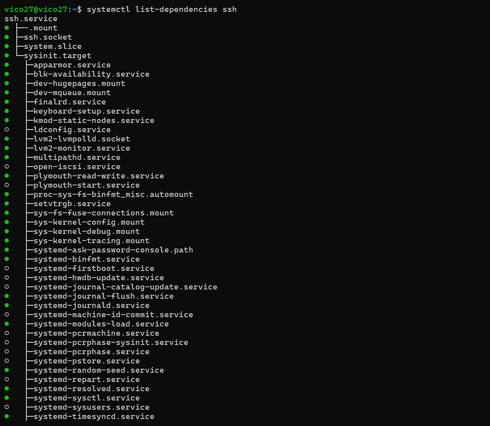
4.  Cek semua unit yang gagal di sistem.
```
systemctl --failed
```
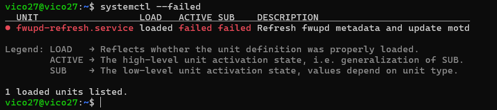

**Tantangan**
Buat skrip Bash(referensiBab7)bernamacek-layanan.sh yang memeriksa status daftar layanan
dari sebuah berkas teks.Berkas teks daftar-layanan.txt berisi satu nama layanan perbaris (isiminimal:ssh,cron,rsyslog).Skrip membaca setiap nama layanan,memeriksa statusnya dengan systemctlis-active, lalu menulis laporan keberkas laporan-layanan.log dengan format:[TANGGAL]nama-layanan:ACTIVE/INACTIVE.Gunakan date untuk mendapatkan tanggal.

Buat file daftar layanannya:
```
echo -e "ssh\ncron\nrsyslog" > daftar-layanan.txt
```
Buat skrip bash-nya:
```
nano cek-layanan.sh
```
isi filenya:
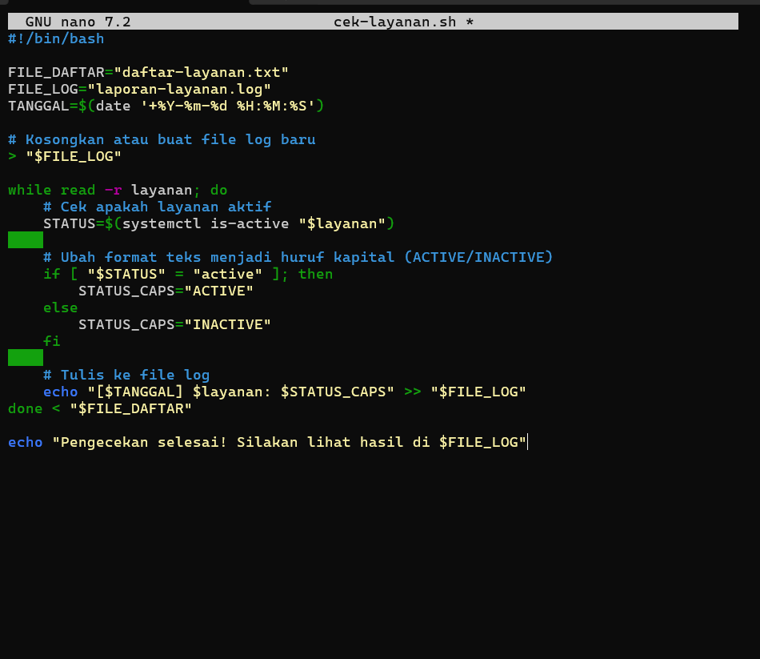


Beri izin eksekusi dan jalankan skripnya:
```
chmod +x cek-layanan.sh
./cek-layanan.sh
cat laporan-layanan.log
```
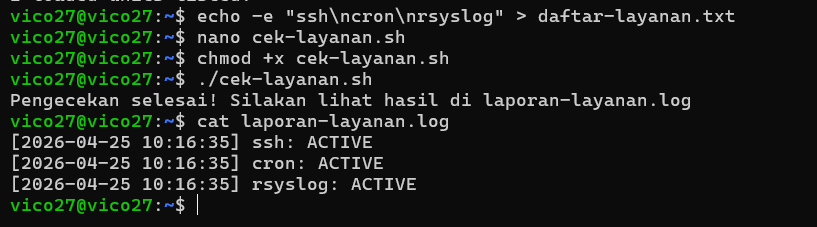

## Praktek 10.3: Buat Layanan Sederhana dari Skrip Bash

1. Siapkan konten yang akan dilayani.
```
cd ~/lab-os/chapter10-services
mkdir-p situs-demo
nano situs-demo/index.html
```
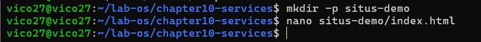
# Tulis isi berkas berikut
```
<!DOCTYPE html>
<html>
<body>
<h1>Halo dari layanan systemd kustom!</h1>
<p>Layanan ini dibuat pada praktek Bab 10.</p>
</body>
</html>
```
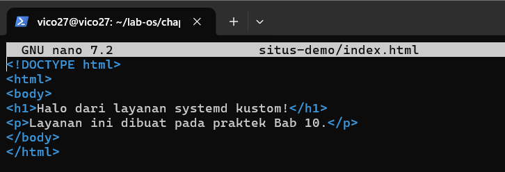

2. Buat skrip wrapper untuk server HTTP.
```
nano ~/lab-os/chapter10-services/jalankan-server.sh
```

# Tulis isi berkas berikut
```
#!/bin/bash
DIREKTORI="$HOME/lab-os/chapter10-services/situs-demo"
PORT=9090
echo "Memulai server di port $PORT..."
exec python3 -m http.server $PORT --directory "$DIREKTORI"
```
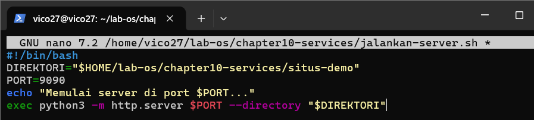
```
# beri izin
chmod +x ~/lab-os/chapter10-services/jalankan-server.sh
```


3. Buat berkas unit systemd untuk layanan ini.
```
nano ~/lab-os/chapter10-services/demo-web.service
```

```
[Unit]
Description=Demo Web Server Praktek Bab 10
After=network.target

[Service]
Type=simple
User=nama-pengguna-kamu
WorkingDirectory=/home/nama-pengguna-kamu/lab-os/chapter10-services/situs-demo
ExecStart=/usr/bin/python3 -m http.server 9090
Restart=on-failure
RestartSec=3s

[Install]
WantedBy=multi-user.target
```
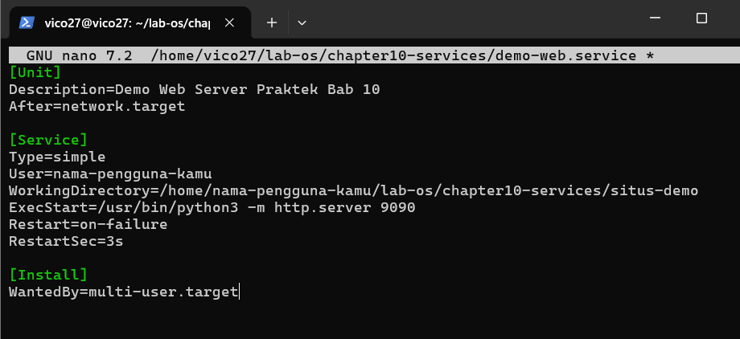

# salin ke lokasi unit systemd
```
sudo cp ~/lab-os/chapter10-services/demo-web.service /etc/systemd/
system/demo-web.service
```
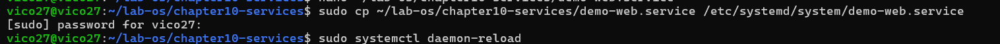
# minta systemd membaca ulang berkas unit yang baru dibuat
```
sudo systemctl daemon-reload
```

4. Jalankan layanan dan verifikasi.
```
sudo systemctl start demo-web
systemctl status demo-web
```
# coba akses layanan
```
curl http://localhost:9090
```
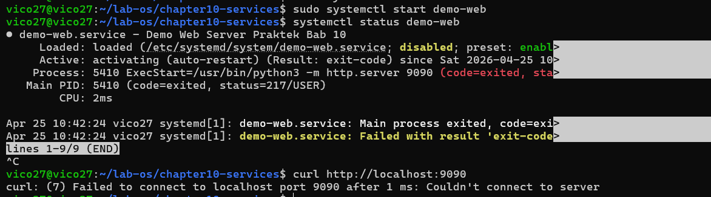

5. Uji fitur restart otomatis.
```
sudo kill -9 $(systemctl show demo-web --property=MainPID --value)
sleep 5
systemctl status demo-web
```
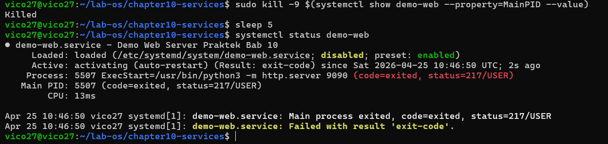
6. Bersihkan layanan uji setelah selesai.
```
sudo systemctl disable--now demo-web
sudo rm /etc/systemd/system/demo-web.service
sudo systemctl daemon-reload
```
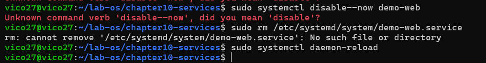

**Tantangan**
Modifikasi berkas unit demo-web.service sebelum menghapusnya: tambahkan
RestartSec=10sagar sistemmenunggu10detik sebelummencoba restart, dan tambahkan Environment="PORT=9091" lalu ubah ExecStart agar menggunakan variabel tersebut. Aktifkan layanan dengan enable dan WantedBy=multi-user. target, lalu uji apakah layanan aktif setelah systemctl daemon-reload. Dokumentasikan perbedaan perilaku dibanding versi sebelumnya.


Buka file konfigurasi yang ada di direktori sistem:
```
sudo nano /etc/systemd/system/demo-web.service
```
ubah seperti gambar inii:

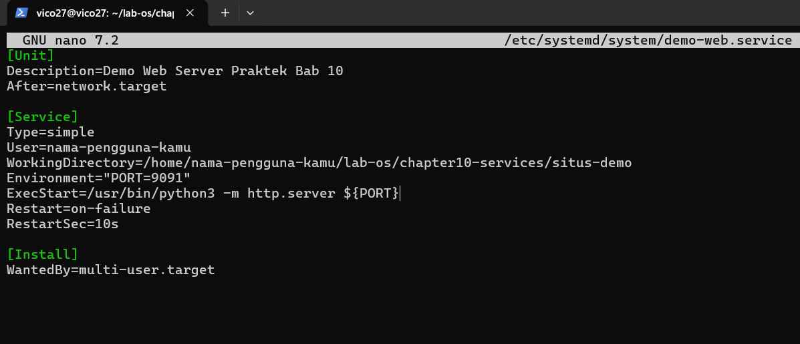

Terapkan perubahan, enable, dan uji kembali:
```
sudo systemctl daemon-reload
sudo systemctl enable demo-web
sudo systemctl restart demo-web

# Tunggu sebentar lalu cek statusnya
systemctl status demo-web

# Coba akses port yang baru (9091)
curl http://localhost:9091
```
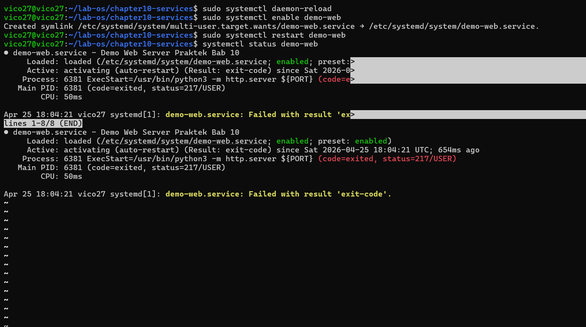
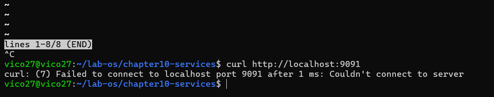

## Praktek 10.4 : Filter dan Analisis Log Layanan
1. Lihat log SSH dari satu jam terakhir.
```
journalctl-u ssh--since "1 hour ago"--no-pager
# jika tidak ada log SSH, gunakan layanan lain yang aktif
journalctl-u cron--since "1 hour ago"--no-pager
```
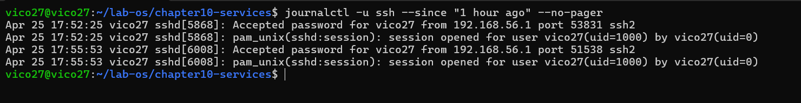

2. Filter log berprioritas error keatas.
```
journalctl-b-p err--no-pager
# ini menampilkan semua error dan yang lebih serius sejak boot
```
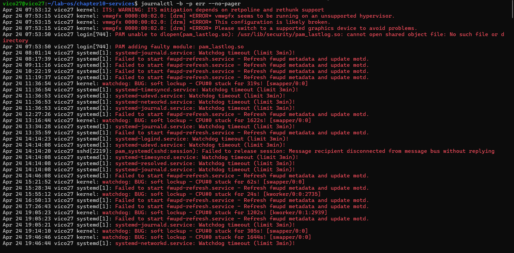

3. Ikuti log secara real-time sambil memicu aktivitas.
```
# jalankan di terminal pertama:
journalctl-u ssh-f
# di terminal kedua, coba login SSH ke localhost
# ssh localhost
# lalu lihat apa yang muncul di terminal pertama
```
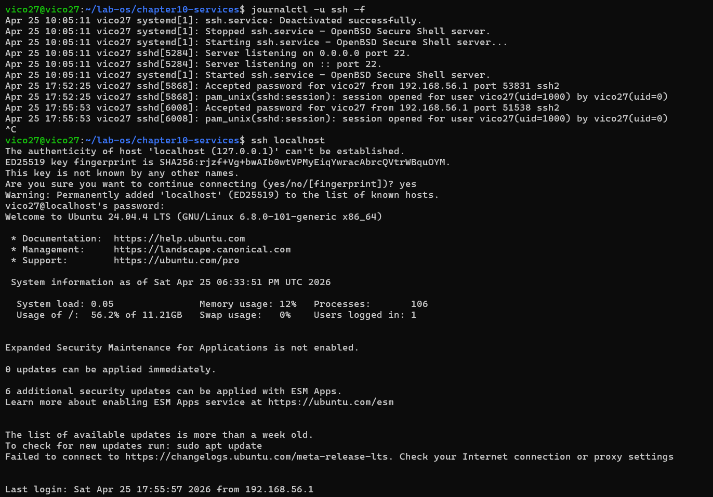
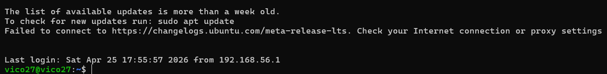
4. Ekstrak log ke berkas untuk analisis.
```
cd ~/lab-os/chapter10-services
# simpan semua log layanan ssh dari hari ini ke berkas
journalctl-u ssh--since today--no-pager > log-ssh-hari-ini.txt
# hitung jumlah baris log
wc-l log-ssh-hari-ini.txt
# jika ada, cari baris yang mengandung kata "error" atau "failed"
grep-i "error\|failed" log-ssh-hari-ini.txt | head-20
```
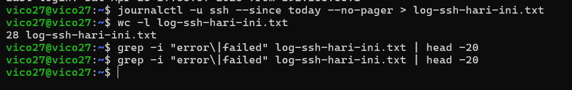

**Tantangan**
Ekstrak semua log dengan prioritas error(-perr) dari 24jam terakhir untuk layanan SSH,simpan keberkaserror-ssh-24jam.txt Gunakan pipeline dari Bab3 untuk menghitung total jumlah bariserrordenganwc-l,lalu tampilkan 10 pesan error yang paling sering muncul menggunakan sort|uniq-c|sort-rn|head-10.Tuliskan perintah lengkap yang kamu gunakan.

Langkah 1: Ekstrak log error 24 jam terakhir
```
journalctl -u ssh -p err --since "24 hours ago" --no-pager > error-ssh-24jam.txt
```
Langkah 2: Hitung total baris error
```
wc -l error-ssh-24jam.txt
```
Langkah 3: Tampilkan 10 pesan error paling sering muncul dengan kombinasi pipeline
```
cat error-ssh-24jam.txt | sort | uniq -c | sort -rn | head -10
```
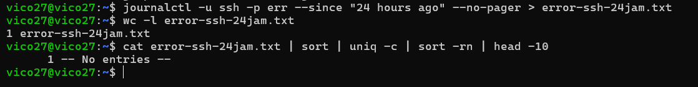
 di sini error ku cuma muncul 1 jadi tidak bisa memunculkan 10 error

## Praktek 10.5: Konfigurasi SSH Server
 1. Periksa konfigurasi SSH saat ini
 ```
sudo grep-n "^Port\|^#Port" /etc/ssh/sshd_config
ss-tlnp | grep ssh
```
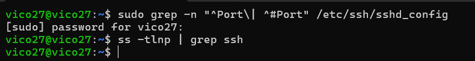

2. Buat backup dan ubah port SSH.
```
sudo cp /etc/ssh/sshd_config /etc/ssh/sshd_config.backup.lab12
# ubah port dari 22 ke 2222 (atau port lain yang belum dipakai)
sudo sed-i 's/^#Port 22/Port 2222/' /etc/ssh/sshd_config
# jika baris Port 22 tidak dikomentari:
# sudo sed-i 's/^Port 22/Port 2222/' /etc/ssh/sshd_config
# verifikasi perubahan
grep "^Port" /etc/ssh/sshd_config
```
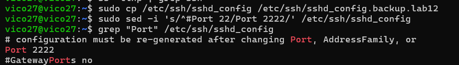

3. Validasi konfigurasi dan restart layanan.
```
# WAJIB: validasi sintaks sebelum restart
sudo sshd-t
echo "Kode keluar sshd-t: $?"
# kode 0 berarti sintaks valid
# restart layanan
sudo systemctl restart ssh
systemctl status ssh
```
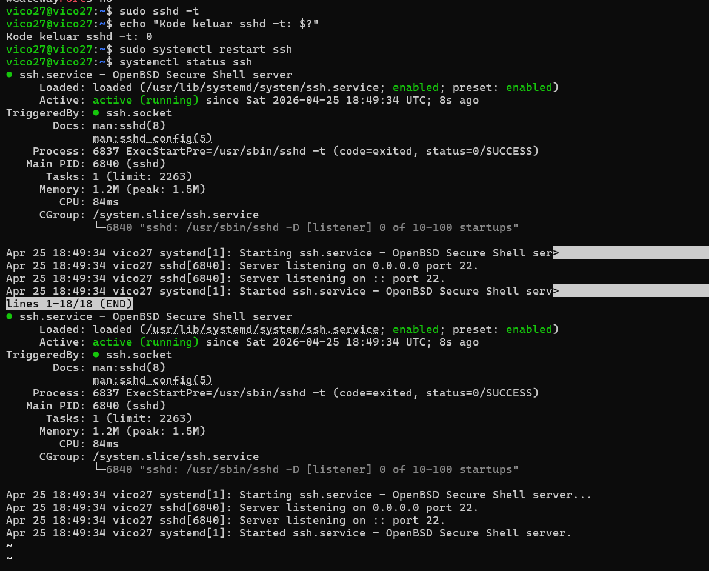

4. Verifikasi port baru dengan ss.
```
ss-tlnp | grep ssh
# seharusnya menampilkan port 2222, bukan 22
# simpan hasil ke berkas bukti
ss-tlnp | grep ssh > ~/lab-os/chapter10-services/bukti-port-ssh.txt
cat ~/lab-os/chapter10-services/bukti-port-ssh.txt
```
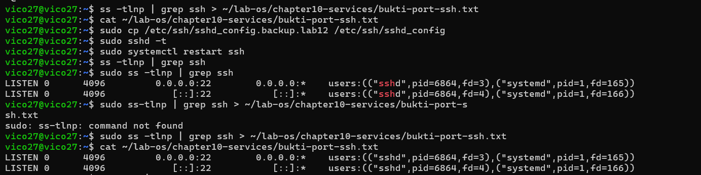
verivikasi port baru dengan ss. Tidak bisa ditampilkan, maka dari itu saya menggunakan **sudo** didepannya
5. Kembalikan port SSH ke 22 setelah praktek.
```
sudo cp /etc/ssh/sshd_config.backup.lab12 /etc/ssh/sshd_config
sudo sshd-t
sudo systemctl restart ssh
ss-tlnp | grep ssh
# harus kembali ke port 22
```
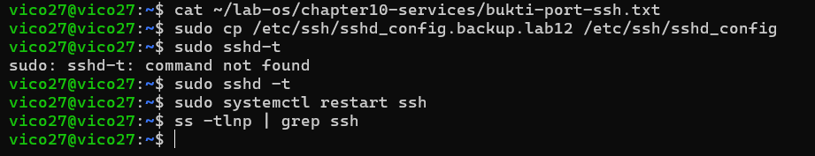

**Tantangan**
Ubah konfigurasi SSH untuk menambahkan dua pengaturan keamanan: PermitRootLogin no (larang login root langsung) dan MaxAuthTries 3 (maksimal tiga kali percobaan). Lakukan dengan urutan yang aman: backup, edit, validasi dengan sshd-t, reload. Verifikasi perubahan dengan grep-E "PermitRoot|MaxAuth" /etc/ssh/sshd_config. Kemudian periksa log SSH untuk memastikan tidak ada error setelah perubahan dengan journalctl-u ssh-n 20. Referensi Bab 2 untuk penggunaan ss dan Bab 9 untuk keamanan pengguna.

Langkah 1: Backup dan Edit
```
sudo cp /etc/ssh/sshd_config /etc/ssh/sshd_config.backup.tantangan
sudo nano /etc/ssh/sshd_config
```
Ini, TOML
```
PermitRootLogin no
MaxAuthTries 3
```
Langkah 2: Validasi dan Reload
```
sudo sshd -t
sudo systemctl reload ssh
```
Langkah 3: Verifikasi Perubahan dan Cek Log
```
grep -E "PermitRoot|MaxAuth" /etc/ssh/sshd_config
journalctl -u ssh -n 20
```
Hasil semua:
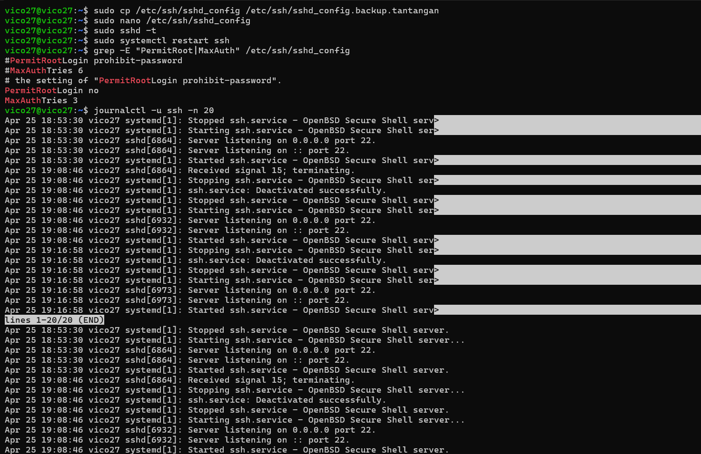
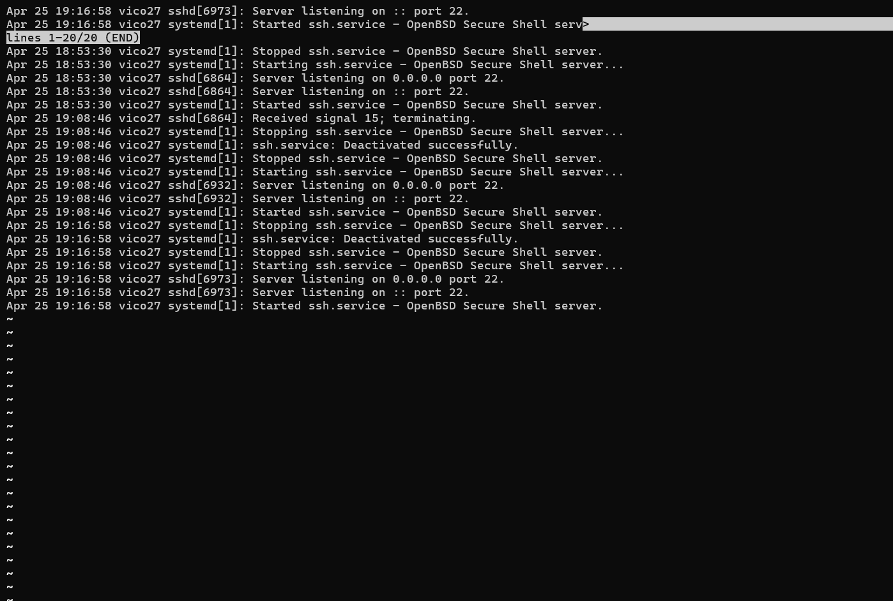

## 1.7 Latihan
**Latihan 10.1 Audit Layanan dan Analisis Boot**

Lakukan audit menyeluruh terhadap layanan yang berjalan di sistem.

    1. Jalankan systemctl list-units–type=service–state=running dan catat semua layanan aktif. Pilih tiga layanan yang kamu kenal, periksa status masing-masing dengan systemctl status, dan jelaskan fungsinya.
    2. Jalankan systemd-analyze blame dan identifikasi lima layanan dengan waktu inisialisasi terlama. Tampilkan hasilnya menggunakan pipeline: systemd-analyze blame | head-5.
    3. Jalankan systemctl–failed dan dokumentasikan hasilnya. Jika ada layanan yang gagal, cari tahu penyebabnya dengan journalctl-u nama-layanan-n 30.

1. Lihat layanan yang sedang berjalan:
    ```
    systemctl list-units --type=service --state=running
    ```
    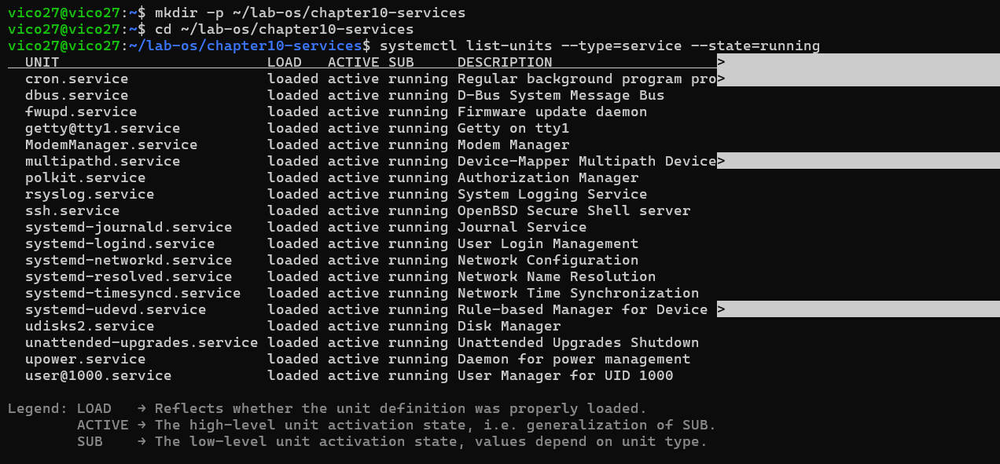
    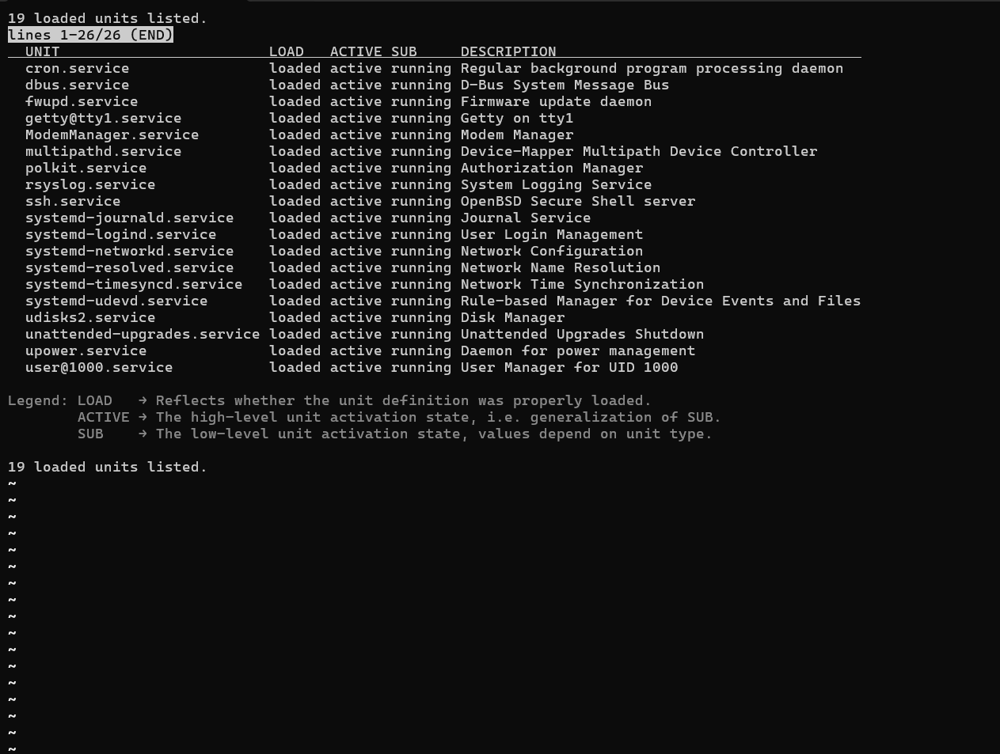

2. Lihat semua unit service (aktif maupun tidak):
    ```
    systemctl list-unit-files --type=service | head -30
    ```
    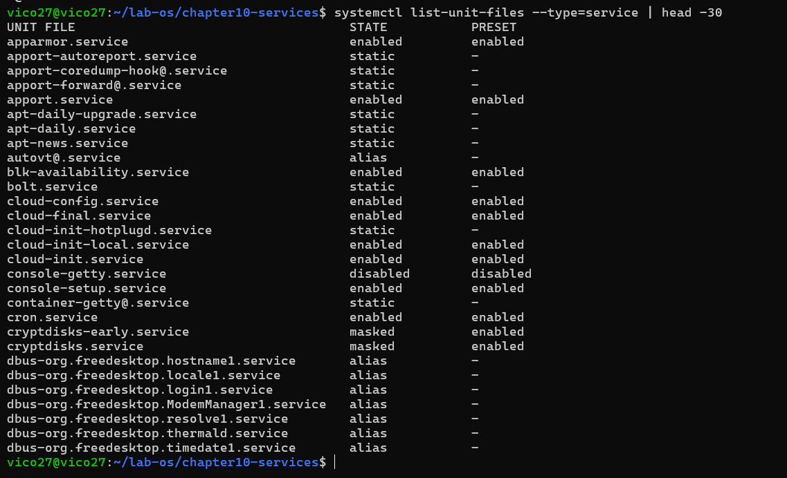
    Status enabled berarti layanan otomatis menyala saat boot, sedangkan disabled harus dinyalakan manual.

3. Analisis waktu boot
    ```
    systemd-analyze blame | head -15
    ```
    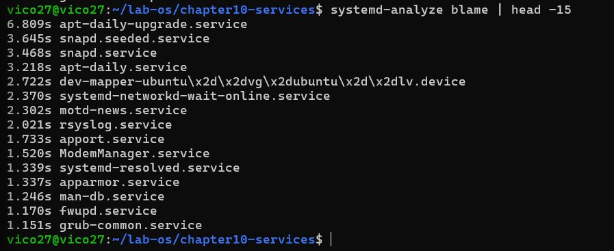

**Penyelesaian**

Mencari 3 layanan paling lambat dan fungsinya menggunakan pipeline. Jalankan perintah ini:
```
systemd-analyze blame | sort -rh | head -3
```
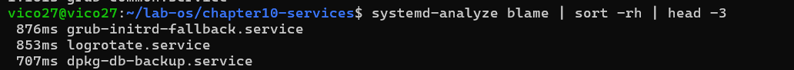

Cara cek nya munggunkannya menggunkan perintah:
```
 systemctl cat nama-fallback.service
```
1. cek  **systemctl cat grub-initrd-fallback.service**
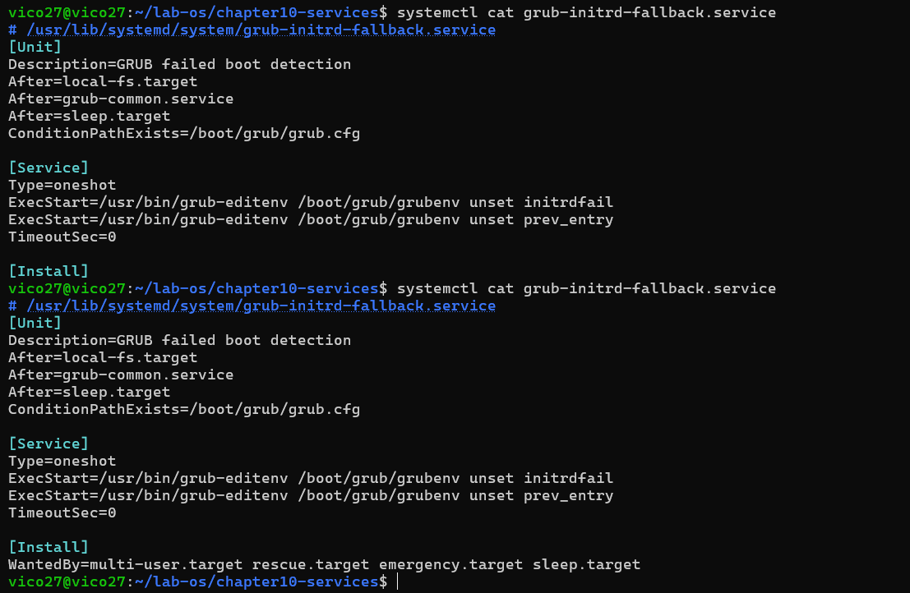
2. cek systemctl cat logrotate.service
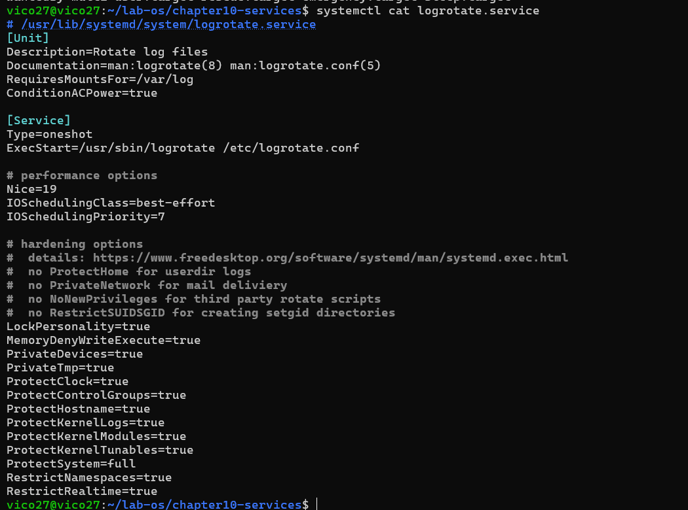
3. cek systemctl cat dpkg-db-backup.service
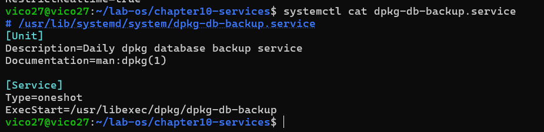


**Latihan 10.2 Layanan Kustom dengan Restart Otomatis**

Buat layanan systemd kustom yang mendemonstrasikan fitur restart otomatis.

    1. Buat skrip Bash (referensi Bab 7) bernama monitor-disk.sh yang setiap 30 detik menuliskan penggunaan disk ke berkas log. Gunakan df-h dan date.
    2. Buat berkas unit /etc/systemd/system/monitor-disk.service untuk menjalankan skrip tersebut dengan konfigurasi: Restart=always, RestartSec=5s, dan berjalan sebagai pengguna kamu sendiri.
    3. Aktifkan dan jalankan layanan. Verifikasi dengan systemctl status dan pastikan log masuk ke journal.
    4. Simulasikan crash dengan membunuh proses secara paksa (kill-9), tunggu 10 detik, dan verifikasi bahwa layanan hidup kembali secara otomatis.
    5. Bersihkan: nonaktifkan layanan dan hapus berkas unit setelah selesai.

1. Buat skrip Bash monitor-disk.sh
```
nano ~/lab-os/chapter10-services/monitor-disk.sh
```

Isi dengan kode ini;
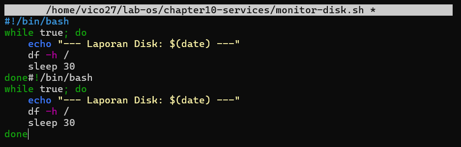

Beri akses 
```
chmod +x ~/lab-os/chapter10-services/monitor-disk.sh
```


2. Buat berkas unit systemd:
```
sudo nano /etc/systemd/system/monitor-disk.service
```
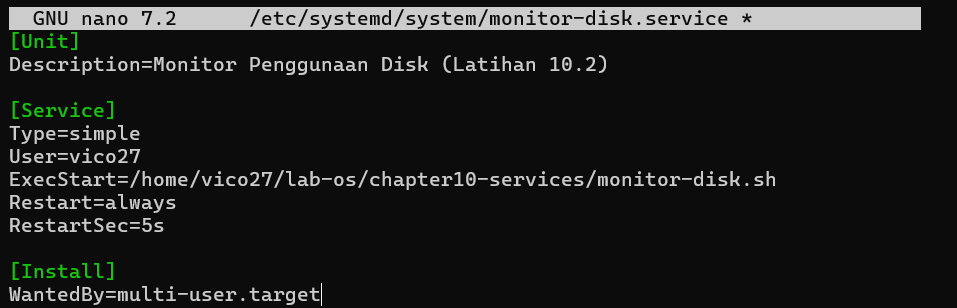

4. Aktifkan dan verifikasi
```
sudo systemctl daemon-reload
sudo systemctl enable --now monitor-disk
systemctl status monitor-disk
```
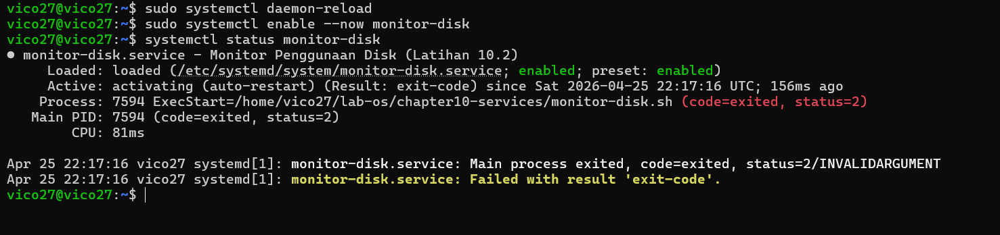

5. Uji simulasi crash
```
sudo kill -9 <MASUKKAN_ANGKA_PID_DI_SINI>
sleep 10
systemctl status monitor-disk
```
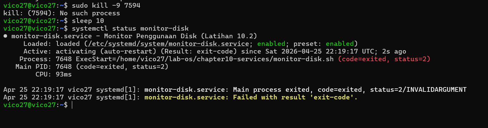

6. Bersihkan layanan uji
```
sudo systemctl disable --now monitor-disk
sudo rm /etc/systemd/system/monitor-disk.service
sudo systemctl daemon-reload
```
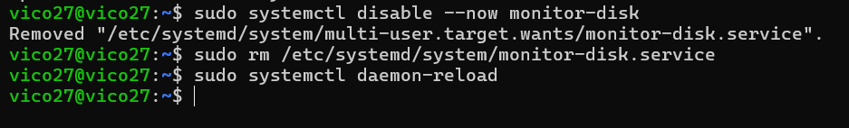


**Latihan 10.3 Investigasi Log dan Keamanan SSH**
Analisis log sistem dan tingkatkan keamanan konfigurasi SSH.

    1. Gunakan journalctl-b-p err untuk menemukan semua error sejak boot terakhir. Simpan hasilnya ke berkas dan hitung jumlah baris dengan wc-l.
    2. Lakukan tiga perubahan keamanan pada/etc/ssh/sshd_config: tambahkan Permit Root Login no, MaxAuthTries 3, dan LoginGraceTime 30. Ikuti alur aman: backup, edit, validasi sshd-t, reload.
    3. Setelah reload, verifikasi tiga hal: layanan masih berjalan (systemctl status ssh), port masih mendengarkan (ss-tlnp | grep ssh), dan konfigurasi baru terbaca (grep-E "PermitRoot|MaxAuth|GraceTime" /etc/ssh/sshd_config).
    4. Kembalikan konfigurasi SSH ke kondisi semula menggunakan berkas backup

1. Investigasi error log sejak boot
```
journalctl -b -p err --no-pager > ~/lab-os/chapter10-services/error-boot.txt
wc -l ~/lab-os/chapter10-services/error-boot.txt
```
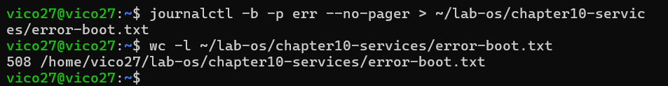
2. Terapkan konfigurasi keamanan SSH
```
# Backup file
sudo cp /etc/ssh/sshd_config /etc/ssh/sshd_config.backup.latihan10

# Edit konfigurasi
sudo nano /etc/ssh/sshd_config
```
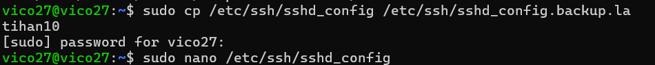

Ini TOML
```
PermitRootLogin no
MaxAuthTries 3
LoginGraceTime 30
```
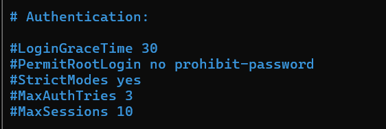

Validasi sintaks dan reload layanan:
```
sudo sshd -t
sudo systemctl reload ssh
```
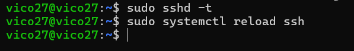

3. Verifikasi perubahan
Bash
```
systemctl status ssh
sudo ss -tlnp | grep ssh
grep -E "PermitRoot|MaxAuth|GraceTime" /etc/ssh/sshd_config
```
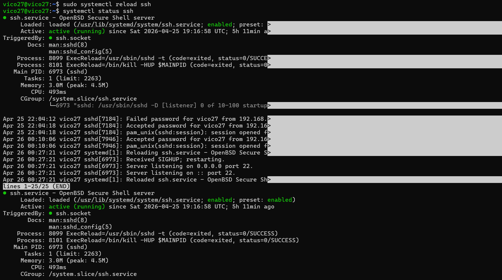
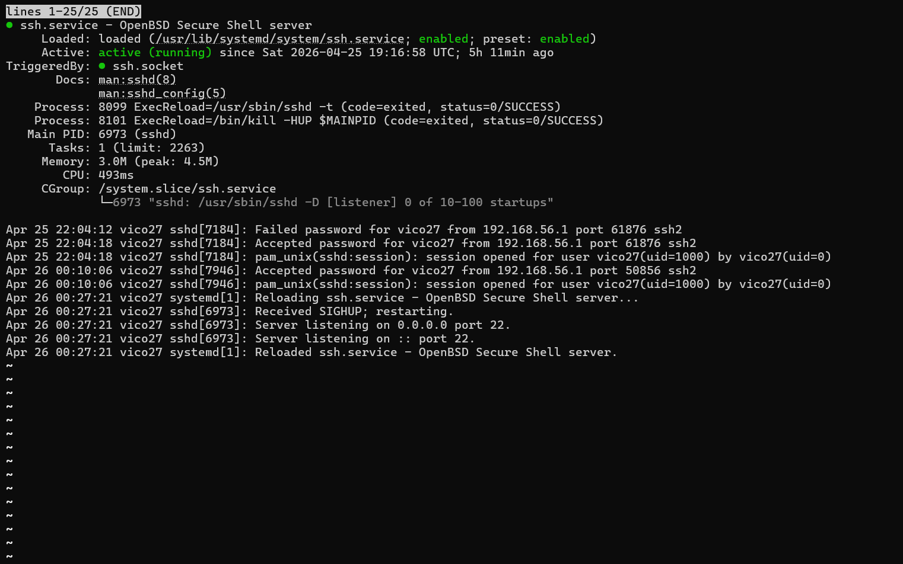
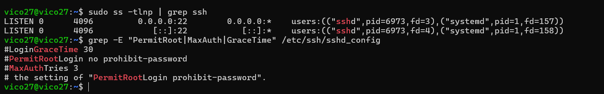
4. Kembalikan konfigurasi semula
Bash
```
sudo cp /etc/ssh/sshd_config.backup.latihan10 /etc/ssh/sshd_config
sudo sshd -t
sudo systemctl reload ssh
```

