# Laporan Praktikum Sistem Operasi Jobsheet 2

<h4>Nama : Vico Dwi Wijaya<h4>
<h4>NIM  : 254107020259<h4>
<h4>Kelas: TI-1H<h4>

## Praktikum 2.1 _ Identifikasi CPU dan Memori

1. Tampilkan informasi CPU:
```
lscpu
```

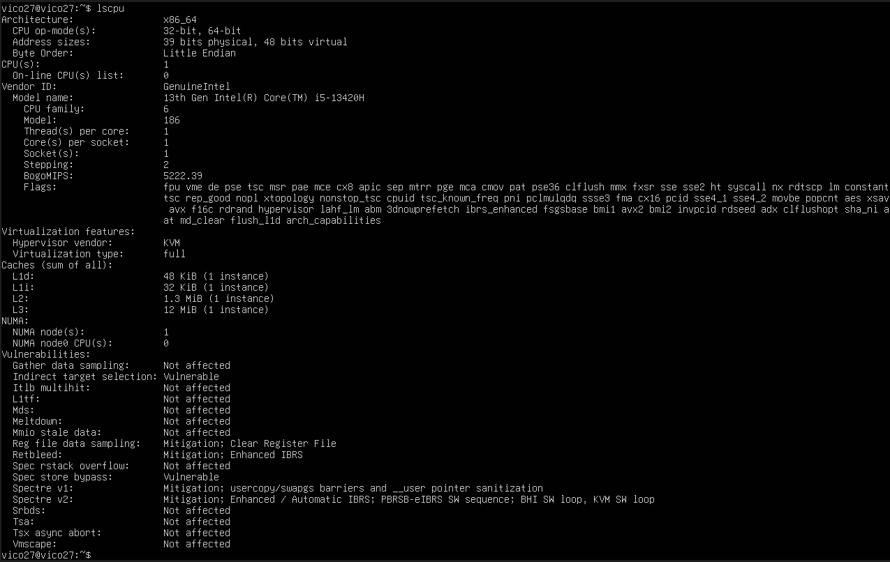

2.  Tampilkan ringkasan memori:
```
free -h
```
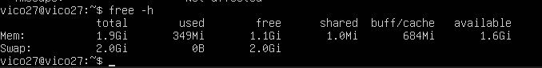


3.  (Opsional) cek informasi hardware dari DMI/BIOS (butuh sudo):
```
 sudo dmidecode-t system
```
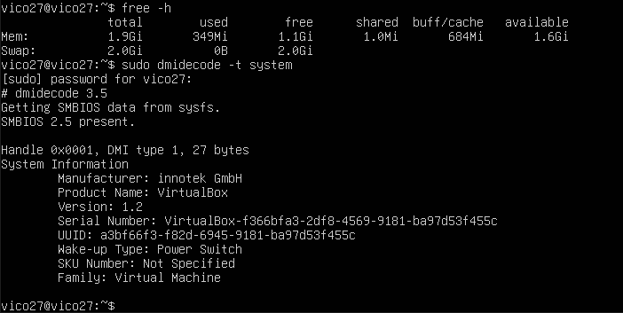


Latihan 2.1

Catat: (1) jumlah CPU(s), core/thread, (2) total RAM, (3) total swap. Jelaskan perbedaan RAM vs swap dalam 2–3 kalimat.
Jumlah CPU(s), core/thread

1. CPU (processor fisik)
* 4 core / 8 thread

2. Total RAM
* 8 GB

3. Total Swap (Virtual Memory / Pagefile)
* 4 GB

Perbedaan RAM dan Swap

RAM adalah memori utama yang digunakan sistem untuk menjalankan program secara langsung dan memiliki kecepatan sangat tinggi.
Swap adalah ruang penyimpanan di disk (HDD/SSD) yang digunakan sebagai memori cadangan ketika RAM penuh, tetapi kecepatannya jauh lebih lambat dibanding RAM.

## Praktikum 2.2 — Identifikasi Perangkat PCI/USB dan Driver

Langkah-langkah

1. Lihat daftar perangkat PCI
```
lspci
```
.png)

2. Lihat perangkat PCI beserta driver kernel yang digunakan
```
lspci-nnk
```
.png)
3. Fokus pada NIC (Ethernet) untuk mencari modul driver
```
lspci-nnk | grep-A3-i ethernet
```
.png)
4. Lihat perangkat USB:
```
lsusd
```
.png)
5. Lihat topologi USB (tree):
```
lsusd -t
```
.png)

Latihan 2.2

Temukan 1 perangkat PCI (misal NIC) dan tuliskan: Vendor:Device ID (angka
heksadesimal), nama driver/modul kernel, dan deskripsi singkat fungsinya

Perangkat PCI: Network Interface Card (Ethernet)

Vendor:Device ID (hex): 8086:15F3

Vendor: Intel Corporation

Nama driver / modul kernel (Linux): e1000e

Deskripsi fungsi:
Perangkat ini adalah kartu jaringan Ethernet yang berfungsi untuk menghubungkan komputer ke jaringan kabel (LAN). Driver e1000e memungkinkan sistem operasi berkomunikasi dengan NIC sehingga komputer dapat mengirim dan menerima data melalui jaringan.

### ini contoh di ubuntu server;


## Praktikum 2.3 
Identifikasi Storage dan Filesystem
Tujuan: memahami disk/partisi dan filesystem yang terpasang.
Langkah-langkah:
1. Lihat daftar disk/partisi:
```
lsblk-f
```
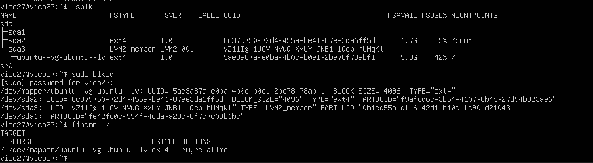
2. Tampilkan UUID dan tipe filesystem:
```
sudo blkid
```
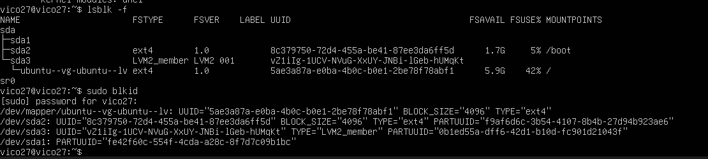
3. Lihat mount point untuk root filesystem:
```
findmnt /
```


## Praktikum 2.4_Melihat Modul Aktif dan Informasinya

1. Cek versi kernel:
```
1 uname-r
```
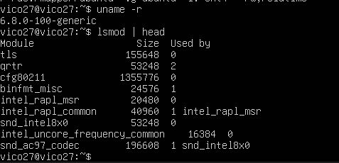

2. Tampilkan daftar modul aktif:
```
lsmod | head
```


3. Pilih salah satu modul (contoh aman: loop) dan lihat detailnya:
```
modinfo loop
```


4. Muat modul (jika belum aktif), lalu verifikasi:
```
1 sudo modprobe loop
2 lsmod | grep-i loop

```

5. (Opsional) lihat pesan kernel terbaru:
```
dmesg-T | tail-n 20
```


## Praktikum 2.5 - Konfigurasi Auto-load dan Blacklist

1. Buat file auto-load: echo " loop " | sudo tee / etc / modules - load . d / loop . conf


2. Simulasikan verifikasi (tanpa reboot) dengan memastikan modul sudah aktif: lsmod | grep -i loop


3. (Opsional, konsep) blacklist modul: # echo "blacklist loop" | sudo tee /etc/modprobe.d/ blacklist - loop . conf
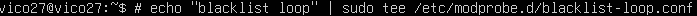

## Praktikum 2.6 — Mengenali Block vs Character Device

1. Manajemen Perangkat Keras & Perintah Dasar Sistem Operasi
ls-l /dev/sda
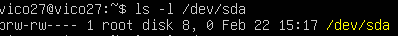
2. Lihat detail device terminal:
ls-l /dev/tty
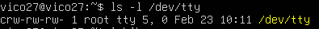
3. Lihat disk dan partisi untuk mengaitkan dengan /dev:
lsblk


## Praktikum 2.7 — Melihat Informasi udev
1. Cek atribut udev untuk disk:
udevadm info--query=all--name=/dev/sda | head-n 30

2. (Opsional) monitor event udev (jalankan, lalu colok/lepas USB pada mesin fisik):
sudo udevadm monitor


## Praktikum 2.8 — Membuat Workspace Praktikum

1. Buat direktori praktikum dan masuk ke dalamnya:
1 mkdir-p ~/praktikum-os/week02
2 cd ~/praktikum-os/week02
3 pwd

2. Buat beberapa file contoh:
1 touch notes.txt data.log config.txt
2 ls-lah

3. Isi file log contoh (simulasi):
1 echo "INFO: service started" >> data.log
2 echo "WARN: disk usage high" >> data.log
3 echo "ERROR: failed to connect" >> data.log
4 cat data.log

4. Baca file dengan less:
less data.log


## Praktikum 2.9 — Pencarian Pola dengan grep

1. Cari baris yang mengandung ERROR pada data.log:
grep "ERROR" data.log
2. Cari tanpa memperhatikan huruf besar/kecil:
 grep-i "error" data.log
3. Tampilkan nomor baris:
 grep-n "WARN" data.log
4. Tampilkan baris yang tidak cocok (invert match):
 grep-v "INFO" data.log
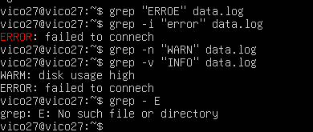

## Praktikum 2.10 — Substitusi dengan sed (Aman di File Latihan)

1. Siapkan file konfigurasi latihan:
* cat > config.txt << ’EOF’
* PORT=8080
* MODE=dev
* SERVICE_NAME=myserver
* EOF
* cat config.txt
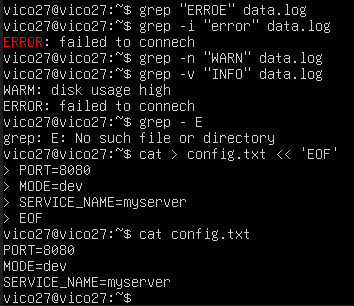
2. Ganti dev menjadi prod (tanpa mengubah file asli):
* sed ’s/MODE=dev/MODE=prod/’ config.txt

3. Terapkan perubahan langsung ke file (-i):
* sed-i ’s/MODE=dev/MODE=prod/’ config.txt
* cat config.txt
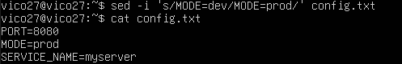
4. Ganti semua kemunculan kata (g untuk global), contoh ubah myserver menjadi
node:
* sed-i ’s/myserver/node/g’ config.txt
* cat config.txt


## Praktikum 2.11 — Ekstraksi Kolom dengan awk

1. Lihat output df-h:
df-h

2. Ambil kolom filesystem dan persentase pemakaian:
df-h | awk ’NR==1 {print $1, $5, $6} NR>1 {print $1,
$5, $6}’

3. Filter hanya yang pemakaian disk di atas 80%:
df-h | awk ’NR==1 || ($5+0) > 80 {print $1, $5, $6}’


## Praktikum 2.12 — Melihat Proses dengan ps

1. Tampilkan semua proses (format BSD):
```
ps aux | head
```
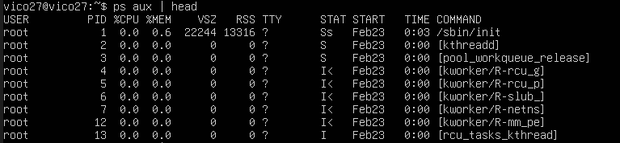
2. Cari proses tertentu (misal sshd):
```
ps aux | grep-i sshd
```


## Praktikum 2.13 — Monitoring Real-time dengan top

1. Jalankan top:
```
top
```
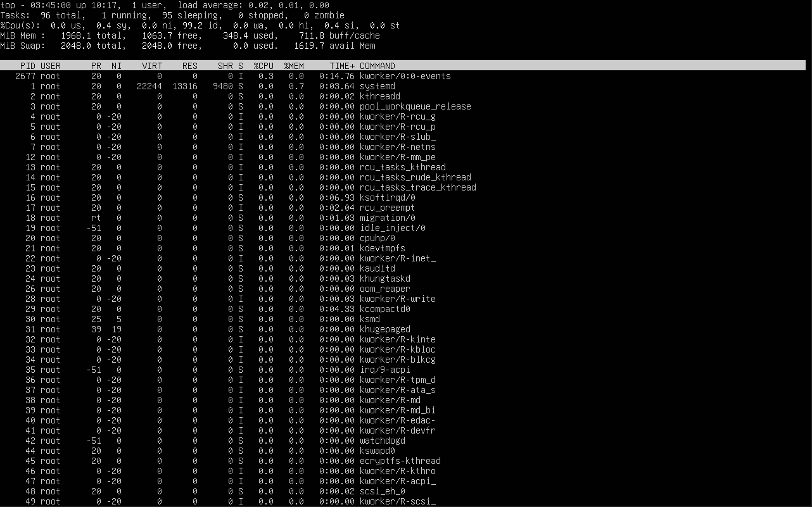

2. Amati nilai load average, pemakaian CPU, dan proses teratas. Tekan q untuk keluar.
```
sudo apt install-y htop btop
```


## Praktikum 2.14 — Menghentikan Proses dengan kill

1. Jalankan proses dummy di background:
```
sleep 300 &
```
2. Cari PID proses sleep:
```
ps aux | grep-E "sleep 300" | grep-v grep
```
3. Hentikan dengan SIGTERM:
```
kill <PID_ANDA>
```
4. Verifikasi proses berhenti:
```
ps aux | grep-E "sleep 300" | grep-v grep
```
5. (Opsional) Jika proses sulit untuk dihentikan dan Anda membutukan untuk menghentikan proses tersebut, gunakan SIGKILL:

```
kill-9 <PID_ANDA>
```

uji no1-5


## Praktikum 2.15 — Cek Disk, Load, dan Service

1. Cek penggunaan disk:
```
df-h
```
2. Cari direktori yang besar (contoh pada /var):
```
sudo du-sh /var/* 2>/dev/null | sort-h | tail-n 10
```
3. Cek load dan uptime:
```
uptime
```
4. Cek service yang gagal:
```
systemctl--failed
```
5. Ambil log error terbaru (jika ada indikasi masalah):
```
journalctl-xe | tail-n 50
```

uji 1-5


## Praktikum 2.16 — Monitoring Port dan Koneksi (Network Basics)
1. Lihat interface dan IP:
```
ip a
```
2. Lihat routing table:
```
ip r
```
3. Lihat port yang sedang listening:
```
sudo ss-tulpn
```
uji coba 1-3


## 1.9 Latihan
#### Latihan 2.A
Jalankan lspci-nnk. Pilih 1 perangkat PCI dan tuliskan: nama perangkat,
ID vendor:device, dan kernel driver in use.

* nama perangkat: Intel Corporation 82371AB/EB/MB PIIX4 IDE
* ID vendor:device;
```
8086 --> Vendor ID
```
```
7111 --> Device
```
* Karnel driver in use
```
pata_acpi
```
#### Latihan 2.B
Tentukan device root filesystem dengan findmnt /. Lalu cocokkan dengan
lsblk-f dan tuliskan tipe filesystem serta UUID-nya.
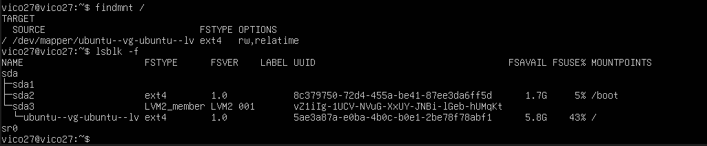
filesysyem: ext4

UUID: 5a8a387a-e0ba-4b0c-b0e1-2be78f78abf1


#### Latihan 2.C
Buat file server.log berisi minimal 10 baris dengan variasi kata: INFO,
WARN, ERROR. Gunakan grep untuk menampilkan hanya baris ERROR.


####Latihan 2.D
Gunakan sed untuk mengganti semua kata server menjadi node pada file latihan. Tunjukkan sebelum dan sesudah.
#### Sebelum


#### Sesudah


#### Latihan 2.E
Gunakan df-h lalu awk untuk menampilkan filesystem yang penggunaan disk
di atas 70%.

#### Latihan 2.F
Jalankan sleep 600 &. Temukan PID-nya dengan ps. Hentikan dengan
SIGTERM. Jelaskan beda SIGTERM vs SIGKILL.


| SIGTERM                   | SIGKILL              |
| ------------------------- | -------------------- |
| Nomor 15                  | Nomor 9              |
| Bisa ditangani program    | Tidak bisa ditangani |
| Program bisa cleanup dulu | Langsung mati paksa  |
| Lebih aman                | Lebih kasar          |


#### Latihan 2.G
Gunakan systemctl–failed. Jika tidak ada yang gagal, pilih satu service
aktif (misal ssh) dan tampilkan status serta 30 baris log terakhirnya.

