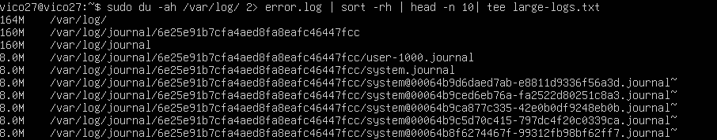
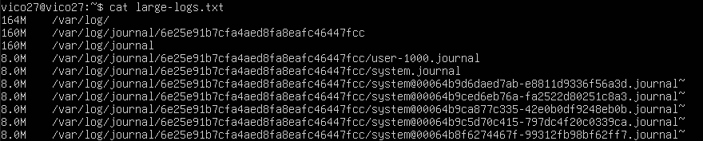
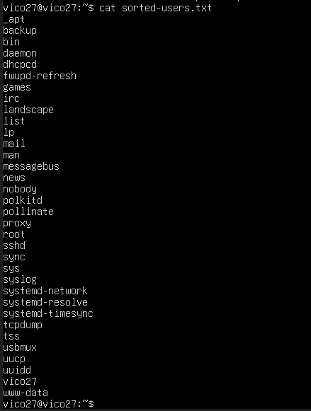
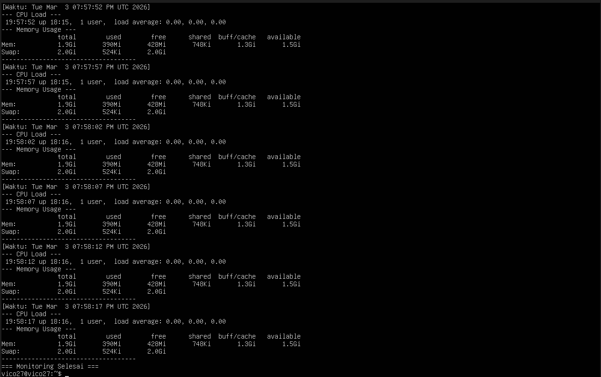
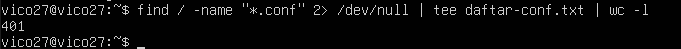
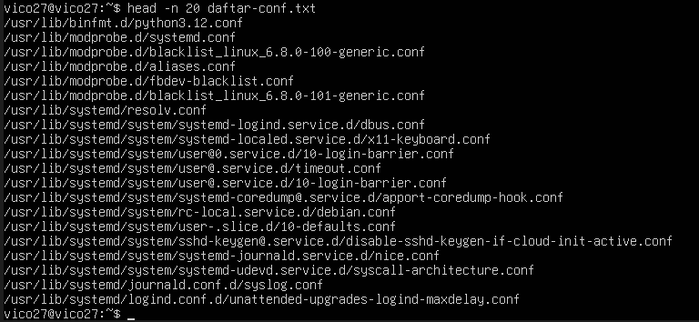
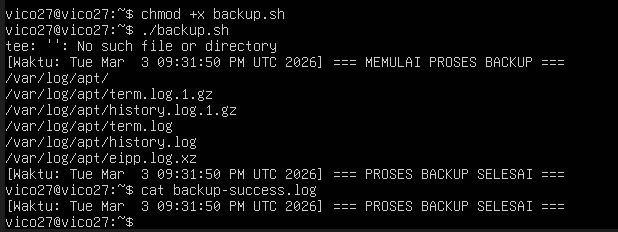

# Laporan Praktikum Sistem Operasi Jobsheet 3

Nama : Vico Dwi Wijaya

NIM : 254107020259

Kelas : TI-1H

## Latihan 3.1
Buatlah script yang:
1. Menampilkan daftar 10 file terbesar di direktori /var/log/
2. Menyimpan hasilnya ke file large-logs.txt
3. Menampilkan output juga di terminal menggunakan tee
4. Menangani error dengan redirect ke error.log

```
sudo du -ah /var/log/ 2> error.log | sort -rh | head -n 10 | tee large-logs.txt
```


```
cat large-logs.txt
```



## Latihan 3.2
Buat pipeline yang:
1. Membaca /etc/passwd
2. Mengekstrak username (kolom pertama)
3. Mengurutkan alfabetis
4. Menyimpan ke file sorted-users.txt
Hint: Gunakan cut, sort, dan operator redirect.
```
cut -d: -f1 /etc/passwd | sort > sorted-users.txt
```


```
untuk cek hasil
cat sorted-users.txt
```


## Latihan 3.3
Tulis script monitoring yang:
1. Mencatat penggunaan CPU dan memory setiap 5 detik
2. Menyimpan log dengan timestamp
3. Berjalan selama 1 menit (12 iterasi)
4. Output ditampilkan di terminal DAN disimpan ke file 44

* Membuat file script
```
nano monitoring.sh
```
```
#!/bin/bash
LOGFILE="hasil-monitoring.log"

{
    echo "=== Mulai Monitoring (1 Menit) ==="
     for i in {1..12}; do
        # Menampilkan timestamp
        echo "[Waktu: $(date)]"
        echo "--- CPU Load ---"
        uptime
        echo "--- Memory Usage ---"
        free -h
        echo "-----------------------------------"
        sleep 5
    done
    
    echo "=== Monitoring Selesai ==="
} 2>&1 | tee -a "$LOGFILE"
```
* Hasil Monitoring 
```
./monitoring.sh
```



## Latihan 3.4
Buat perintah yang:
1. Mencari semua file .conf di sistem
2. Membuang pesan "Permission denied"
3. Menghitung jumlah file yang ditemukan
4. Menyimpan daftar path lengkap ke file
```
find / -name "*.conf" 2> /dev/null | tee daftar-conf.txt | wc -l
```



Ini untuk mengecek 20 datar
```
head -n 20 daftar-conf.txt
```


## Latihan 3.5
Implementasikan script backup yang:
1. Menggunakan tar untuk backup direktori
2. Menampilkan progress dengan tee
3. Mencatat stdout ke backup-success.log
4. Mencatat stderr ke backup-error.log
5. Menambahkan timestamp di setiap log entry

```
#!/bin/bash

# Menentukan nama file log dan nama file backup
SUCCESS_LOG="backup-success.log"
ERROR_LOG="backup-error.log"
BACKUP_NAME="backup-data-$(date +%Y%m%d).tar.gz"

# Direktori target yang akan di-backup (kita pakai folder /var/log/apt sebagai contoh yang aman)
TARGET_DIR="/var/log/apt"

# Menambahkan timestamp awal ke dalam log
echo "[Waktu: $(date)] === MEMULAI PROSES BACKUP ===" | tee -a "$SUCCESS_LOG"
echo "[Waktu: $(date)] === MEMULAI PROSES BACKUP ===" >> "$ERROR_LOG"

# Mengeksekusi perintah tar untuk backup
# -c (create), -z (compress), -v (verbose/tampilkan progress), -f (file)
tar -czvf "$BACKUP_NAME" "$TARGET_DIR" 2>> "$ERROR_LOG" | tee -a "$SUCCESS_LOG"

# Menambahkan timestamp akhir ke dalam log
echo "[Waktu: $(date)] === PROSES BACKUP SELESAI ===" | tee -a "$SUCCESS_LOG"
echo "[Waktu: $(date)] === PROSES BACKUP SELESAI ===" >> "$ERROR_LOG"
```
* Setelah selesai membuat file masukan perintah 
```
chmod +x backup.sh
```
```
./backup.sh
```
