<h4>Nama : Vico Dwi Wijaya<h4>
<h4>NIM  : 254107020259<h4>
<h4>Kelas: TI-1H<h4>

## Percobaan 1 : Direktory

1. Melihat direktori HOME 
```
$ pwd  
$ echo $HOME 
```
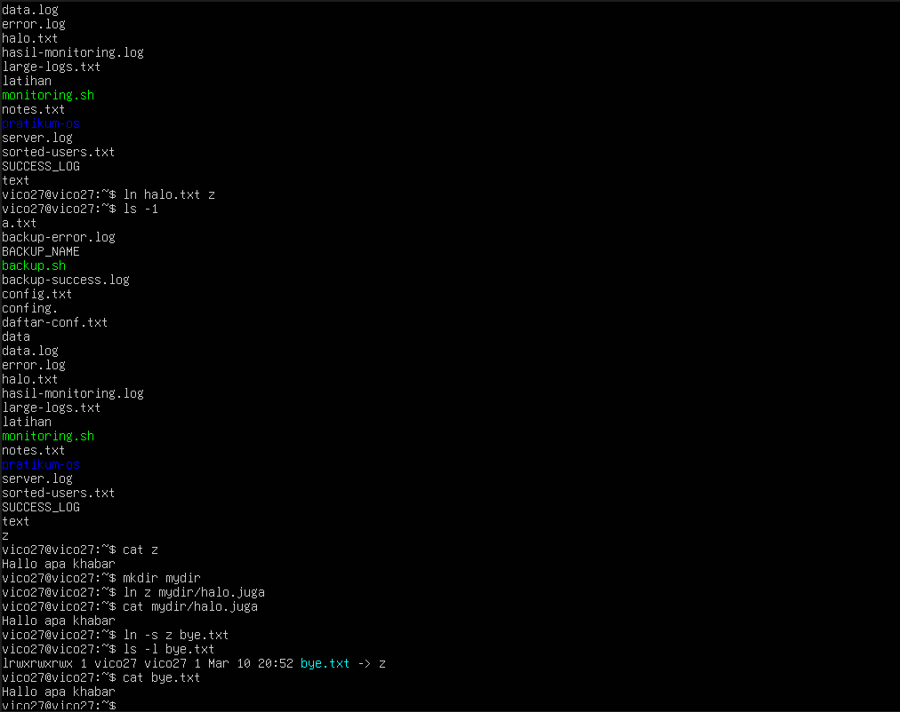
2. Melihat direktori aktual dan parent direktori 
```
$ pwd 
$ cd . 
$ pwd 
$ cd .. 
$ pwd 
$ cd 
```
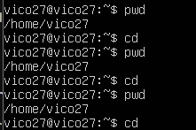
 
3. Membuat satu direktori, lebih dari satu direktori atau sub direktori
``` 
$ pwd 
$ mkdir A B C A/D A/E B/F A/D/A 
$ ls -l 
$ ls -l A 
$ ls -l A/D 
```
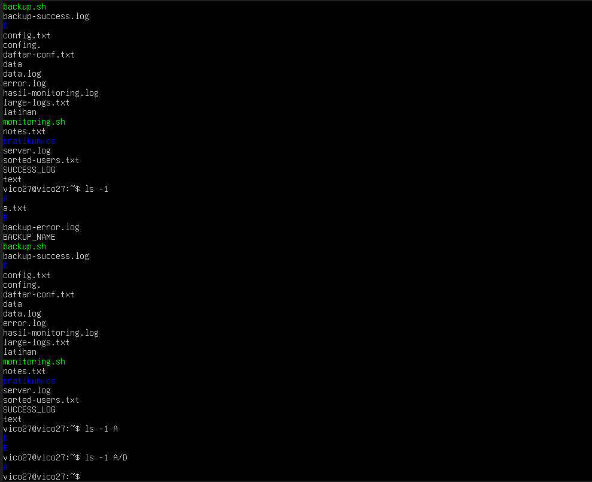
 
4. Menghap us  satu  atau  lebih  direktori  hanya  dapat  dilakukan  pada  direktori 
kosong  dan  hanya  dapat  dihapus  oleh  pemiliknya  kecuali  bila  diberikan  ijin 
aksesnya 
```
$ rmdir B 
$ ls -l B 
$ rmdir B/F B 
$ ls -l B  
```
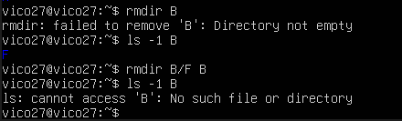
 
5. Navigasi direktori dengan instruksi cd  untuk  pindah  dari  satu  direktori  ke 
direktori  lain. 
```
$ pwd 
$ ls -l 
$ cd A 
$ pwd 
$ cd .. 
$ pwd 
$ cd /home/<user>/C 
$ pwd 
$ cd /<user/C 
$ pwd 
```
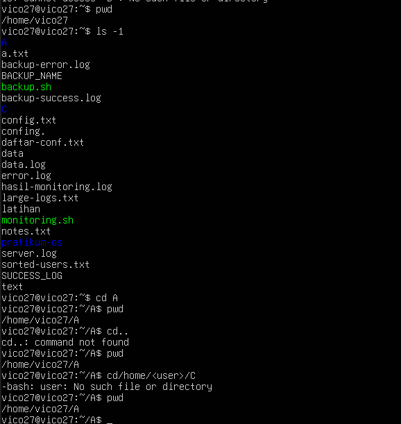

## Percobaan 2 : Manipulasi file 

1. Perintah  cp  untuk  mengkopi file atau seluruh direktori 
```
$ cat > contoh  
Membuat sebuah file 
[Ctrl-d] 
$ cp contoh contoh1 
$ ls -l  
$ cp contoh A 
$ ls –l A 
$ cp contoh contoh1 A/D 
$ ls –l A/D 
```

 
2. Perintah  mv untuk memindah file 
``` 
$ mv contoh contoh2 
$ ls -l 
$ mv contoh1 contoh2 A/D 
$ ls –l A/D 
$ mv contoh contoh1 C 
$ ls –l C 
```

 
3. Perintah rm untuk menghapus file 
```
$ rm contoh2 
$ ls -l 
$ rm –i contoh 
$ rm –rf A C 
$ ls -l 
```

## Percobaan 3 : Symbolic Link

1. Membuat shortcut (file link) 
```
$ echo "Hallo apa khabar" > halo.txt 
$ ls -l 
$ ln halo.txt z 
$ ls -l 
$ cat z 
$ mkdir mydir 
$ ln z mydir/halo.juga 
$ cat mydir/halo.juga 
$ ln -s z bye.txt 
$ ls -l bye.txt 
$ cat bye.txt 
```

## Percobaan 4 : Melihat Isi File 
```
$ ls –l 
$ file halo.txt 
$ file bye.txt
```

## Percobaan 5 : Mencari file

1. Perintah  find 
```
$ find /home –name “*.txt” –print > myerror.txt 
$ cat myerror.txt 
$ find . –name “*.txt” –exec wc –l ‘{}’ ‘;’ 
```
2. Perintah  which
``` 
$ which ls
``` 
3. Perintah  locate 
```
$ locate “*.txt”
```


## Percobaan 6 : Mencari text pada file
```
$ grep Hallo *.txt 
```


## LATIHAN: 
1. Cobalah urutan perintah berikut : 
```
$ cd 
$ pwd 
$ ls –al 
$ cd . 
$ pwd 
$ cd .. 
$ pwd 
$ ls -al 
$ cd .. 
$ pwd 
$ ls -al 
$ cd /etc 
$ ls –al | more 
$ cat passwd 
$ cd – 
$ pwd
```
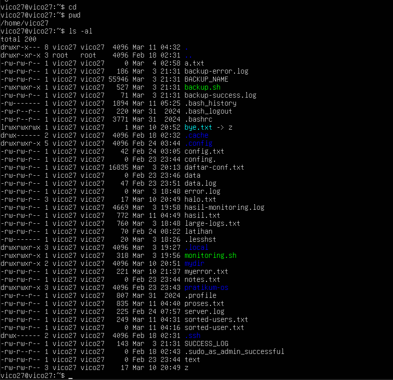


2. Lanjutkan  penelusuran  pohon  pada  sistem  file  menggunakan  cd, ls,  pwd dan cat. 
Telusuri direktory  /bin, /usr/bin, /sbin, /tmp dan  /boot. 

```
cd /bin && ls
```
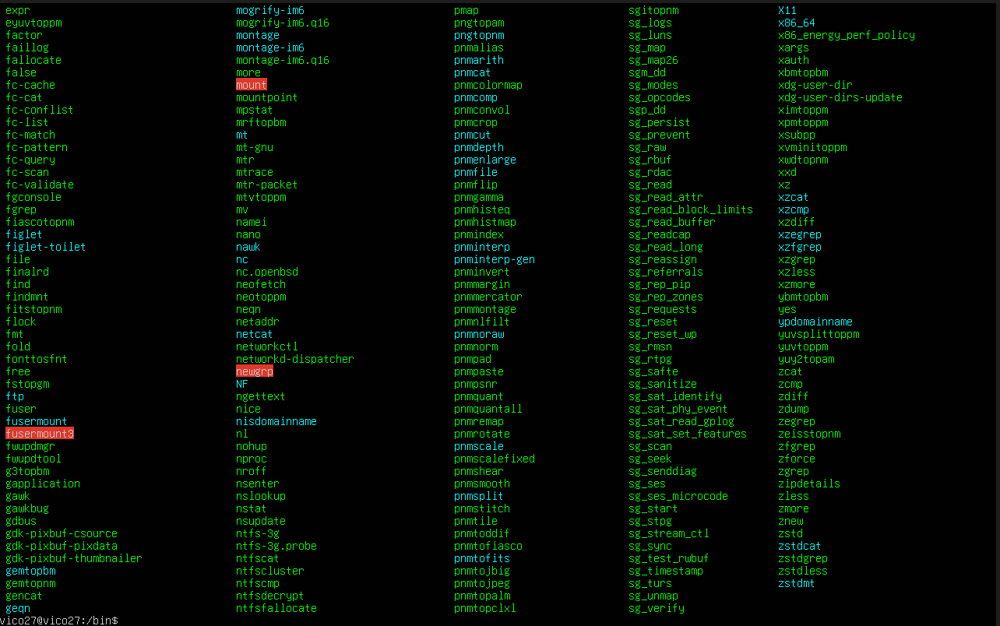

```
cd /usr/bin && ls
```
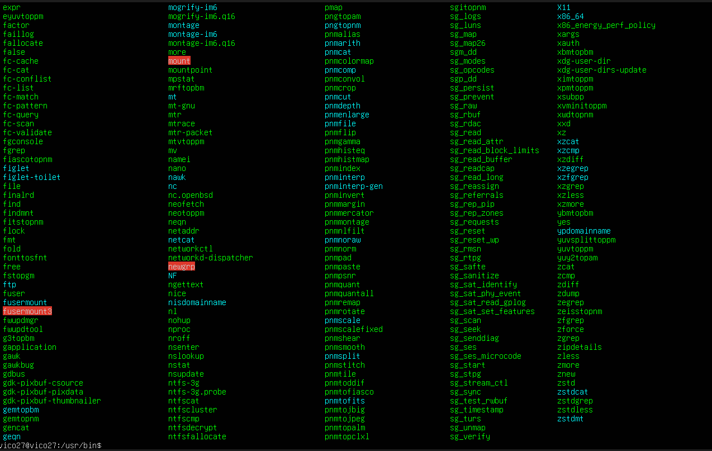

```
cd /sbin && ls
```
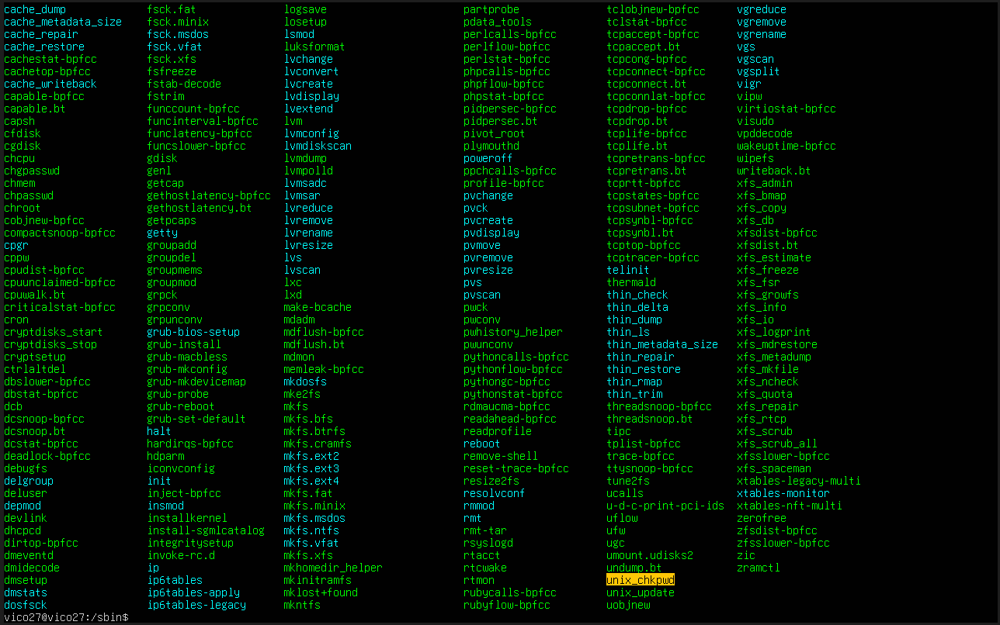

```
cd /tmp && ls
```
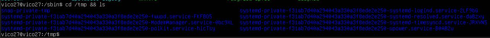

```
cd /boot && ls
```
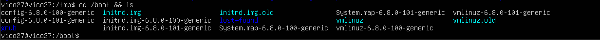

3. Telusuri direktory /dev.  I dentifikasi perangkat yang tersedia. Identifikasi tty 
(termninal) Anda (ketik who am i); siapa pemilih tty Anda (gunakan ls –l). 
```
who am i
# hasilnya: user tty1
ls -l /dev/tty1
```
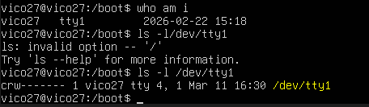

4. Telusuri derectory /proc.  Tampilkan isi file  interrupts,  devices, 
cpuinfo, meminfo  dan uptime menggunakan  perintah cat.    Dapatkah  Anda melihat mengapa directory  /proc disebut  pseudo -filesystem  yang memungkinkan 
akses ke struktur data kernel ?
```
cd /proc
cat interrupts
cat devices
cat cpuinfo
cat meminfo
cat uptime
```
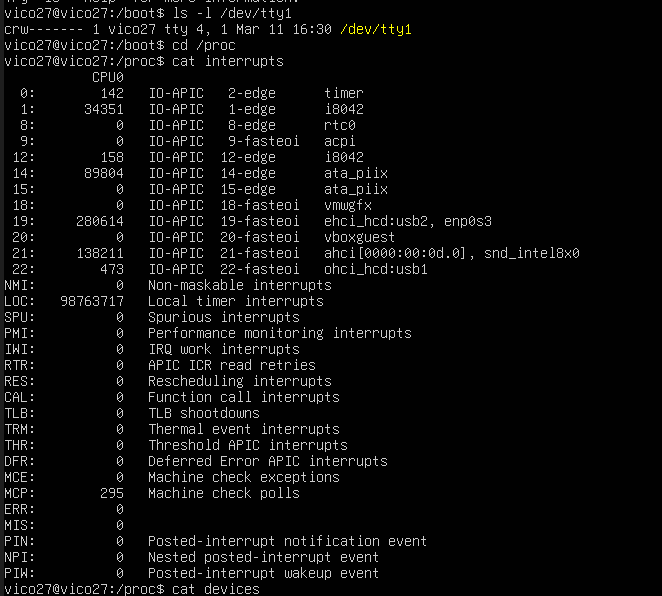

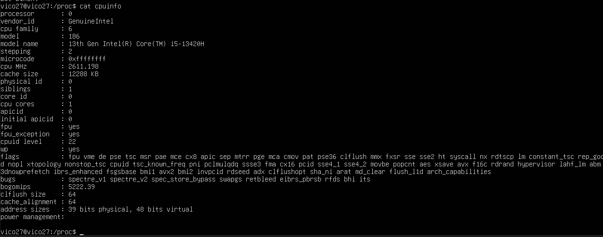

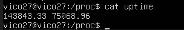

### Kenapa disebut Pseudo-filesystem? 
Karena file-file di dalam /proc sebenarnya tidak ada di harddisk. Mereka adalah data langsung dari RAM yang disediakan oleh Kernel Linux untuk menunjukkan status sistem secara real-time.

5. Ubahlah direktory home ke user lain secara langsung menggunakan  cd ~username.
```
cd ~nama_user_lain 
```
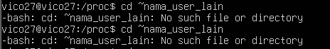

6. Ubah kembali ke direktory home Anda. 
```
cd ~
```
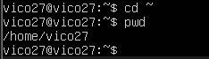

7. Buat subdirektory  work dan play. 
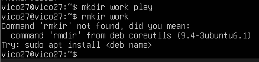
8. Hapus subdirektory work. 


9. Copy file /etc/passwd ke direktory home Anda. 
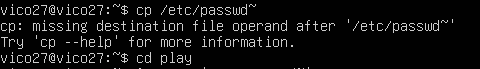
10. Pindahkan ke subirectory  play. 


11. Ubahlah ke subdirektory play dan buat symbolic link dengan nama terminal yang 
menunjuk ke perangkat tty.  Apa  yang  terjadi  jika  melakukan  hard link ke perangkat 
tty ? 
```
ln -s /dev/tty terminal
```
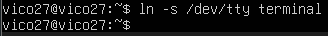
### Apa yang terjadi jika Hard Link ke tty?
gagal (Error). Sistem Linux tidak mengizinkan hard link ke file perangkat (device files) atau antar file system yang berbeda.

12. Buatlah file bernama  hello.txt yang berisi kata ”hello word”.  Dapatkah Anda 
gunakan  ”cp”  menggunakan  ”terminal”  sebagai  file  asal  untuk  menghasilkan  efek yang sama ? 
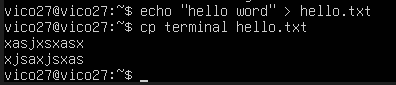
Jika menggunakan cp terminal hello.txt: Terminal akan "menunggu" kamu mengetik sesuatu. Apa pun yang ketik di layar akan masuk ke file hello.txt
13. Copy  hello.txt ke terminal.   Apa  yang  terjadi ? 
```
cp hello.txt /dev/tty
```
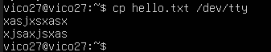

file yang kita tadi kita ketik akan muncul

14. Masih  direktory  home,  copy  keseluruhan  direktory  play  ke  direktory  bernama  work
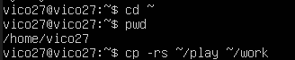 
menggunakan symbolic link. 
15. Hapus direktory work dan isinya dengan satu perintah
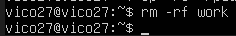 