## Jobsheet6

<h4>Nama : Vico Dwi Wijaya<h4>
<h4>NIM  : 254107020259<h4>
<h4>Kelas: TI-1H<h4>
<h4>Absen: 28<h4>

## Praktikum 6.1 — Melihat Proses dan Thread

1. Tampilkan semua proses yang berjalan:
```
ps aux
```
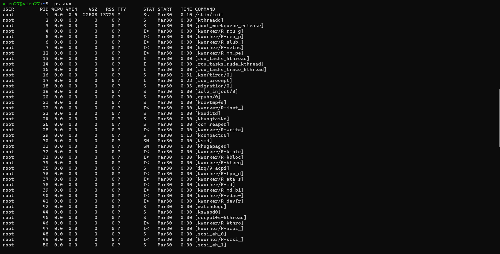
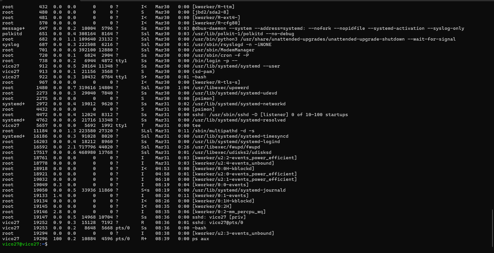
2. Tampilkan proses beserta thread-nya, dapat dilihat pada kolom LWP (LightWeight Process ID):
```
ps aux -L
```
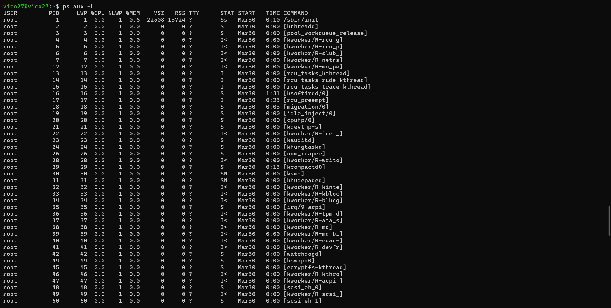
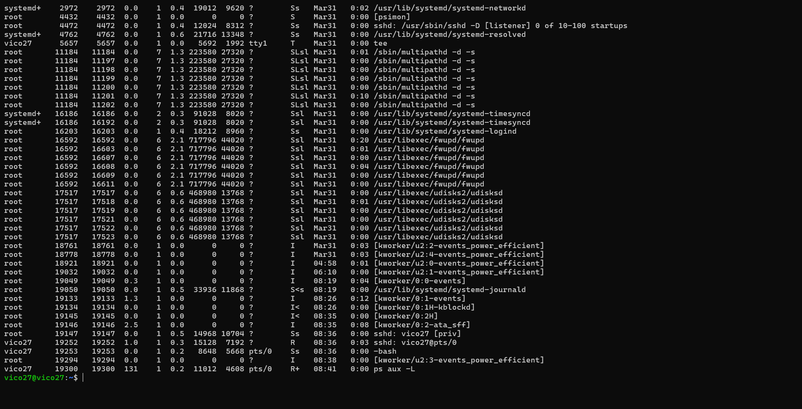
3. Lihat PID shell aktif dan detail prosesnya:
```
echo $$
ps -p $$ -f
```
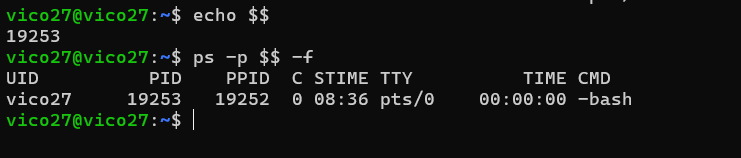

4. Lihat hierarki proses secara visual:
```
pstree -p
```
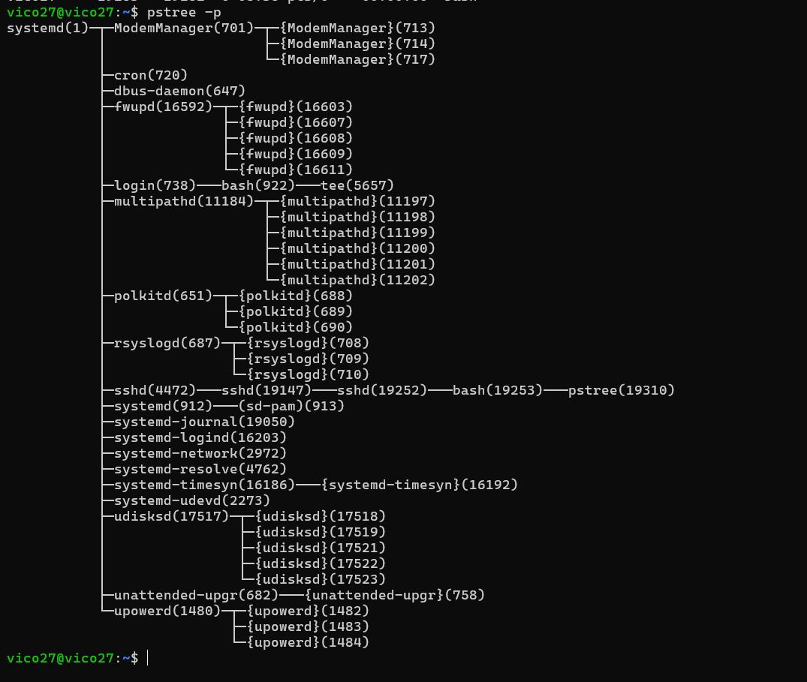

### Latihan 6.1
Jalankan ps aux dan amati outputnya:
1. Berapa total proses yang berjalan? Proses apa yang memiliki PID
terkecil?
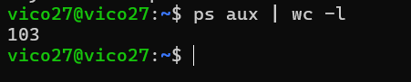

- 103 , prses mencarinya menggunakan perintah  ```
ps aux | wc -l``` artinya;

ps aux: mengambil dan menampilkan proses secara format dan lengkap

| : artinya menangkap teks hasil keluaran (output) dari perintah di sebelah kirinya (ps aux), lalu mengalirkannya sebagai bahan masukan (input) untuk perintah di sebelah kanannya.

wc -l : wc (word count) penghitung kata sedangan -l singkatan dari ```lines``` yaitu menghitung jumlah baris dari teks yang di terima

2. Jalankan pstree -p dan temukan proses bash Anda. Proses apa yang menjadi induk (PPID) dari bash tersebut?
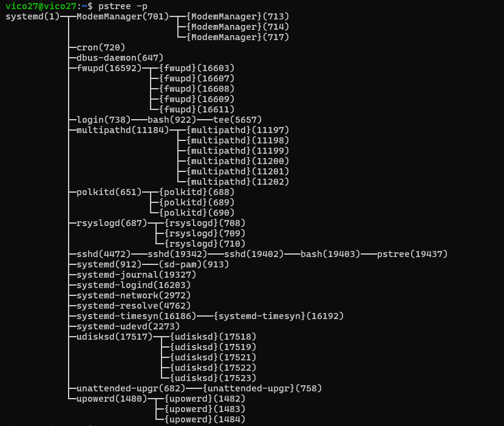
```─sshd(4472)───sshd(19342)───sshd(19402)───bash(19403)───pstree(19437)```
jadi induk PPID nya di sebelah kirinya, yaitu sshd dengan PID 19402.

3. Bandingkan output ps aux dan ps aux -L. Apa perbedaan yang Anda
lihat?
```
ps aux
```
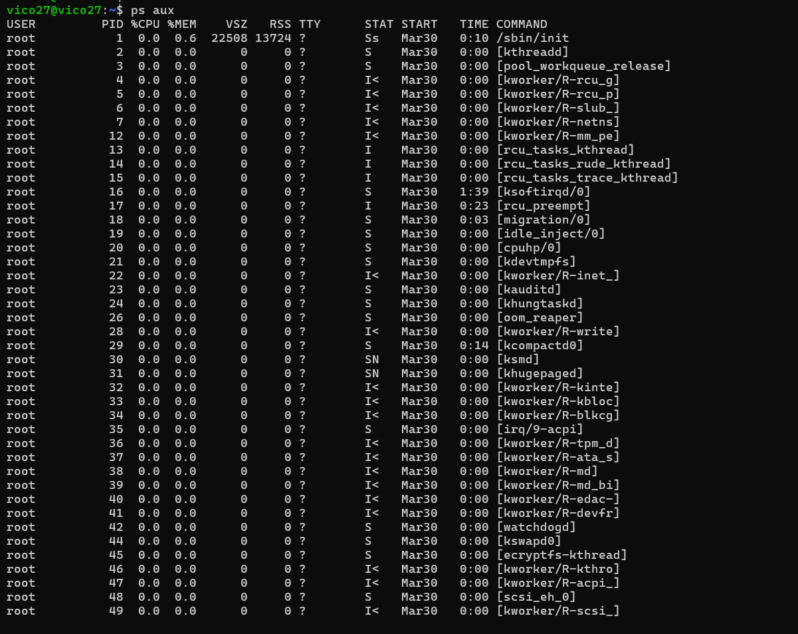
```
ps aux -L
```
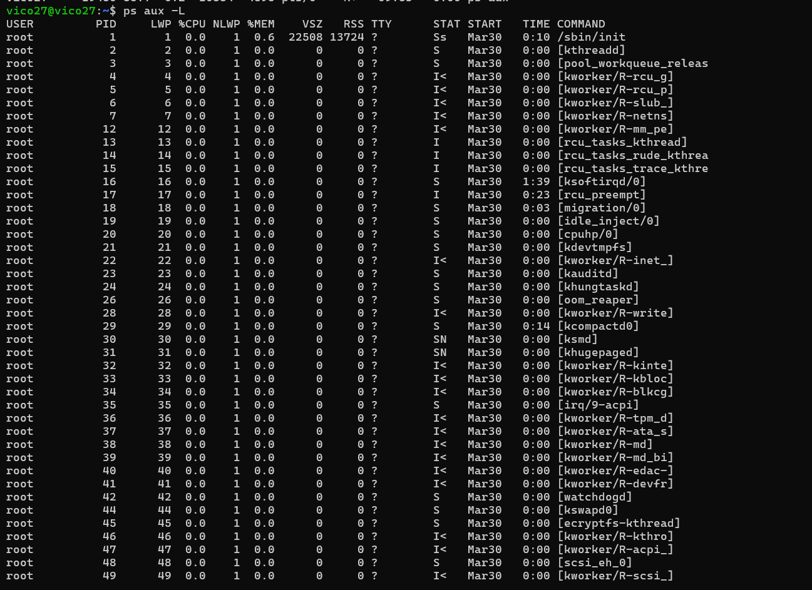

ada tambahan di ps aux -L yaitu LWP dan NLWP


## Praktikum 6.2 — Mengamati Siklus Hidup Proses

1. Buat proses di background dan amati kondisinya:
```
sleep 60 &
ps aux | grep sleep
```
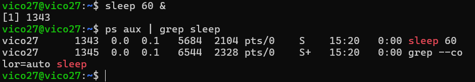

2. Amati perubahan exit code dari perintah yang berhasil dan gagal:
```
ls / tmp
echo " Sukses : $?"
ls / direktori - tidak - ada
echo " Gagal : $?"
```
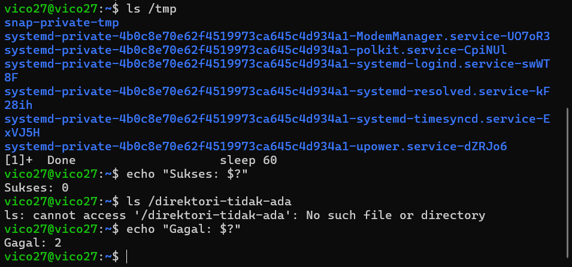

```hasil akhirnya```
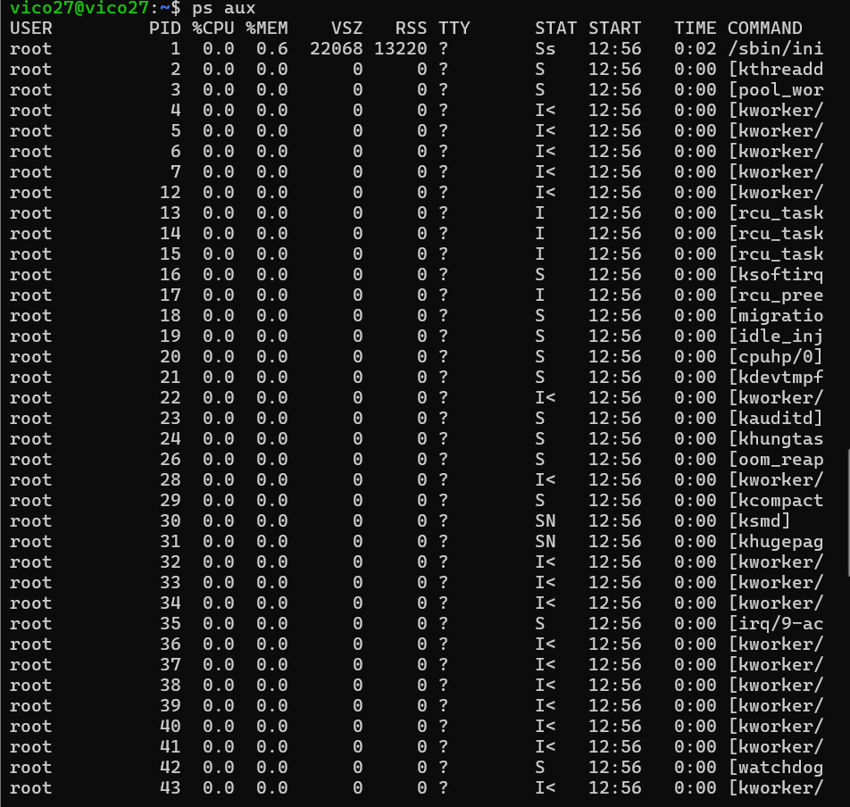
kondisi apa yang ditampilkan ? yaitu kondisi sleep (s), Mengapa proses sleep berada di kondisi tersebut?
karena Sesuai dengan perintah sleep 120 hanyalah diam dan menunggu selama 120 detik.

2. Jalankan beberapa perintah yang berhasil dan yang gagal, lalu catat exit
code masing-masing. Pola apa yang Anda temukan?

```Perintah berhasil yang hasilnya 0```
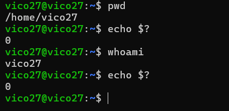

```jika tidak 0 maka akan gagal seperti;```
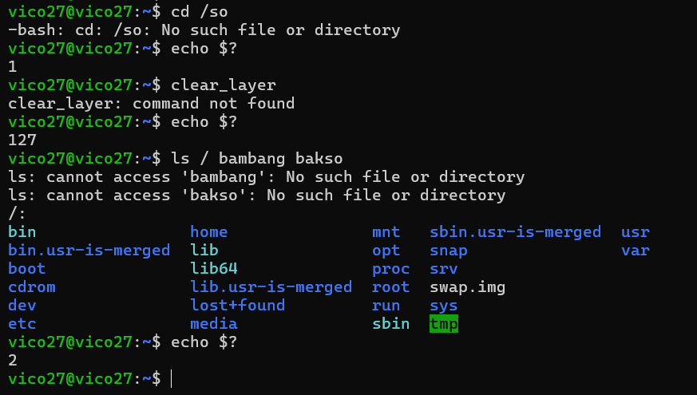

## Praktikum 6.3 — Mengatur Prioritas Proses

1. Jalankan proses dengan prioritas rendah:
```
nice -n 10 sleep 300 &
```

2. Verifikasi nilai nice pada kolom NI:
```
ps aux | grep sleep
```

3. Ubah nilai nice proses yang sudah berjalan:
```
renice -n 15 -p <PID >
ps -p <PID > -o pid , ni , cmd
```

4. Bersihkan proses percobaan:
```
kill %1
```
```percobaan 1-4```
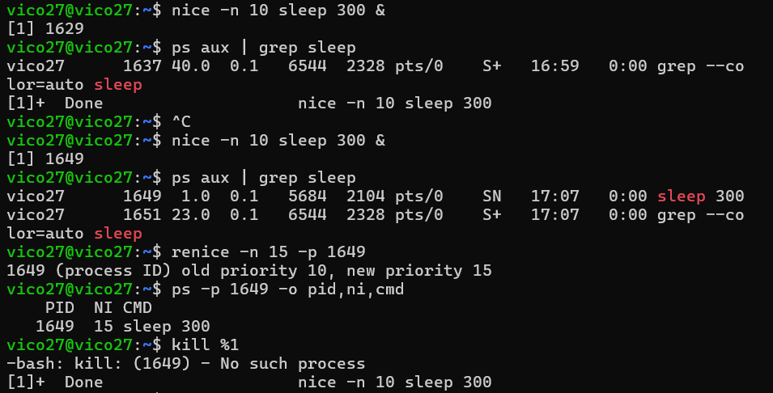

### Latihan 6.3
1. Jalankan nice -n 5 sleep 200 & dan verifikasi nilai NI-nya dengan
ps.
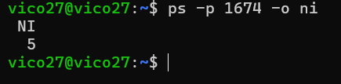
2. Ubah nilai nice menjadi 10 menggunakan renice, lalu verifikasi kembali.
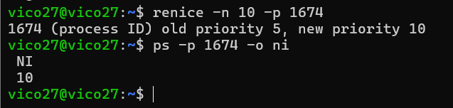
3. Coba ubah nilai nice menjadi -5 tanpa sudo. Apa yang terjadi? Mengapa
Linux membatasi hal ini untuk user biasa?
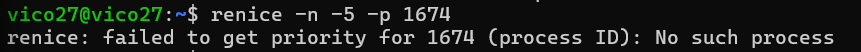
karena -5 termasuk golongan yang egis, egis ini berarti melok perintah ,  dengan rentang-20 (prioritas
tertinggi) hingga +19 (prioritas terendah).
## Praktikum 6.4 — Mengirim Sinyal ke Proses

1. Buat proses percobaan:
```
sleep 500 &
sleep 600 &
sleep 700 &
ps aux | grep -v grep | grep sleep
```
 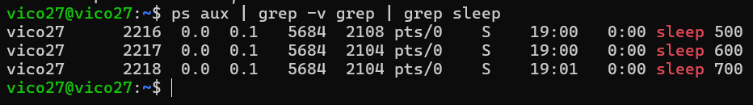

2. Hentikan satu proses dengan SIGTERM dan verifikasi:
```
kill <PID - sleep -500 >
ps aux | grep -v grep | grep sleep
```
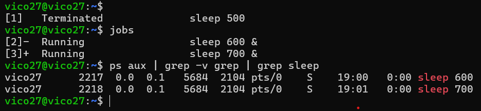

3. Jeda dan lanjutkan proses dengan SIGSTOP/SIGCONT:
```
kill - SIGSTOP <PID - sleep -600 >
ps aux | grep sleep # amati kolom STAT : berubah
menjadi T
kill - SIGCONT <PID - sleep -600 >
ps aux | grep sleep # STAT kembali ke S
```
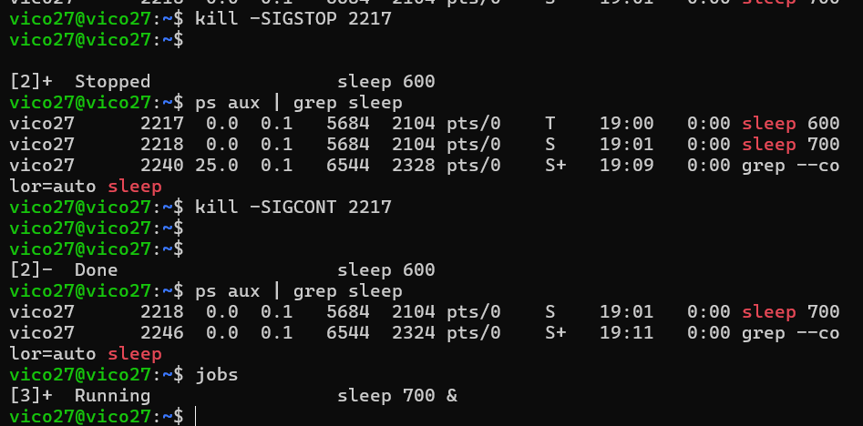
4. Hentikan semua proses sleep sekaligus:
```
pkill sleep
```
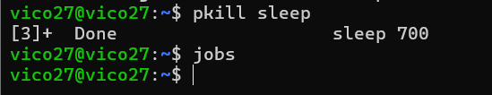

## Latihan 6.4
1. Jalankan sleep 400 &, kirim SIGSTOP, dan amati perubahan kolom
STAT. Kondisi apa yang muncul?image/
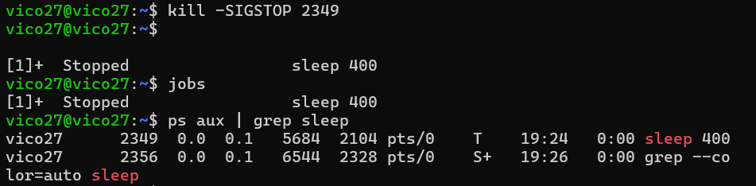
berubah menjadi T yaitu stop/terhenti
2. Kirim SIGCONT dan verifikasi proses kembali berjalan.
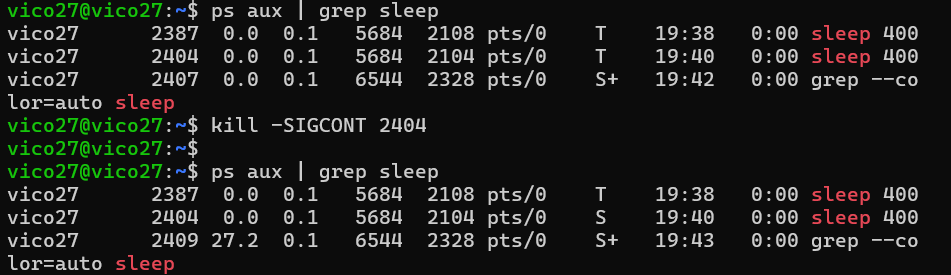
3. Hentikan proses dengan SIGTERM lalu verifikasi sudah tidak ada. Kapan Anda memilih SIGKILL daripada SIGTERM?
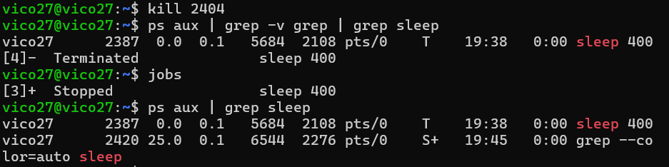
SIGKILL : ketika program tidak mau dihentikan maka harus menggunakan perintah SIGKILL dan ini ada efek sampingnya yaitu data akan tiba tiba hilang/crash
SIGTREM : perintah ini digunakan untuk menghentikan proses juga tetepi lebih aman dari pada SIGKILL , kalau tidak bisa digunakan SIGTREM maka terpaksa menggunakan SIGKILL

## Praktikum 6.5 — Manajemen Job Foreground dan Background

1. Jalankan tiga job di background:
```
sleep 200 &
sleep 300 &
sleep 400 &
jobs
```
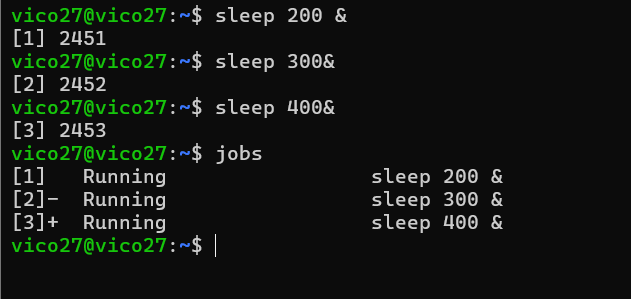

2. Bawa job pertama ke foreground, jeda, lalu kembalikan ke background:
```
fg %1
# Tekan Ctrl +Z untuk menjeda
bg %1
jobs
```
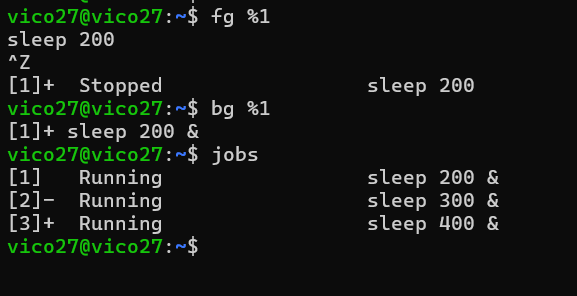

3. Hentikan semua job:
```
kill %1 %2 %3
jobs
```
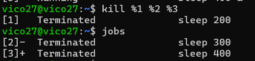

### Latihan 6.5
1. Jalankan top di foreground. Apa yang terjadi di terminal?
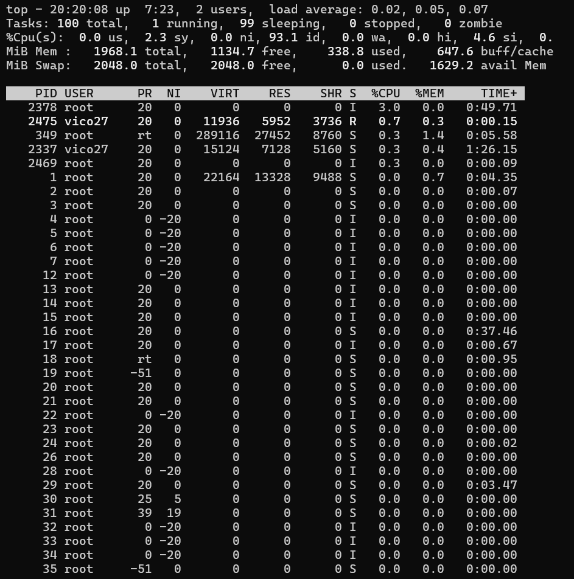
Program akan terus menerus berjalan tidak bisa berhenti
2. Tekan Ctrl+Z dan cek statusnya dengan jobs. Kondisi apa yang
ditampilkan?
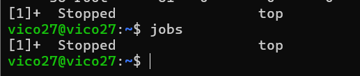
kondisinya: [1]+  Stopped                 top
3. Pindahkan ke background dengan bg. Apakah top dapat berjalan dengan baik di background? Mengapa?
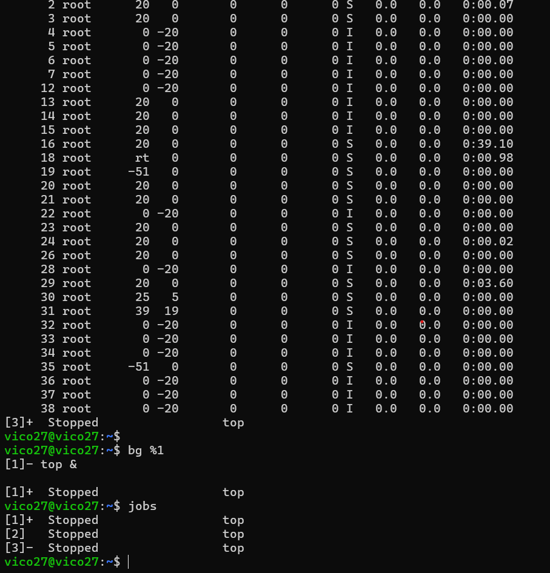
tidak, karena top akan langsung berstatus Stopped (Tersuspensi) kembali secara otomatis oleh sistem, atau ia akan berjalan tapi tidak melakukan apa-apa.
4. Kembalikan ke foreground dengan fg, lalu keluar dengan q .
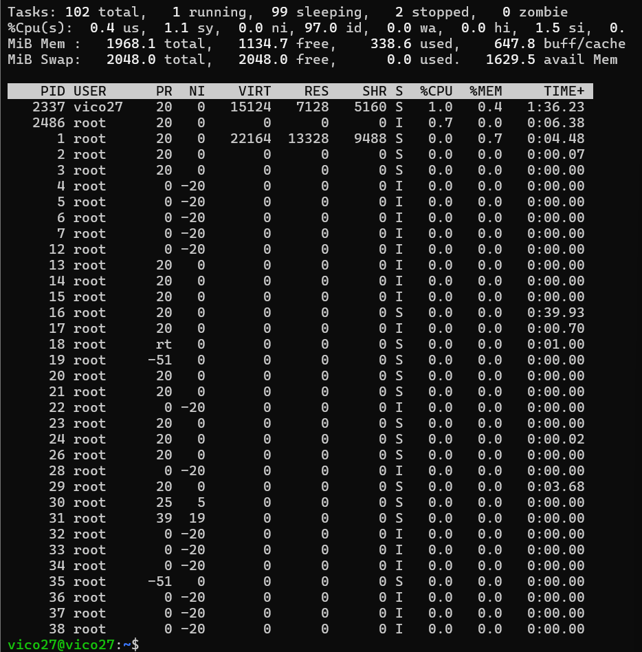

## Praktikum 6.6 — Pemantauan Proses

1. Temukan proses dengan penggunaan CPU dan memori tertinggi:
```
ps aux -- sort = -% cpu | head -10
ps aux -- sort = -% mem | head -10
```
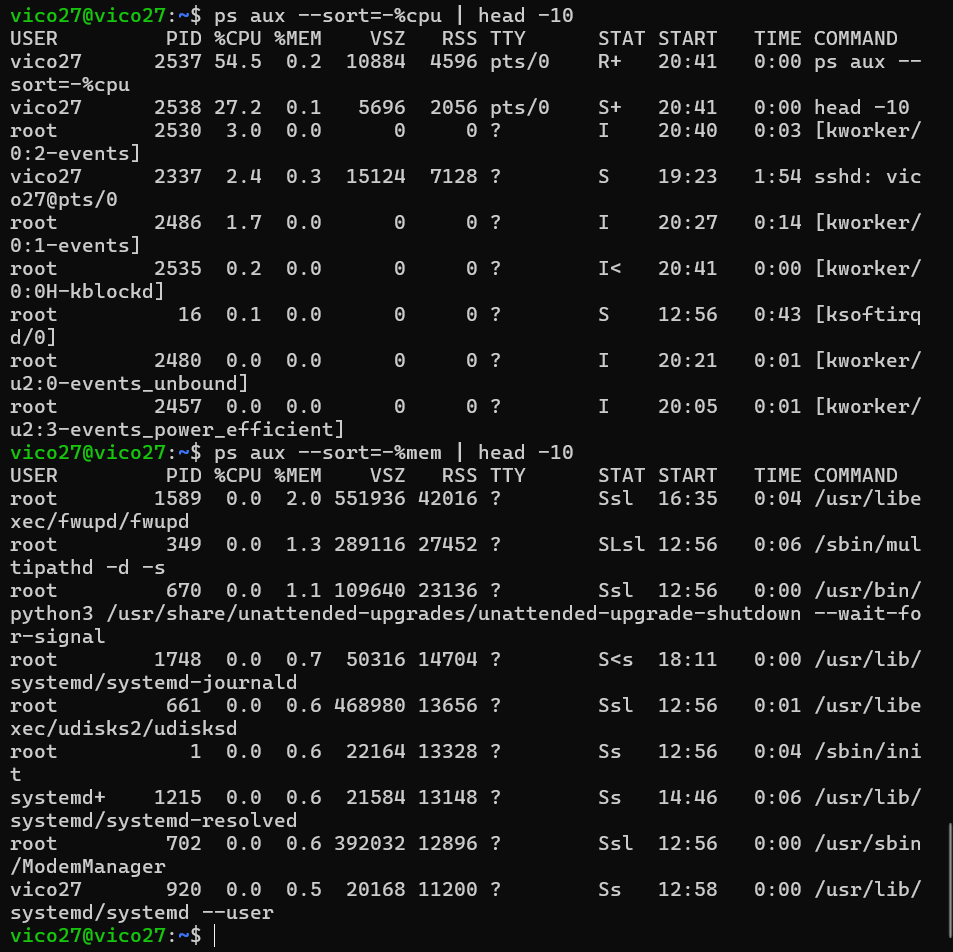

2. Jalankan top dan eksplorasi shortcut-nya:
```
top
# Tekan M, P, 1 , u secara bergantian
# Tekan q untuk keluar
```
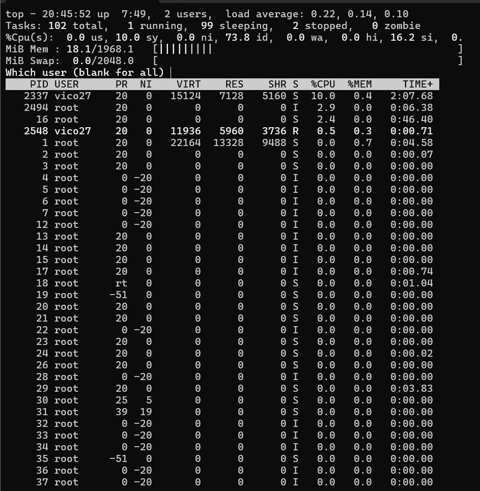
3. Instal dan jalankan htop:
```
sudo apt install -y htop
htop
# Tekan F6 untuk pilih kolom pengurutan
# Tekan F10 atau q untuk keluar
```
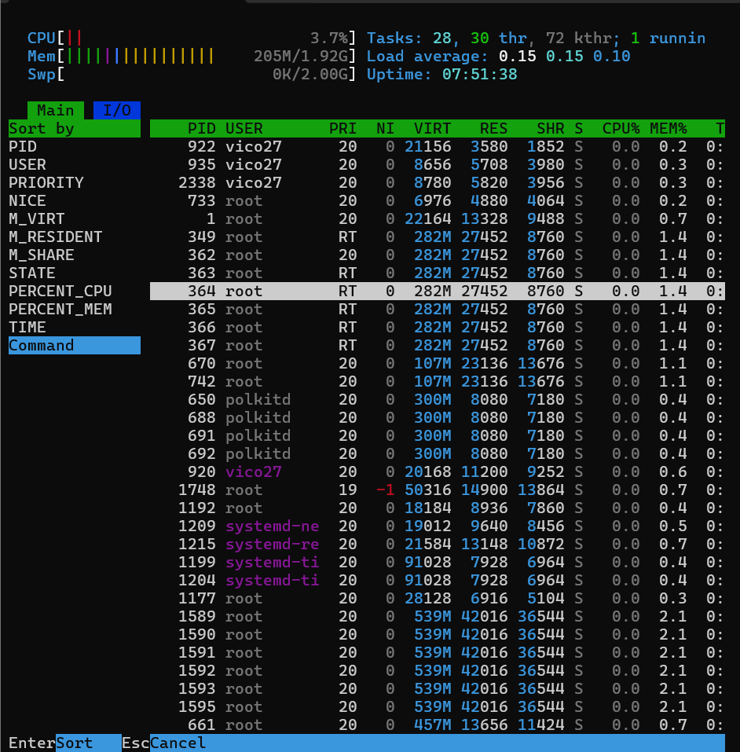


### Latihan 6.6
1. Gunakan ps aux –sort=%mem untuk menemukan proses yang menggunakan memori paling banyak di VM Anda. Proses apa itu?
Mengurutkan berdasarkan penggunaan memori
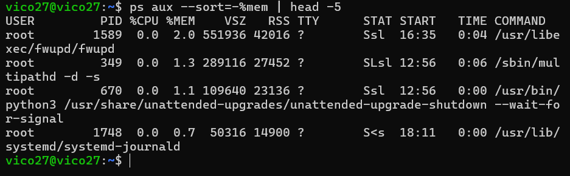
2. Di dalam top, tekan 1 . Apa yang berubah pada tampilan? Mengapa
informasi ini berguna?
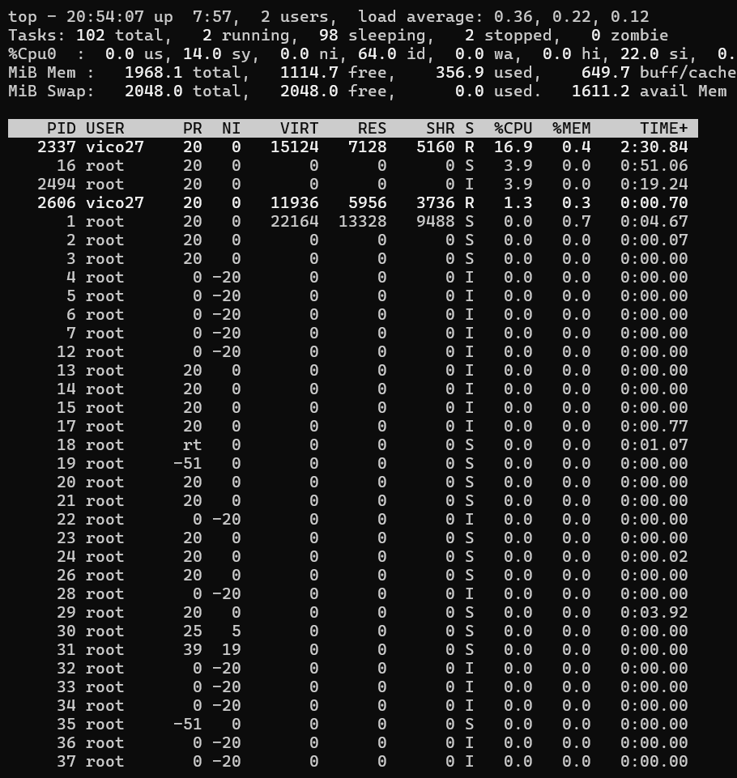
karena perintah 1 menampilan tiap core CPU
3. Di dalam htop, navigasikan ke proses sshd menggunakan tombol panah.Tekan F9 dan amati opsi sinyal yang tersedia
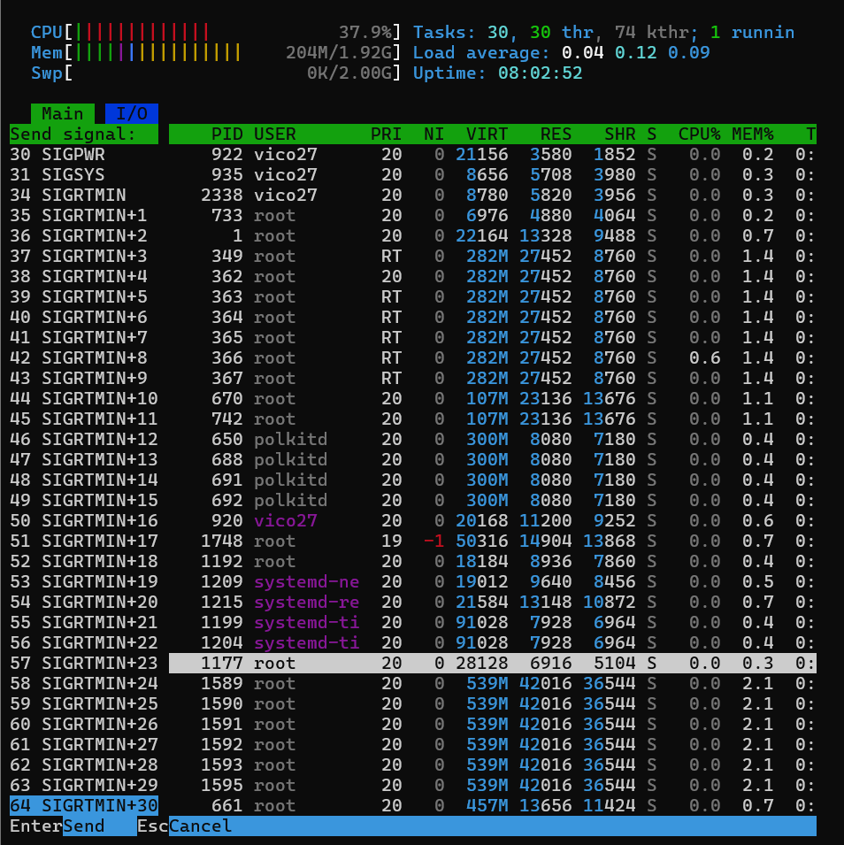


# 1.8 Latihan

## Latihan 6.A
Eksplorasi Proses Sistem
1. Jalankan ps aux –forest dan temukan proses dengan PID 1. Apa
nama dan fungsi proses tersebut dalam sistem Linux modern?
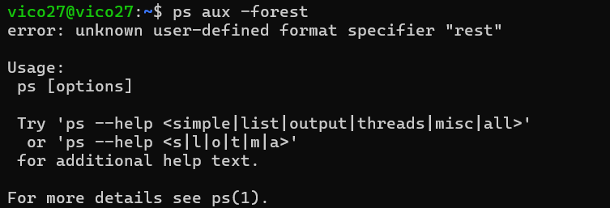
hasilnya error seharusnya ```ps aux –-forest```
ini hasilnya
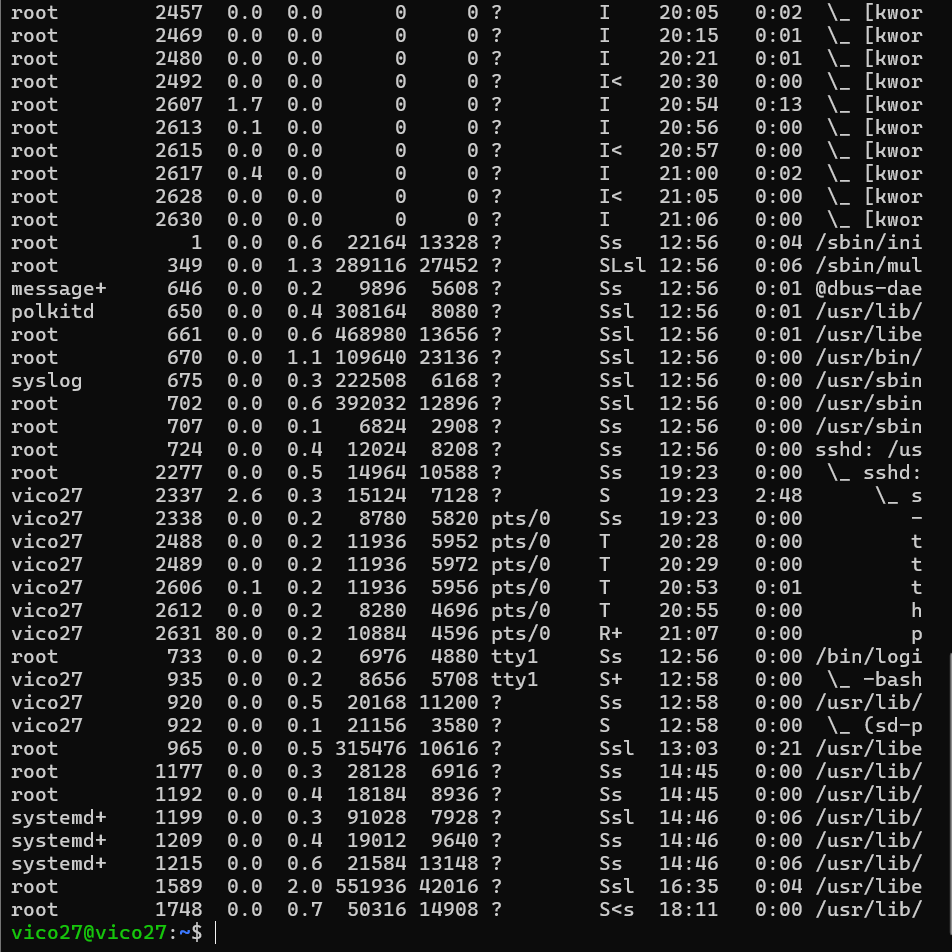
nama proses dengan PID 1 adalah systemd (di Linux versi jadul, namanya adalah init). 
Fungsinya: Ini adalah "Ibu dari Segala Proses" (The Mother of All Processes).

```systemd``` adalah program pertama yang dinyalakan oleh Linux saat komputer baru dihidupkan (booting).

2. Hitung berapa proses yang dimiliki oleh user root dan berapa yang dimiliki oleh user Anda. Mengapa root memiliki lebih banyak proses?
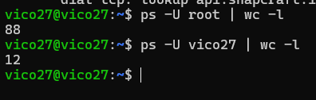

user roat = 88

user saya = 12

karena root bertugas menjaga fondasi sistem operasi agar tetap hidup. root harus menjalankan proses di latar belakang (daemon) untuk mengelola memori, driver perangkat keras (seperti keyboard/mouse), jaringan internet, dan keamanan komputer sedangkan user biasa (seperti vico27) hanya memiliki proses sebatas aplikasi yang sedang dibukanya saja (seperti terminal dan koneksi SSH).

3. Temukan semua proses yang berada dalam kondisi S. Mengapa sebagian besar proses di sistem berada dalam kondisi ini?

untuk melihat daftar proses yang huruf depannya S (Status Sleep):
```
ps aux | awk '$8 ~ /^S/ {print}' | less
```
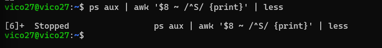

menghitung total jumlahnya (coba bandingkan dengan total seluruh proses di komputermu, pasti yang statusnya S mendominasi):
```
ps aux | awk '$8 ~ /^S/ {print}' | wc -l
```
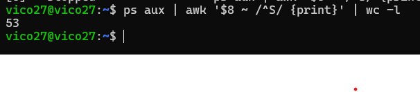

Mengapa sebagian besar proses berada di kondisi ini? Ini adalah bentuk efisiensi tingkat tinggi dari Linux. Sebagian besar program di sistem tugasnya hanyalah menunggu (menunggu input keyboard, menunggu data internet masuk, atau menunggu waktu tertentu).


## Latihan 6.B
Simulasi Manajemen Job
1. Jalankan tiga perintah sleep dengan durasi 100, 200, dan 300 detik di background. Verifikasi ketiganya dengan jobs.
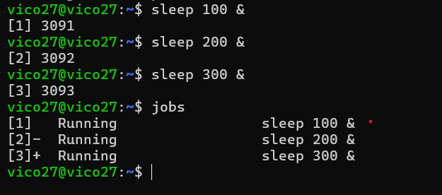

2. Bawa job kedua ke foreground, jeda dengan Ctrl+Z , lalu kembalikan ke background dengan bg.
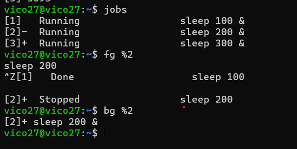
3. Hentikan job pertama dengan kill %1. Tampilkan kembali daftar job. Berapa job yang tersisa?
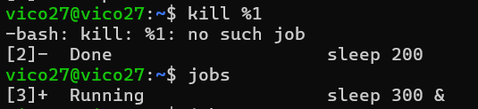

## Latihan 6.C
Prioritas dan Sinyal
1. Jalankan dua proses sleep: satu dengan nice +5 dan satu dengan nice +15. Verifikasi nilai NI keduanya dengan ps.
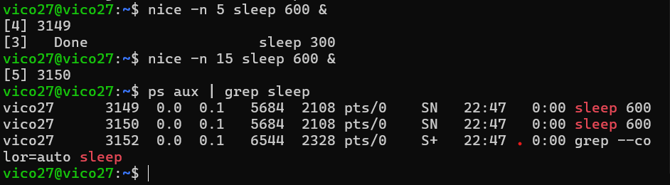

2. Gunakan renice untuk mengubah nice proses pertama menjadi +10.
Proses mana yang kini lebih diprioritaskan scheduler?
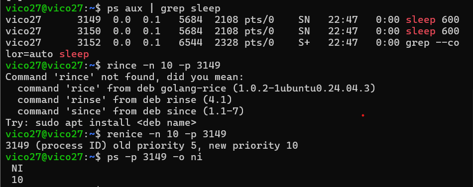

3. Kirim SIGSTOP ke salah satu proses, verifikasi kondisi T-nya, lalu kirim SIGCONT. Akhiri semua proses percobaan dengan pkill sleep.
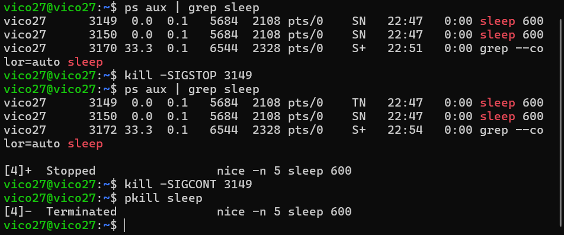

