<h4>Nama : Vico Dwi Wijaya<h4>
<h4>NIM  : 254107020259<h4>
<h4>Kelas: TI-1H<h4>
<h4>Absen: 28<h4>


## Tugas Praktikum 1 — Toolkit Bash Administrator Pribadi

**Konteks riil: seorang administrator sering mengulang perintah yang sama setiap hari. Agar pekerjaan lebih efisien dan konsisten, ia perlu memiliki toolkit Bash pribadi yang otomatis aktif setiap login.**

Instruksi tugas:
1. Tambahkan konfigurasi pada .bashrc untuk:
  
• menambahkan direktori bin pribadi ke PATH,  
• membuat minimal 2 alias yang membantu kerja harian,  
• membuat minimal 1 fungsi shell yang berguna untuk administrasi.

2. Pastikan konfigurasi tersebut aktif kembali saat membuka shell login.
3. Buat satu script sederhana di direktori bin pribadi, misalnya script untuk menampilkan ringkasan sistem.
4. Uji dari direktori yang berbeda untuk memastikan script dapat dipanggil tanpa
menuliskan path lengkap.
5. Simpan bukti pengujian ke file toolkit-bash-report.txt.
Minimal luaran:

• isi blok konfigurasi yang ditambahkan ke .bashrc,  
• output echo $PATH,  
• output type untuk alias, fungsi, dan script,  
• file laporan toolkit-bash-report.txt.

#### Langkah 1: Menyiapkan Folder Kerja dan File Laporan
```
mkdir -p ~/praktikum-os/week07-bash/bin
touch ~/praktikum-os/week07-bash/toolkit-bash-report.txt
```
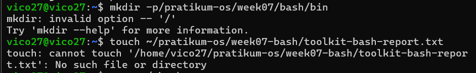
#### Langkah 2: Memasukkan Konfigurasi ke dalam .bashrc
```
nano ~/.bashrc
```
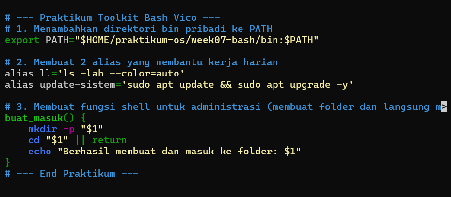

#### Langkah 3: Mengaktifkan Konfigurasi
```
source ~/.bashrc
```


#### Langkah 4: Membuat Script Sederhana
```
nano ~/praktikum-os/week07-bash/bin/info-sistem
```
**Masukkan kode berikut:**

#!/usr/bin/env bash

echo "=== Ringkasan Sistem ==="

echo "Waktu    : $(date)"

echo "Hostname : $(hostname)"

echo "User     : $(whoami)"

### Langkah 5: Menguji dan Membuat Laporan
# Pindah ke home directory untuk menguji
cd ~

1. Menyimpan bukti PATH
* echo "=== BUKTI PATH ===" >> ~/praktikum-os/week07-bash/toolkit-bash-report.txt
* echo "$PATH" >> ~/praktikum-os/week07-bash/toolkit-bash-report.txt

2. Menyimpan bukti Alias dan Fungsi
* echo -e "\n=== BUKTI ALIAS & FUNGSI ===" >> ~/praktikum-os/week07-bash/toolkit-bash-report.txt
* type ll >> ~/praktikum-os/week07-bash/toolkit-bash-report.txt
* type buat_masuk >> ~/praktikum-os/week07-bash/toolkit-bash-report.txt

3. Menguji jalannya script tanpa mengetik path lengkap
* echo -e "\n=== BUKTI SCRIPT ===" >> ~/praktikum-os/week07-bash/toolkit-bash-report.txt
* type info-sistem >> ~/praktikum-os/week07-bash/toolkit-bash-report.txt
* info-sistem >> ~/praktikum-os/week07-bash/toolkit-bash-report.txt

Untuk melihat hasil laporanmu, ketik:

```
cat ~/praktikum-os/week07-bash/toolkit-bash-report.txt
```
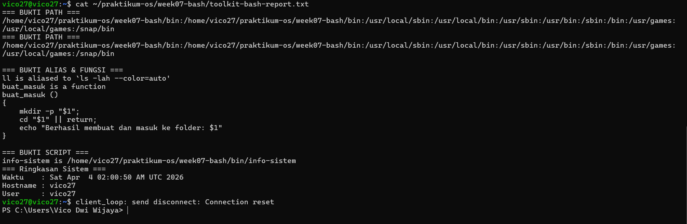


## Tugas Praktikum 2 — Audit File Konfigurasi dan Logging Aman

Konteks riil: saat troubleshooting, administrator sering perlu menginventarisasi file konfigurasi dan memisahkan output normal dari pesan error.
Instruksi tugas:
1. Buat file laporan bernama audit-konfigurasi-$(date +%F).txt.
2. Cari file *.conf di dalam /etc dan simpan hasilnya ke file laporan.
3. Catat jumlah total file konfigurasi yang ditemukan.
4. Jika ada pesan error, simpan ke file terpisah, misalnya audit-error.log.
5. Tampilkan isi laporan ke terminal dan sekaligus simpan menggunakan tee.
6. Tambahkan ringkasan singkat 3–5 baris yang menjelaskan mengapa pemisahan stdout dan stderr penting dalam audit sistem.

Syarat konsep yang harus muncul:
• redirection >, 2>, atau &>,
• pipeline,
• tee,  
• penggunaan variabel atau command substitution.
Minimal luaran:  
• file laporan audit,  
• file log error,  
• perintah yang digunakan,  
• analisis singkat hasil audit.

#### Langkah 1: Masuk ke Folder Kerja
```
cd ~/praktikum-os/week07-bash/
```
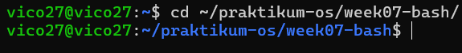

#### Langkah 2: Melakukan Pencarian, Memisahkan Error, dan Menyimpan Hasil
menggabungkan beberapa perintah sekaligus menggunakan pipeline (|) dan redirection (2>).
```
find /etc -type f -name "*.conf" 2> audit-error.log | tee audit-konfigurasi-$(date +%F).txt
```
Penjelasan Perintah:


find /etc -type f -name "*.conf": Mencari file berakhiran .conf di dalam folder sistem /etc.


2> audit-error.log: Membelokkan semua pesan error (stderr) ke dalam file audit-error.log.


| tee audit-konfigurasi-$(date +%F).txt: Menangkap hasil pencarian yang sukses, menampilkannya ke layar terminalmu, dan sekaligus menyimpannya ke dalam file baru yang namanya otomatis menyesuaikan tanggal hari ini (berkat $(date +%F)).

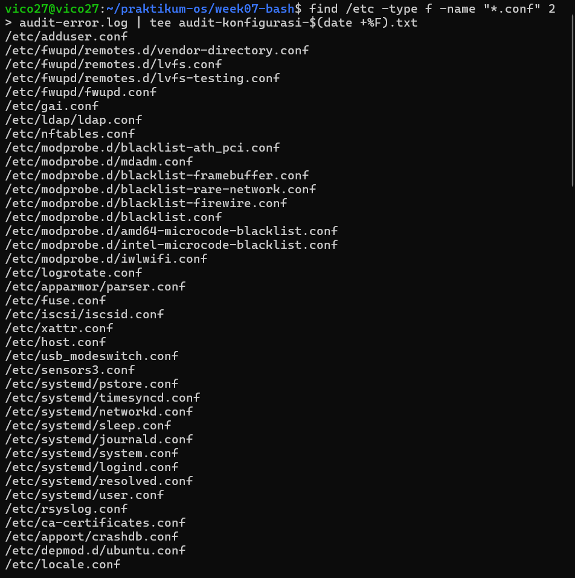
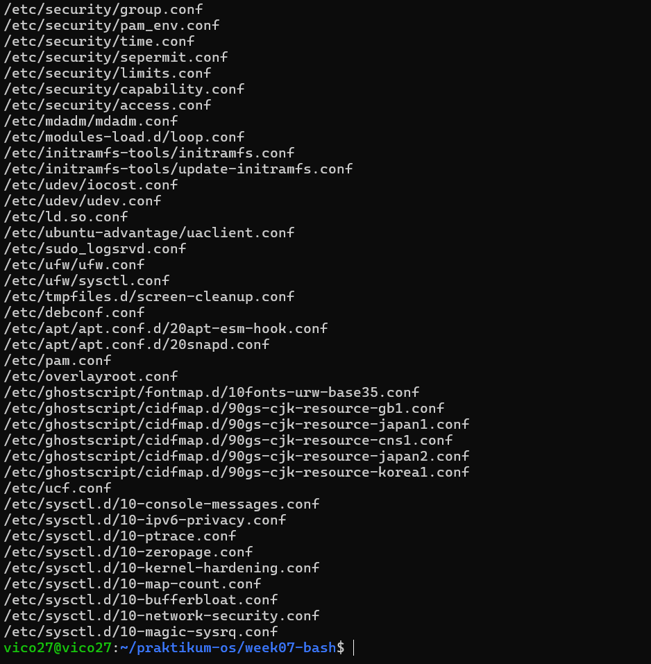

#### Langkah 3: Menghitung Total File Konfigurasi
mencatat berapa banyak total file konfigurasi yang berhasil ditemukan
```
echo "Total file konfigurasi ditemukan: $(wc -l < audit-konfigurasi-$(date +%F).txt)" >> audit-konfigurasi-$(date +%F).txt
```
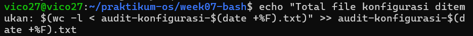
#### Langkah 4: Menambahkan Ringkasan Analisis
Modul meminta ringkasan 3-5 baris yang menjelaskan pentingnya memisahkan stdout dan stderr. Kita bisa menuliskannya langsung ke dalam file laporan menggunakan metode cat <<EOF
```
cat << 'EOF' >> audit-konfigurasi-$(date +%F).txt

=== Analisis Singkat ===
Pemisahan stdout (output normal) dan stderr (pesan error) sangat penting dalam audit sistem agar file laporan akhir tetap bersih dan akurat. Jika pesan error seperti 'Permission denied' dibiarkan bercampur dengan data valid, administrator akan kesulitan membaca hasil audit. Dengan pemisahan ini, data sukses tersimpan rapi untuk dianalisis, sementara daftar error tersimpan di log terpisah untuk keperluan troubleshooting jika dibutuhkan.
EOF
```
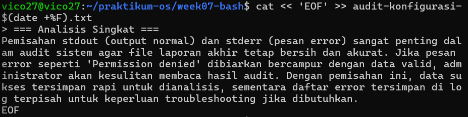

#### Langkah 5: Memverifikasi Hasil Kerja

1. Lihat 10 baris terakhir dari laporan utama
```
tail -n 10 audit-konfigurasi-$(date +%F).txt
```
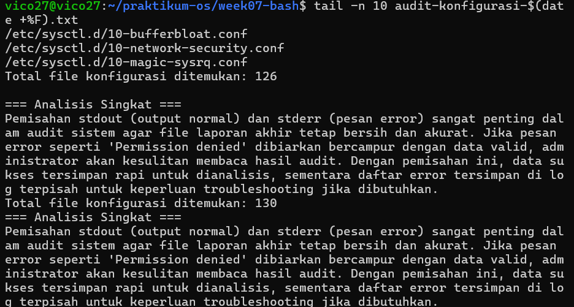
2. Lihat 5 baris pertama dari file kumpulan pesan error
```
head -n 5 audit-error.log
```
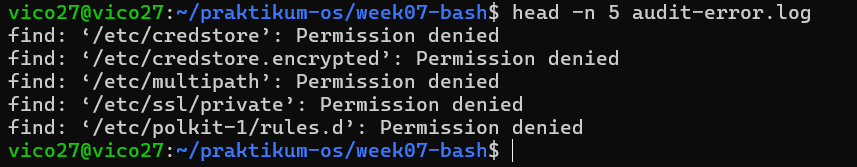


## Tugas Praktikum 3 — Mini Health Check Harian Server
Konteks riil: administrator perlu membuat pemeriksaan cepat (health check) untuk
mengetahui kondisi dasar server sebelum dan sesudah maintenance.
Instruksi tugas:
1. Buat script Bash bernama daily-healthcheck pada direktori bin pribadi.
2. Script minimal harus menampilkan:
• tanggal dan waktu,
• hostname,
• user aktif,
• shell aktif,
• uptime,
• penggunaan memori,
• penggunaan filesystem root,
• 10 baris terakhir history command yang relevan dengan pengecekan.
3. Simpan hasil ke file log harian, misalnya healthcheck-$(date +%F).log.
4. Tampilkan hasil ke terminal dan ke file secara bersamaan.
5. Jika Anda menggunakan pipeline dengan tee, cek juga status exit command

Syarat konsep yang harus muncul:
• environment variable,
• PATH,
• alias atau fungsi pendukung,
• history,
• tee,
• penanganan error dasar.
Minimal luaran:
• file script yang executable,
• contoh isi file log hasil eksekusi,
• penjelasan singkat fungsi tiap bagian script.

#### Langkah 1: Membuat File Script
```
nano ~/praktikum-os/week07-bash/bin/daily-healthcheck
```
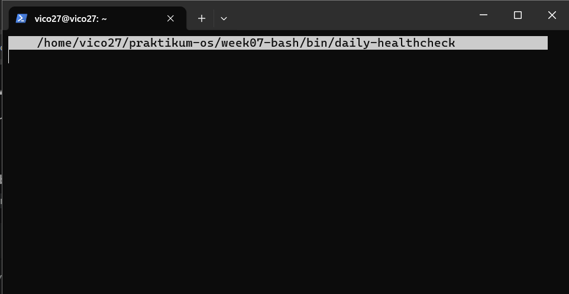

#### Langkah 2: Menulis Kode Script

```
#!/usr/bin/env bash

# Penanganan error dasar: hentikan script jika ada perintah penting yang gagal
set -e 

echo "======================================"
echo "       MINI HEALTH CHECK SERVER       "
echo "======================================"
# Mengambil data dari environment variable dan command dasar
echo "Tanggal & Waktu : $(date)"
echo "Hostname        : $(hostname)"
echo "User Aktif      : $(whoami)"
echo "Shell Aktif     : $SHELL"
echo "--------------------------------------"
echo ">>> UPTIME"
uptime -p
echo "--------------------------------------"
echo ">>> PENGGUNAAN MEMORI"
free -h
echo "--------------------------------------"
echo ">>> PENGGUNAAN FILESYSTEM ROOT"
df -h /
echo "--------------------------------------"
echo ">>> 10 HISTORY PERINTAH TERAKHIR"
# Fitur 'history' biasanya tidak muncul otomatis di dalam script, 
# jadi kita membacanya langsung dari file riwayat bash milik user.
cat ~/.bash_history | tail -n 10
echo "======================================"
```
#### Langkah 3: Memberikan Izin Eksekusi
```
chmod +x ~/praktikum-os/week07-bash/bin/daily-healthcheck
```
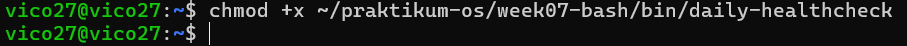

#### Langkah 4: Menjalankan Script dan Menyimpan
Modul meminta untuk menampilkan hasil ke terminal sekaligus menyimpannya ke dalam file log harian (misalnya healthcheck-tanggal.log). Menggunakan perintah tee untuk melakukan ini. juga harus berpindah ke folder praktikum utama terlebih dahulu. 
```
cd ~/praktikum-os/week07-bash/
daily-healthcheck | tee healthcheck-$(date +%F).log
```
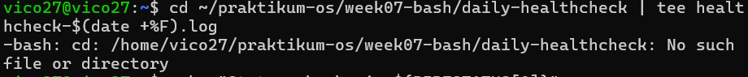

#### Langkah 5: Mengecek Status Error (Exit Status)
```
echo "Status eksekusi: ${PIPESTATUS[0]}"
```
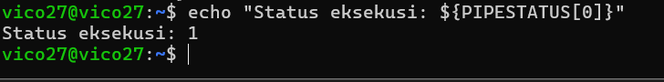

## Tugas Praktikum 4 — Penanganan File dengan Nama
Kompleks dan Arsip Aman
Konteks riil: file hasil backup, ekspor, atau laporan sering memiliki nama yang
mengandung spasi atau karakter khusus. Administrator harus tetap dapat memproses
file-file tersebut tanpa salah target.
Instruksi tugas:
1. Buat minimal 4 file contoh dengan nama yang bervariasi, termasuk:
• nama file yang mengandung spasi,
• nama file yang mengandung tanda kurung siku atau karakter khusus,
• file dengan pola nama serupa untuk diuji dengan wildcard.
2. Tunjukkan perbedaan hasil jika file diakses tanpa quoting dan dengan quoting
yang benar.
3. Lakukan preview wildcard dengan echo sebelum dipakai untuk operasi nyata.
4. Salin file-file tersebut ke direktori backup dengan nama yang aman.
5. Buat arsip tar.gz dari hasil backup.
6. Simpan riwayat perintah yang Anda gunakan ke file riwayat-arsip.txt.
Syarat konsep yang harus muncul:
22
1 Bash Shell dan Shell Basic
• single quote, double quote, dan escaping,
1.9 Rangkuman
• wildcard,
• variabel path,
• history,
• operasi file lanjutan yang aman.
Minimal luaran:
• daftar file awal,
• daftar file hasil backup,
• file arsip tar.gz,
• file riwayat-arsip.txt,
• refleksi singkat tentang pentingnya quoting di Bash.

#### Langkah 1: Membuat Folder Khusus dan File Contoh
```
cd ~/praktikum-os/week07-bash/
mkdir -p tugas4/backup
cd tugas4
```
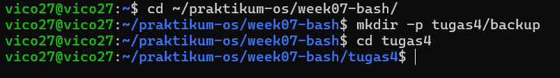

#### Langkah 2: Menguji Perbedaan Quoting
1. jalankan perintah ini tanpa tanda kutip:
```
ls -l laporan keuangan 2026.txt
```
2. jalankan dengan tanda kutip ganda (Double Quote):
```
ls -l "laporan keuangan 2026.txt"
```
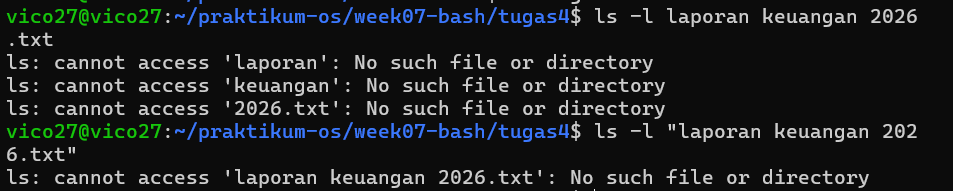

#### Langkah 3: Preview Wildcard dan Salin File secara Aman

1. Lakukan preview wildcard:
```
echo sistem-*.conf
```

2. sudah muncul sistem-*.conf. jalankan perintah dibawah ini
```
file_spasi="laporan keuangan 2026.txt"
file_kurung="backup[mingguan].log"

cp "$file_spasi" backup/
cp "$file_kurung" backup/
cp sistem-*.conf backup/
```
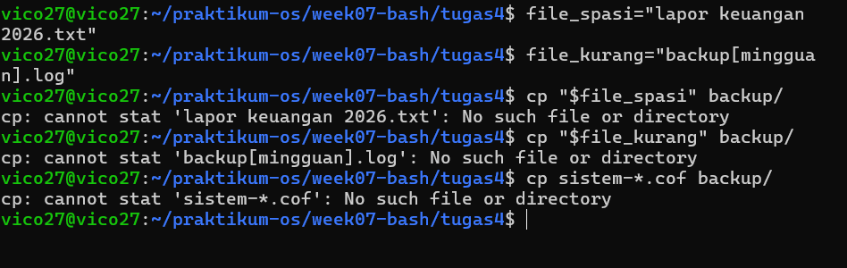

#### Langkah 4: Membuat Arsip (Tar.gz)
```
tar -czf arsip-aman-tugas4.tar.gz backup/
```
#### Langkah 5: Menyimpan Riwayat dan Refleksi Singkat
```
history | tail -n 20 > riwayat-arsip.txt
```
```
cat << 'EOF' >> riwayat-arsip.txt

=== Refleksi Pentingnya Quoting ===
Di dalam Bash, spasi digunakan sebagai pemisah antar argumen atau perintah. Jika sebuah nama file memiliki spasi (seperti 'laporan keuangan.txt'), Bash akan mengiranya sebagai dua file yang berbeda. Oleh karena itu, penggunaan tanda kutip ganda ("...") atau tanda kutip tunggal ('...') sangat krusial agar file dengan nama kompleks atau karakter khusus dapat dibaca sebagai satu entitas utuh tanpa memicu error atau modifikasi file yang salah sasaran.
EOF
```

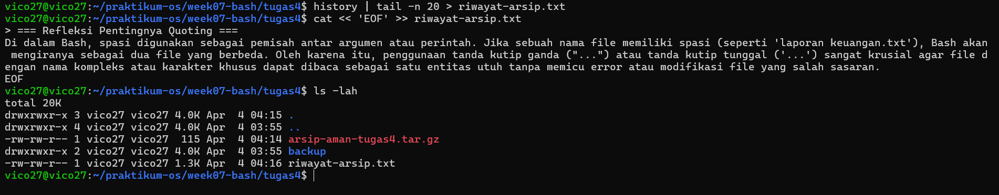
