<h4>Nama : Vico Dwi Wijaya<h4>
<h4>NIM  : 254107020259<h4>
<h4>Kelas: TI-1H<h4>
<h4>Absen: 28<h4>

## Praktikum 7.1 Script Pertama: Laporan Sistem

1. Buat workspace praktikum:
```
mkdir-p ~/praktikum-os/week09/{scripts,logs,data}
cd ~/praktikum-os/week09/scripts
```
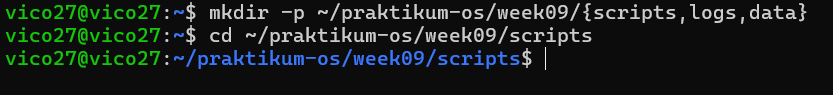

2. Buat script dengan nano:
```
nano laporan-sistem.sh
```
3. Ketik isi berikut, simpan ( Ctrl+O Enter), lalukeluar (Ctrl+X ):
```
#!/bin/bash
# Script: laporan-sistem.sh
echo "================================"
echo " LAPORAN SISTEM"
echo "================================"
echo "Tanggal : $(date '+%A, %d %B %Y')"
echo "Jam
: $(date '+%H:%M:%S')"
echo "Hostname : $(hostname)"
echo "User
: $(whoami)"
echo "CPU core : $(nproc)"
echo "RAM bebas: $(free-h | awk '/^Mem/ {print $4}')"
echo "Disk / : $(df-h / | awk 'NR==2 {print $5}')
terpakai"
echo "================================"
```
4. Beri izin dan jalankan:
```
chmod +x laporan-sistem.sh
./laporan-sistem.sh
```
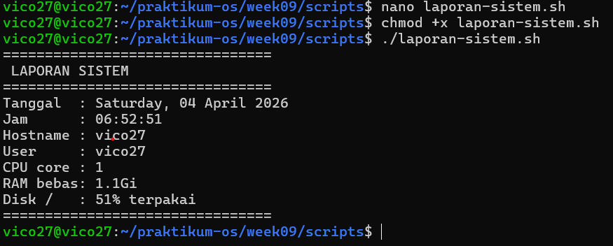

#### Latihan Latihan 9.1
Modifikasi laporan-sistem.sh agar menyimpan output ke file
laporan-YYYY-MM-DD.txt sekaligus menampilkannya di terminal. Petunjuk: gunakan tee yang sudah dipelajari di bab sebelumnya

```
 ./laporan-sistem.sh | tee laporan-$(date +%Y-%m-%d).txt
```
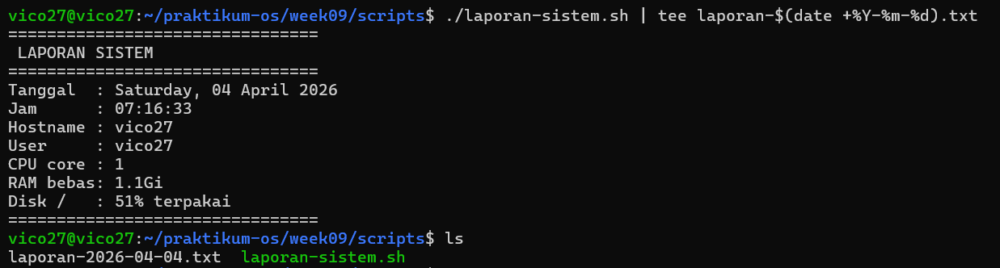

## Praktikum 7.2 Script Info Sistem dengan Argumen
1. Buat script:
```
nano ~/praktikum-os/week09/scripts/info-sistem.sh
```
2. Ketikisi berikut:
```
#!/bin/bash
# Penggunaan: ./info-sistem.sh [nama-admin] [batas
disk-persen]
ADMIN=${1:-"Tidak dikenal"}
BATAS=${2:-80}
TANGGAL=$(date '+%F %T')
DISK_PERSEN=$(df / | awk 'NR==2 {print $5}' | tr-d '%
')
echo "Admin : $ADMIN"
echo "Tanggal : $TANGGAL"
echo "Disk / : ${DISK_PERSEN}% terpakai"
echo "Batas : ${BATAS}%"
if [ "$DISK_PERSEN"-gt "$BATAS" ]; then
echo "STATUS : PERINGATAN-disk melebihi batas!
"
else
SISA=$((BATAS- DISK_PERSEN))
echo "STATUS : Normal (sisa toleransi ${SISA}%)"
fi
```
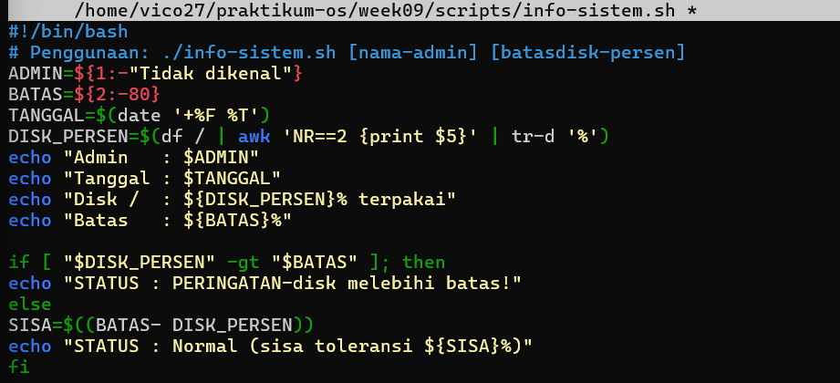

3. Simpan,beri izin,ujidenganberbagaikombinasiargumen:
```
chmod +x ~/praktikum-os/week09/scripts/info-sistem.sh
./info-sistem.sh
./info-sistem.sh "Dian" 50
./info-sistem.sh "Dian" 10
```
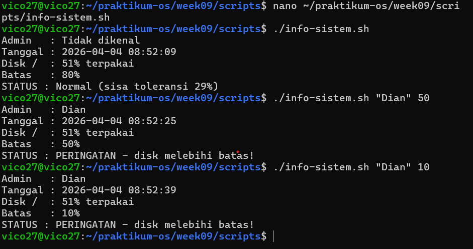

#### Latihan Latihan 9.2
Buat script kalkulator.sh yang menerima tiga argumen: <angka1>
<operator> <angka2> dengan operator + , - , * , atau  /.  Contoh:
./kalkulator .sh 20+5 menghasilkan 25. Gunakan case untuk memilih operasi,danvalidasi jika argumen tidak lengkap.

1. Buat script:
```
nano kalkorator.sh
```
2. isi berikut
```
#!/bin/bash
# Script: kalkulator.sh
if [ $# -ne 3 ]; then
    echo "Error: Argumen tidak lengkap."
    echo "Penggunaan: ./kalkulator.sh <angka1> <operator> <angka2>"
    echo "Contoh: ./kalkulator.sh 20 + 5"
    # Catatan untuk perkalian: gunakan tanda kutip "*" atau \*
    exit 1
fi
ANGKA1=$1
OPERATOR=$2
ANGKA2=$3
case $OPERATOR in
    +)
        HASIL=$((ANGKA1 + ANGKA2))
        ;;
    -)
        HASIL=$((ANGKA1 - ANGKA2))
        ;;
    "*" | \*)
        HASIL=$((ANGKA1 * ANGKA2))
        ;;
    /)
        # Cegah error pembagian dengan angka nol
        if [ "$ANGKA2" -eq 0 ]; then
            echo "Error: Tidak bisa dibagi dengan angka nol!"
            exit 1
        fi
        HASIL=$((ANGKA1 / ANGKA2))
        ;;
    *)
        # Jika operator yang dimasukkan selain +, -, *, /
        echo "Error: Operator '$OPERATOR' tidak valid."
        exit 1
        ;;
esac
echo "Hasil: $HASIL"
```
3. Simpan,beri izin,ujidenganberbagaikombinasiargumen:
```
chmod +x kalkulator.sh
./kalkulator.sh 20 + 5
./kalkulator.sh 20 - 5
./kalkulator.sh 20 "*" 5
./kalkulator.sh 20 / 5

```
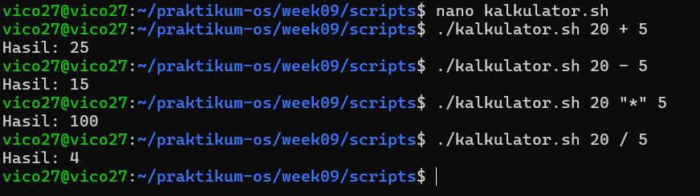

## Praktikum 7.3 Script Grading dan Menu Interaktif
1. Buat script grading (menggunakan if dan for):
```
nano ~/praktikum-os/week09/scripts/grading-batch.sh
```
2. Ketik isi berikut:

```

#!/bin/bash
# Script: grading-batch.sh
# Proses daftar nilai mahasiswa
MAHASISWA=("Andi:92" "Budi:73" "Citra:55" "Deni:80" "Eka:45")
echo "=== HASIL GRADING ==="
for ENTRI in "${MAHASISWA[@]}"; do
NAMA=$(echo "$ENTRI" | cut -d: -f1)
NILAI=$(echo "$ENTRI" | cut -d: -f2)
if [ "$NILAI"-ge 85 ]; then
GRADE="A"
elif [ "$NILAI"-ge 75 ]; then
GRADE="B"
elif [ "$NILAI"-ge 65 ]; then
GRADE="C"
elif [ "$NILAI"-ge 55 ]; then
GRADE="D"
else
GRADE="E"
fi
printf "%-10s %3d %s\n" "$NAMA" "$NILAI" "$GRADE"
done
echo "====================="
```
3. Simpan,beri izin,danjalankan:
```
chmod +x ~/praktikum-os/week09/scripts/grading-batch.sh
./grading-batch.sh
```
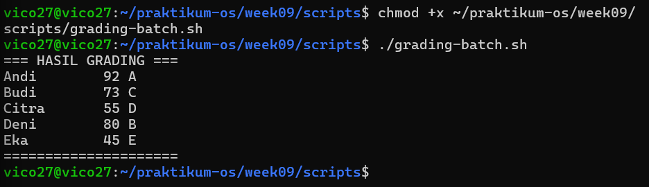

4. Buatscriptmenuinteraktif(while+case):
```
nano ~/praktikum-os/week09/scripts/menu-sistem.sh
```
5. Ketik isi berikut
```
#!/bin/bash
# Menu interaktif pemantauan sistem

while true; do
echo ""
echo "===== MENU MONITOR ====="
echo "1) Info disk"
echo "2) Info memori"
echo "3) Proses teratas"
echo "4) Keluar"
echo -n "Pilih [1-4]: "
read PILIHAN
case $PILIHAN in
1) df -h ;;
2) free -h ;;
3) ps aux --sort= -%cpu | head-6 ;;
4) echo "Sampai jumpa!"; exit 0 ;;
*) echo "Pilihan tidak valid." ;;
esac
done
```
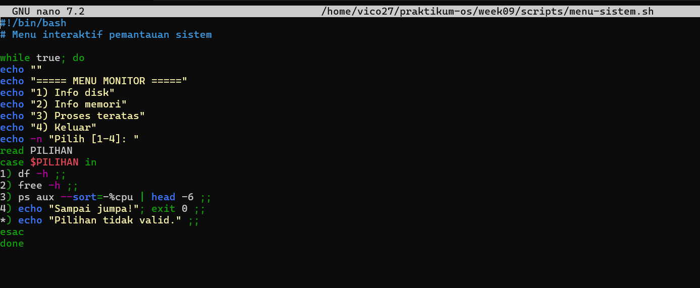
6. Beri izin dan jalankan, coba setiap opsi:
```
chmod +x ~/praktikum-os/week09/scripts/menu-sistem.sh
./menu-sistem.sh
```
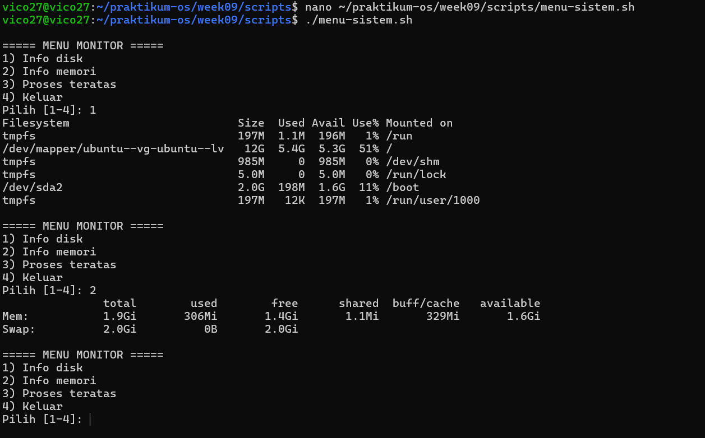
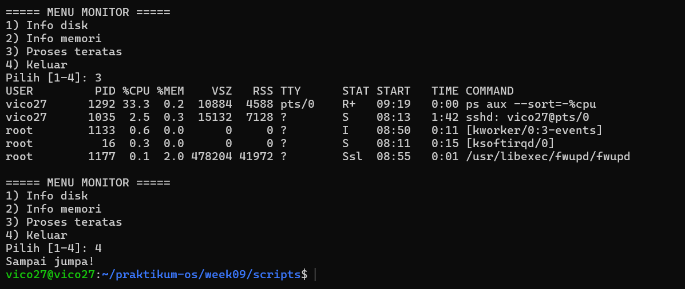

## Latihan Latihan 9.3
Tambahkan ke script grading-batch.sh sebuah ringkasan di bagian bawah yang menampilkan: jumlah mahasiswa per grade (A, B, C, D,E) menggunakan perulangan for kedua yang mengiterasi array MAHASISWA.
1. kembali ke script grading
```
 nano ~/praktikum-os/week09/scripts/grading-batch.sh
```
2. masukan kode ini
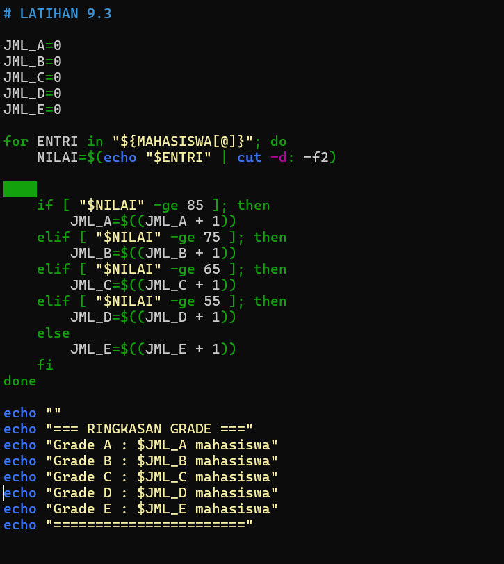

3. Cek menggunakan perintah
```
./grading-batch.sh
```
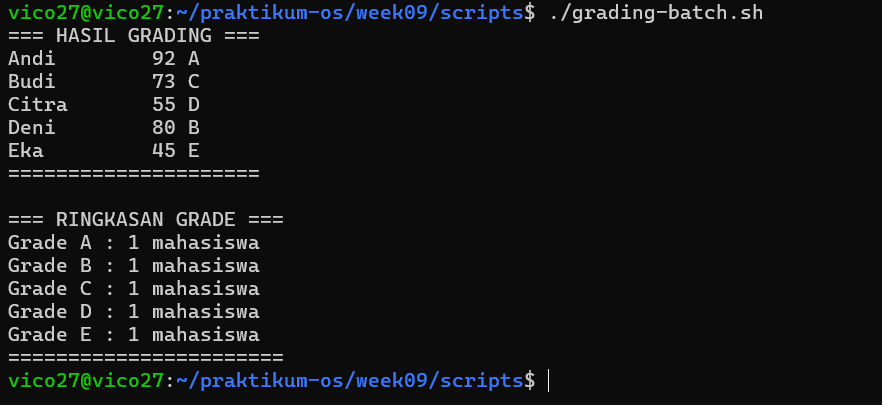

## Praktikum 7.4 Library Fungsi Validasi

1. Buat file library:
```
nano ~/praktikum-os/week09/scripts/lib-validasi.sh
```
2. Ketik isi berikut:
```
#!/bin/bash
# lib-validasi.sh-Library fungsi validasi
adalah_angka() {
[[ "$1" =~ ^[0-9]+$ ]]
}
file_bisa_dibaca() {
[-f "$1" ] && [-r "$1" ]
}
error_exit() {
echo "ERROR: $1" >&2
exit 1
}
info() { echo "[INFO] $1"; }
sukses() { echo "[OK] $1"; }
```
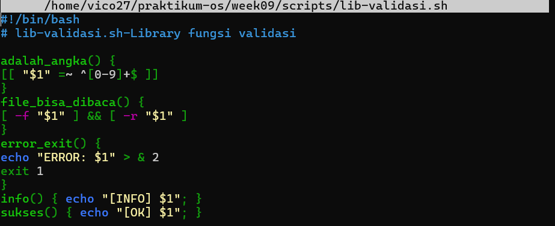
3. Buat script yang menggunakan library:
```
nano ~/praktikum-os/week09/scripts/pakai-library.sh
```
4. Ketik isi berikut:
```
#!/bin/bash
# Muat library (seperti import di Java)
source ~/praktikum-os/week09/scripts/lib-validasi.sh
ANGKA=$1
FILE=$2
[-z "$ANGKA" ] || [-z "$FILE" ] && \
error_exit "Penggunaan: $0 <angka> <path-file>"
if adalah_angka "$ANGKA"; then
sukses "Input '$ANGKA' adalah angka valid"
else
error_exit "'$ANGKA' bukan angka"
fi
if file_bisa_dibaca "$FILE"; then
sukses "File '$FILE' bisa dibaca"
info "Jumlah baris: $(wc-l < "$FILE")"
else
error_exit "File '$FILE' tidak ada atau tidak bisa
dibaca"
fi
```
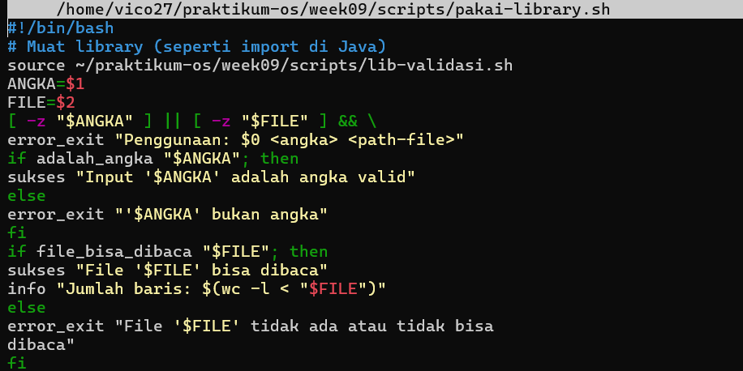

5. Beri izin dan uji semua skenario:
```
chmod +x ~/praktikum-os/week09/scripts/pakai-library.
sh
./pakai-library.sh 42 /etc/hostname
./pakai-library.sh abc /etc/hostname
./pakai-library.sh 42 /tidak-ada.txt
./pakai-library.sh
```


#### Latihan Latihan 9.4
Tambahkan fungsi konfirmasi() ke lib-validasi.sh.
Fungsi ini menampilkan pertanyaan, membaca input Y/N dari user, mengembalikan 0 jika Y dan 1 jika N. Buat script demo yang memanggil fungsi ini sebelum menghapus sebuah file.
1. Buka library lib-validasi.sh dan tambahkan kode kofirmasi brtikut
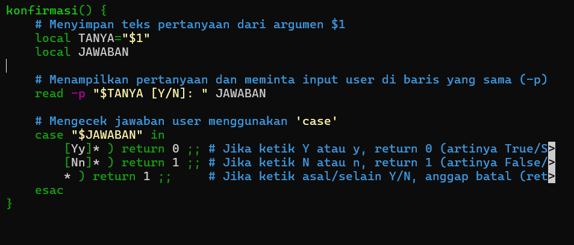
2. Buat file library demo
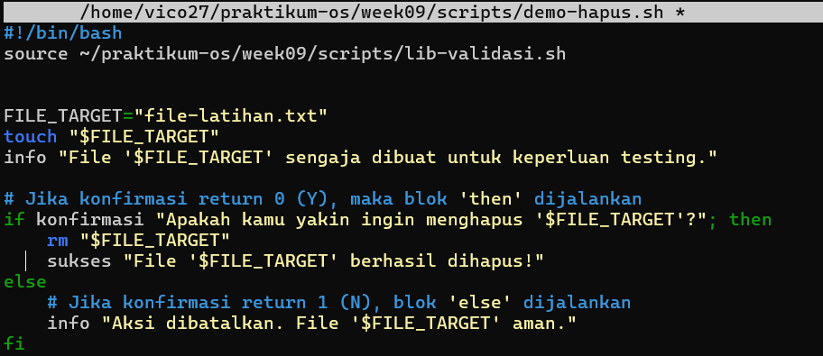
3. verifikasi dan jalankan program:
```
chmod +x ~/praktikum-os/week09/scripts/demo-hapus.sh
./demo-hapus.sh
```
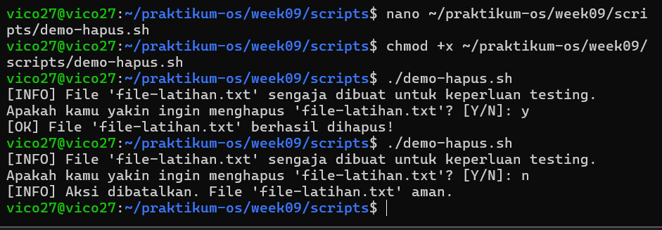

## Praktikum 7.5 Script Backup dengan Opsi

1. Buat script:
```
nano ~/praktikum-os/week09/scripts/backup-data.sh
```
2. Ketik isi berikut:
```
#!/bin/bash
# Penggunaan: ./backup-data.sh [-v] [-c] [-l logfile]
<sumber> <tujuan>
VERBOSE=false
COMPRESS=false
LOG_FILE=""
while getopts "vcl:" OPSI; do
case $OPSI in
v) VERBOSE=true ;;
c) COMPRESS=true ;;
l) LOG_FILE="$OPTARG" ;;
*) echo "Penggunaan: $0 [-v] [-c] [-l logfile]
<sumber> <tujuan>"
exit 1 ;;
esac
done
shift $((OPTIND- 1))
SUMBER=$1
TUJUAN=$2
log() {
local MSG="[$(date '+%T')] $1"
echo "$MSG"
[-n "$LOG_FILE" ] && echo "$MSG" >> "$LOG_FILE"
}
[-z "$SUMBER" ] || [-z "$TUJUAN" ] && {
echo "ERROR: sumber dan tujuan wajib diisi"; exit
1; }
[ !-d "$SUMBER" ] && { log "ERROR: $SUMBER tidak ada"
; exit 2; }
mkdir-p "$TUJUAN"
TANGGAL=$(date '+%F-%H%M%S')
[ "$VERBOSE" = true ] && log "Sumber: $SUMBER | Tujuan
: $TUJUAN"
if [ "$COMPRESS" = true ]; then
ARSIP="$TUJUAN/backup-$(basename "$SUMBER")
$TANGGAL.tar.gz"
tar-czf "$ARSIP"-C "$(dirname "$SUMBER")" "$(
basename "$SUMBER")"
log "Arsip: $ARSIP ($(du-sh "$ARSIP" | cut-f1))"
else
cp-r "$SUMBER" "$TUJUAN/backup-$(basename "
$SUMBER")-$TANGGAL"
log "Backup selesai."
fi

```
3. Beri izin dan uji:
```
chmod +x ~/praktikum-os/week09/scripts/backup-data.sh
cd ~/praktikum-os/week09/scripts
# Tanpa opsi
./backup-data.sh ~/praktikum-os/week09/data ~/
praktikum-os/week09/logs
# Dengan verbose dan kompresi + log ke file
./backup-data.sh-v-c-l ../logs/backup.log \
~/praktikum-os/week09/data ~/praktikum-os/week09/
logs
cat ../logs/backup.log
```
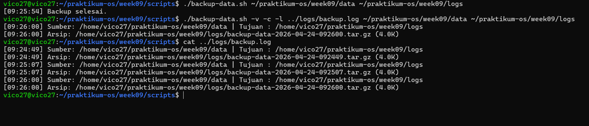

## Praktikum7.6 Debugging Script

1. Buat script untuk dianalisis:
```
nano ~/praktikum-os/week09/scripts/debug-latihan.sh
```
2. Ketik isi berikut:
```
#!/bin/bash
# Script: debug-latihan.sh
# Penggunaan: ./debug-latihan.sh <direktori> <batas-MB
>
DIREKTORI=$1
BATAS=$2
if [ $#-ne 2 ]; then
echo "Penggunaan: $0 <direktori> <batas-MB>"
exit 1
fi
UKURAN=$(du-sm "$DIREKTORI" | cut-f1)
echo "Direktori : $DIREKTORI"
echo "Ukuran : ${UKURAN} MB"
echo "Batas : ${BATAS} MB"
if [ "$UKURAN"-gt "$BATAS" ]; then
echo "PERINGATAN: Ukuran melebihi batas!"
echo "Kelebihan: $((UKURAN-BATAS)) MB"
else
echo "Status: Normal (sisa: $((BATAS-UKURAN)) MB
)"
fi
```
3. Cek sintaks, lalu jalankan dengan tracing:
```
chmod +x ~/praktikum-os/week09/scripts/debug-latihan.
sh
bash-n debug-latihan.sh && echo "Sintaks OK"
bash-x debug-latihan.sh /etc 10
./debug-latihan.sh /var 50
./debug-latihan.sh
```
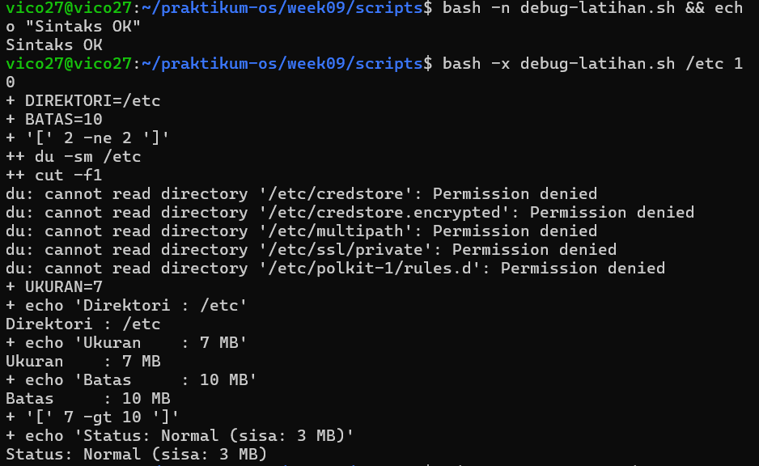
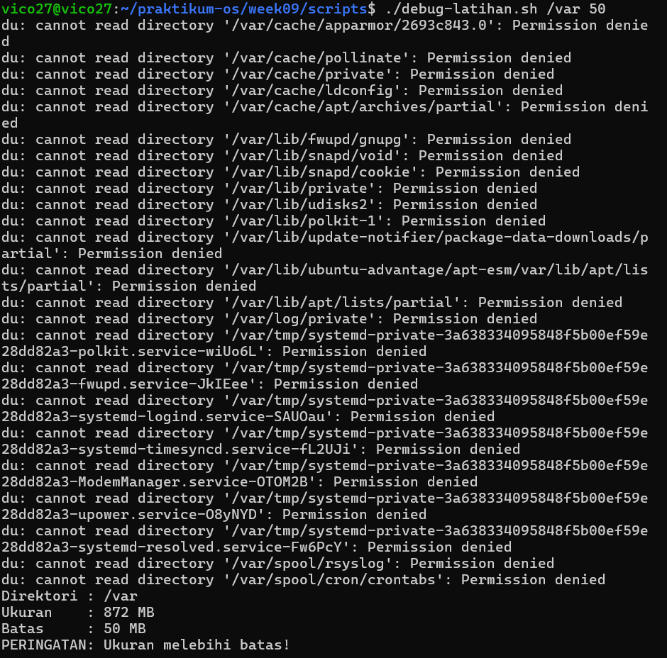
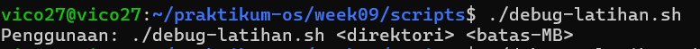

#### Latihan Latihan 9.5

Script debug-latihan.sh tidak menangan idirektori yang tidak ada.Perbaiki denga nmenambahkan:
* set -e di baris kedua
* Pengecekan -d "$DIREKTORI" sebelum memanggil du
* Pesan error yang informatif jika direktori tidak ditemukan
Uji dengan direktori yang tidak ada.
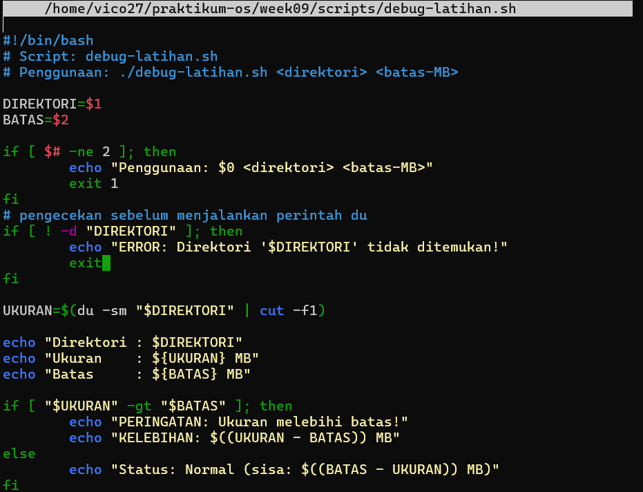
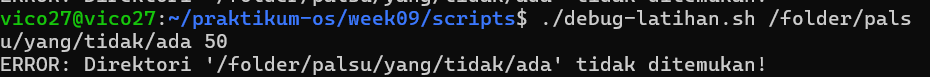

## 1.8 Tugas Praktikum
Kerjakan tugas di$HOME/praktikum-os/week09/. Scriptdiscripts/,output dilogs/.

## Tugas 1 Script Absen si Kelas
Konteks: instruktur mencatat kehadiran mahasiswa dari commandline.
Instruksi:

1. Buat script absensi.sh yang:
* Menerima argumen nama mahasiswa dan status (hadir/izin/alpha)
* Menyimpan entri ke absensi-YYYY-MM-DD.txt dengan format [HH:MM]NAMA-STATUS
* Opsi-r: tampilkan rekapitulasi (jumlah per status)
* Opsi-h: tampilkan bantuan

2. Rekam minimal 5 entri dan tampilkan rekapitulasinya.
Konsep wajib: variabel, parameter posisional, getopts, if, for, fungsi, dan
redirection ke file.

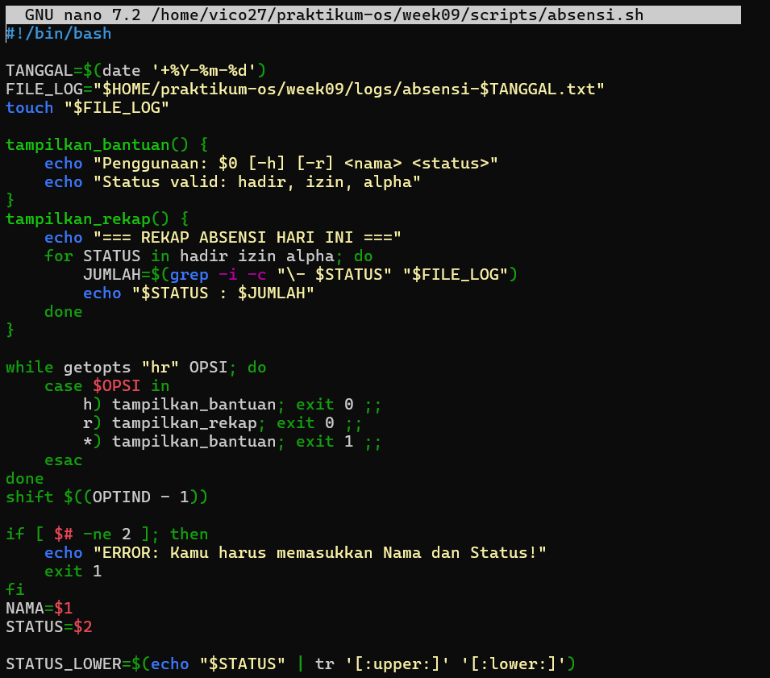
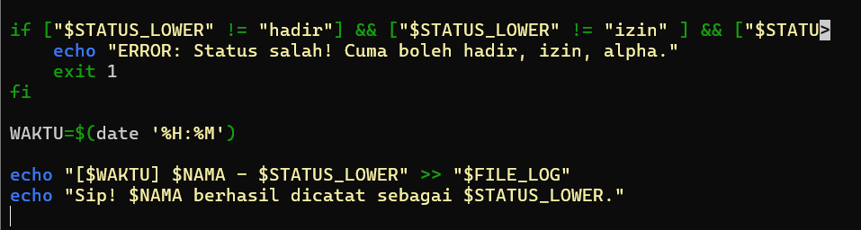

```
./absensi.sh JOKO alpha
./absensi.sh siti izin
 ./absensi.sh madrid izin
 ./absensi.sh arsenal izin
 ./absensi.sh -r
 ./absensi.sh -h
```
* -h untuk bantuan
* -r untuk rekap data
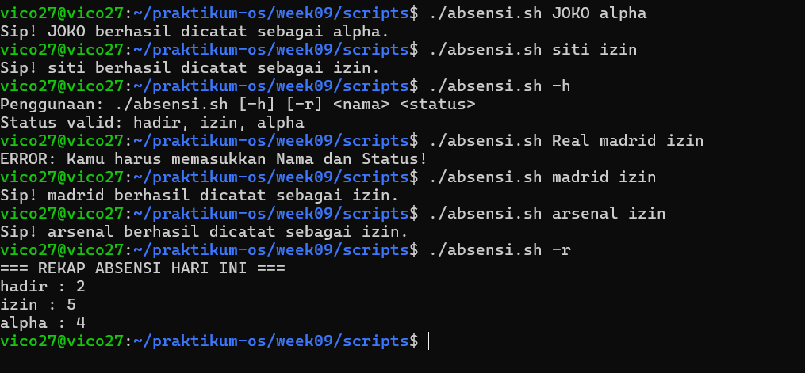


## Tugas 2 Script Health Check Sistem

Konteks: administrator membuat pemeriksaan kondisi server sebelum maintenance.
Instruksi:
1. Buat script healthcheck.sh menggunakan template profesional dari bagian
Best Practices.
2. Script menampilkan: tanggal/waktu, hostname, uptime, penggunaan CPU,
memori, dan disk untuk setiap filesystem yang terpasang.
3. Jika penggunaan disk mana pun melebihi 80%, tampilkan peringatan.
4. Simpan hasil ke healthcheck-YYYY-MM-DD.log dan tampilkan ke terminal
sekaligus menggunakan tee.
5. Opsi-t <persen> mengubah batas peringatan disk (default 80).
Konsep wajib: set-euo pipefail, trap, getopts, fungsi dengan local,
for, if, dan tee.

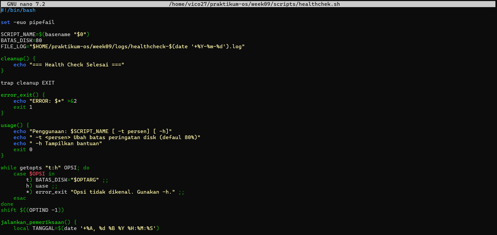
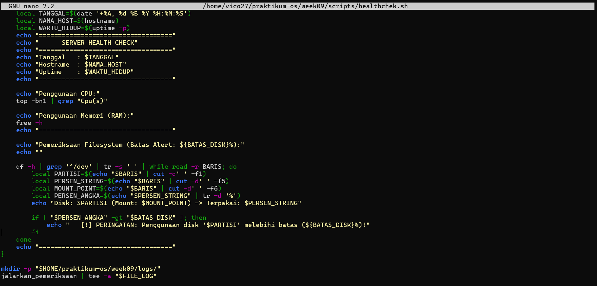

```
 ./healthchek.sh
 ./healthchek.sh -t 10
 ./healthchek.sh -t 2
```
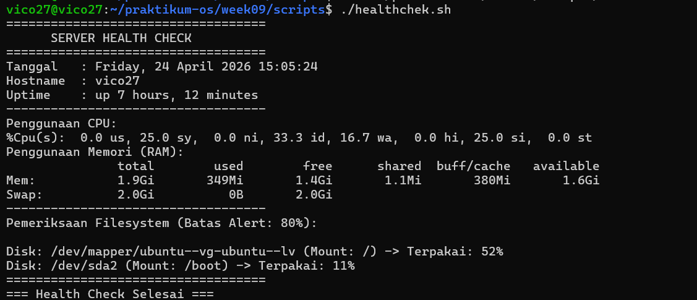
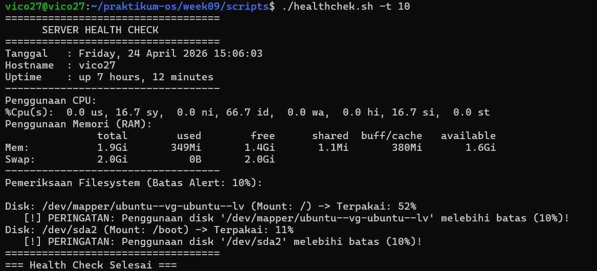
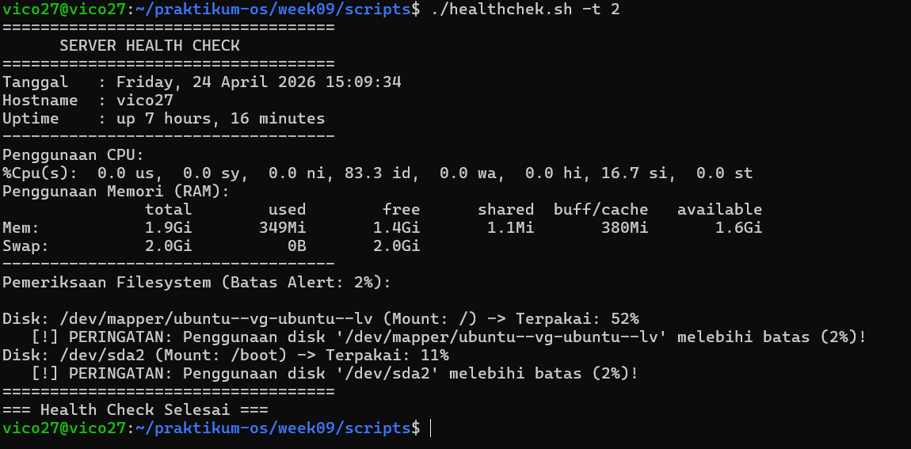
